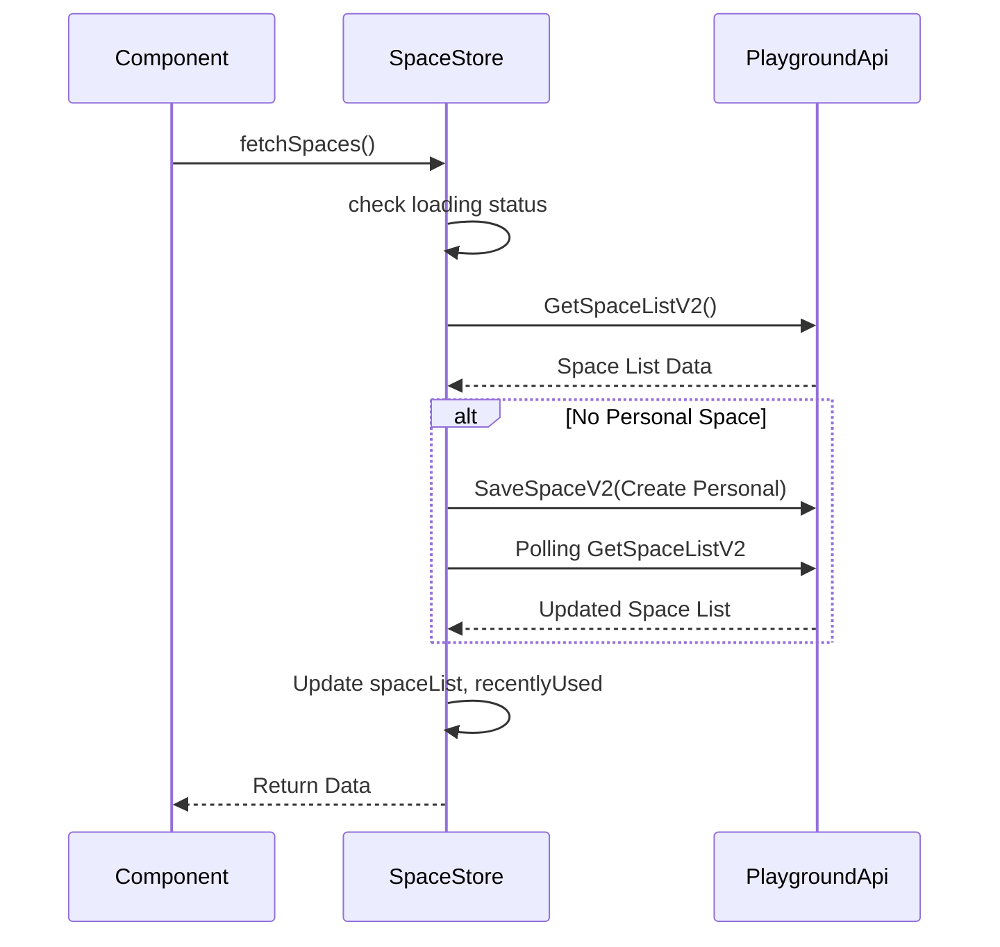

# 基础服务层 (Foundation Layer)

基础服务层是前端架构中的基石，负责承载账号、空间、全局配置、本地存储等核心基础设施能力。它通过分层设计和 Adapter 模式，实现了业务逻辑的解耦以及开源版与商业版的差异化适配。

## 概述

基础服务层（位于 `frontend/packages/foundation`，包含 16 个包）位于应用层之下，架构基础设施层之上，通过 `foundation-sdk` 向应用层提供统一的接口。其核心职责包括：

- **账号体系 (Account System)**: 管理用户登录状态、用户信息、权限信息的获取与更新。
- **空间管理 (Space System)**: 处理 Team/Personal 空间的创建、切换、列表获取及轮询同步。
- **本地存储 (Local Storage)**: 提供类型安全、支持多用户隔离、跨标签页同步的本地存储服务。
- **全局状态 (Global Store)**: 管理应用级的通用配置。
- **差异化适配 (Adapter)**: 通过 Base/Adapter 分离架构，支持不同部署环境（开源/商业）的定制需求。

## 架构分层

Foundation Layer 内部采用了精细的分层设计，确保职责单一且易于扩展：

```mermaid
graph TD
    App[Application Layer (apps/)] --> SDK[Foundation SDK]
    
    subgraph Foundation Layer
        SDK --> UI_Adapter[UI Adapter Layer]
        SDK --> Store_Adapter[Store Adapter Layer]
        
        UI_Adapter --> UI_Base[UI Base Layer]
        Store_Adapter --> Store_Base[Store Base Layer]
    end
    
    Store_Base --> Infra[Infrastructure (local-storage, global-store)]
```

- **Foundation SDK**: 统一对外暴露接口（Facade），屏蔽内部复杂的包结构。
- **UI Adapter Layer**: 如 `account-ui-adapter`，负责具体环境下的 UI 差异（如登录页样式）。
- **UI Base Layer**: 如 `account-ui-base`，提供通用的业务组件（如用户信息面板）。
- **Store Adapter Layer**: 如 `account-adapter`，负责具体环境的数据源注入和逻辑适配。
- **Store Base Layer**: 如 `account-base`，定义核心状态模型和通用业务逻辑。

## 核心包分析

### 1. Account System (账号系统)

账号系统由 `account-base` 和 `account-adapter` 组成，负责维护用户的全生命周期状态。

#### account-base
核心状态管理包，基于 Zustand 实现。

- **UserStoreState**: 定义了用户的核心状态。
- **Middleware**: 使用 `devtools` 和 `subscribeWithSelector` 增强调试和订阅能力。

```typescript
// account-base/src/store/user.ts
export interface UserStoreState {
  isSettled: boolean;       // 初始化是否完成
  hasError: boolean;        // 是否发生错误
  userInfo: UserInfo | null; // 用户基本信息
  userAuthInfos: UserAuthInfo[]; // 用户权限信息
  userLabel: UserLabel | null;   // 用户标签
}

export const useUserStore = create<UserStoreState & UserStoreAction>()(
  devtools(
    subscribeWithSelector((set, get) => ({
      ...defaultState,
      setUserInfo: (userInfo: UserInfo | null) => {
        // 用户信息变更时自动获取 UserLabel
        if (
          userInfo?.user_id_str &&
          userInfo?.user_id_str !== get().userInfo?.user_id_str
        ) {
          fetchUserLabel(userInfo?.user_id_str);
        }
        set({ userInfo });
      },
      // ...
    })),
    // ...
  ),
);
```

### 2. Space System (空间管理)

空间系统负责管理用户的工作空间（Team Space / Personal Space）。核心逻辑位于 `space-store-adapter`。

#### space-store-adapter
实现了复杂的空间状态管理，包括自动创建个人空间和轮询机制。

- **状态管理**: 维护当前空间、空间列表、最近使用列表。
- **轮询机制**: 在 `fetchSpaces` 中，如果未检测到个人空间，会自动创建并轮询直到成功。

```typescript
// space-store-adapter/src/space/index.ts
fetchSpaces: async (force?: boolean) => {
  // ... (请求逻辑)
  let res = await currentPromise;

  // 如果没有个人空间，自动创建并启动轮询
  if (!res?.has_personal_space) {
    await get().createSpace({
      name: 'Personal',
      space_type: SpaceType.Personal,
      // ...
    });
    // 轮询直到 bot_space_list 有数据
    const pollingRes = await polling({
      request,
      isValid: data => (data?.bot_space_list?.length ?? 0) > 0,
    });
    res = pollingRes.data;
  }
  // ... (更新状态)
}
```

### 3. Local Storage (本地存储)

`local-storage` 包提供了一个健壮的本地存储服务封装，解决了多用户环境下的数据隔离和同步问题。

#### 核心特性
- **用户隔离**: 支持 `bindAccount` 配置，自动将数据与当前 `userId` 绑定。
- **跨标签页同步**: 监听 `visibilitychange` 事件，在标签页激活时重新同步数据。
- **性能优化**: 使用 `throttle` (300ms) 限制写入频率，保护 localStorage。

```typescript
// local-storage/src/core/index.ts
class LocalStorageService extends EventEmitter {
  constructor() {
    super();
    // 节流写入
    this.#saveState = throttle(() => {
      localStorage.setItem(LOCAL_STORAGE_KEY, JSON.stringify(this.#state));
    }, throttleWait);
    
    // 跨标签页同步
    document.addEventListener('visibilitychange', () => {
      if (document.visibilityState === 'visible') {
        this.#initState();
      }
    });
  }

  // 支持用户隔离的写入
  setValue(key: LocalStorageCacheKey, value?: string) {
    const { bindAccount } = cacheConfig[key] ?? {};
    if (bindAccount) {
      if (!this.#userId) return;
      this.#setUserRelated(key, value);
    } else {
      this.#setPermanent(key, value);
    }
    this.emit('change');
  }
}
```

### 4. Foundation SDK

`foundation-sdk` 作为外观（Facade），统一导出了底层各个包的能力，简化了业务层的引用。

```typescript
// foundation-sdk/src/index.ts
export {
  useIsLogined,
  useUserInfo,
  refreshUserInfo,
  // ...
} from './user';

export { useSpace } from './space';
export { localStorageService } from './local-storage';
```

## 状态流转图

### 空间初始化流程



## 设计模式

1.  **Facade Pattern (外观模式)**
    - `foundation-sdk` 对外提供统一接口，隐藏了内部 `account-base`、`space-store-adapter` 等复杂的模块依赖。

2.  **Adapter Pattern (适配器模式)**
    - 通过 `*-adapter` 包（如 `account-adapter`）适配不同环境（开源版 vs 商业版）的底层 API 实现，保持上层业务逻辑（`*-base`）的纯净。

3.  **Observer Pattern (观察者模式)**
    - `local-storage` 继承自 `EventEmitter`，允许组件订阅存储变化。
    - Zustand 的 `subscribeWithSelector` 实现了细粒度的状态订阅。

4.  **Factory Pattern (工厂模式)**
    - 账号系统中通过工厂函数创建具体的登录、登出逻辑实例，便于根据环境配置生成不同的处理对象。

## 技术栈

- **状态管理**: [Zustand](https://github.com/pmndrs/zustand) (v4.4.7) - 轻量级、基于 Hooks 的状态管理。
- **不可变数据**: [Immer](https://github.com/immerjs/immer) (v10.0.3) - 简化复杂状态的更新逻辑。
- **Hooks 库**: [ahooks](https://github.com/alibaba/hooks) (v3.7.8) - 提供高质量的 React Hooks。
- **事件通信**: [eventemitter3](https://github.com/primus/eventemitter3) (v5.0.1) - 高性能的事件发射器，用于 LocalStorage 服务。
