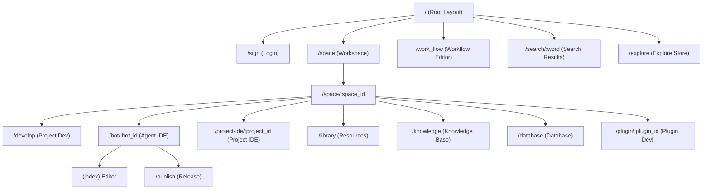

# Coze Studio Frontend - Main Application

## 1. 应用概览

Coze Studio 前端应用是一个基于 React 和 TypeScript 的现代 Web 应用，作为 AI Agent 开发平台的主入口。

- **包名**: `@coze-studio/app`
- **版本**: `0.0.1`
- **定位**: AI Agent 开发平台核心前端应用，负责集成各个功能模块（工作空间、Agent IDE、工作流编辑器等）。
- **构建工具**: [Rsbuild](https://rsbuild.dev/) (基于 Rspack 的高性能构建工具)

## 2. 核心技术栈

| 技术 | 版本 | 用途 |
| --- | --- | --- |
| **React** | 18.2.0 | 核心 UI 库 (react-jsx) |
| **React Router** | 6.11.1 | 路由管理 (Data Router API) |
| **TypeScript** | 5.8.2 | 静态类型检查 |
| **Zustand** | 4.4.7 | 轻量级状态管理 |
| **Rsbuild** | 1.1.0 | 构建与打包工具 |
| **Tailwind CSS** | 3.3.3 | 原子化 CSS 框架 |
| **Less** | - | CSS 预处理器 (配合 CSS Modules) |
| **Vitest** | ~3.0.5 | 单元测试框架（基于 Vite 生态，但主应用构建使用 Rsbuild） |

## 3. 入口点分析

应用采用标准的 React SPA (Single Page Application) 架构。

### 3.1 HTML 入口 (`index.html`)
极简结构，仅提供一个挂载点 `#root`。

```html
<!DOCTYPE html>
<html lang="en">
  <head>
    <meta charset="UTF-8" />
    <meta name="viewport" content="width=device-width, initial-scale=1.0" />
    <title>@coze-studio/app</title>
  </head>
  <body>
    <div id="root"></div>
  </body>
</html>
```

> **注意**：最终显示的页面标题 "扣子 Studio" 是在 `rsbuild.config.ts` 的 `html.title` 中配置的，而非直接在 index.html 中设置。

### 3.2 JS 入口 (`src/index.tsx`)
应用的初始化流程主要包含以下步骤：
1. **Feature Flags 初始化**: `initFlags()` 拉取功能开关配置。
2. **I18n 初始化**: `initI18nInstance()` 配置国际化（中/英），默认根据 `IS_OVERSEA` 环境变量决定。
3. **样式加载**: 动态加载 Markdown 渲染相关的样式 (`dynamicImportMdBoxStyle`)。
4. **React 挂载**: 使用 `createRoot` 将 `<App />` 挂载到 DOM。

```typescript
const main = () => {
  initFlags();
  initI18nInstance({ ... });
  dynamicImportMdBoxStyle();
  const root = createRoot(document.getElementById('root')!);
  root.render(<App />);
};
```

### 3.3 根组件 (`src/app.tsx`)
根组件主要配置全局的 `Suspense` 降级 UI 和路由提供者。

- **Suspense**: 使用 `<Spin />` 组件作为全局 Loading 状态。
- **RouterProvider**: 注入 `router` 配置。

## 4. 路由架构

应用使用 React Router v6 的 `createBrowserRouter` API，支持 Data Loader 模式。

### 4.1 路由结构图



### 4.2 路由配置示例
路由配置位于 `src/routes/index.tsx`，使用 Loader 属性传递布局配置（如是否显示侧边栏 `hasSider`）。

```typescript
{
  path: 'space',
  Component: SpaceLayout, // 懒加载组件
  loader: () => ({
    hasSider: true,
    requireAuth: true,
    subMenu: spaceSubMenu, // 侧边栏菜单组件
    menuKey: BaseEnum.Space,
  }),
  children: [...]
}
```

### 4.3 懒加载策略
所有主要页面组件均通过 `src/routes/async-components.tsx` 进行懒加载，以优化首屏性能。

- 使用 `React.lazy()` 动态 `import` 组件。
- 组件来自 monorepo 中的其他包（如 `@coze-foundation/space-ui-adapter`, `@coze-agent-ide/entry-adapter`），实现了业务模块的解耦。

## 5. 布局系统

布局组件主要由 `@coze-foundation/global-adapter` 和各业务模块提供。

- **GlobalLayout**: 顶层布局，包含顶部导航栏、全局 Context 初始化 (`useAppInit`)。
- **SpaceLayout / SpaceIdLayout**: 工作空间层级的布局，包含左侧项目列表或功能菜单。
- **AgentIDELayout**: Agent 编辑器的专用布局，全屏展示，隐藏标准侧边栏。
- **PluginLayout**: 插件开发页面的布局。

## 6. 状态管理

状态管理采用多层级、多 Store 的策略，主要基于 **Zustand**，并结合 **React Context** 处理依赖注入。

### 6.1 Zustand Store 架构
Store 采用标准模式创建，使用 `devtools` 和 `subscribeWithSelector` 中间件，结合 `Immer` 处理状态更新。

#### 核心 Store 分类

| 类别 | 包名 | 主要 Store | 用途 |
| --- | --- | --- | --- |
| **Bot 详情** | `@coze-studio/bot-detail-store` | `usePageRuntimeStore` | 编辑器运行时状态（保存、历史版本） |
| | | `useMultiAgentStore` | 多智能体模式管理 |
| | | `useBotSkillStore` | 技能配置（插件、工作流、知识库） |
| | | `useMonetizeConfigStore` | 货币化配置 |
| **基础服务** | `@coze-foundation/global-store` | `useCommonConfigStore` | 全局通用配置（横幅、视频配置） |
| **权限管理** | `@coze-common/auth` | `useSpaceAuthStore` | 空间权限与角色管理 |
| | | `useProjectAuthStore` | 项目权限与角色管理 |

#### Store 设计模式示例
```typescript
export const useXxxStore = create<State & Action>()(
  devtools(
    subscribeWithSelector((set, get) => ({
      // 1. 默认状态
      ...getDefaultState(),
      
      // 2. Immer 更新模式
      setXxxByImmer: (update) => 
        set(produce<State>(state => update(state))),
      
      // 3. 生命周期管理
      initStore: (data) => { /* ... */ },
      clear: () => set({ ...getDefaultState() })
    })),
    { enabled: IS_DEV_MODE, name: 'storeName' }
  )
);
```

### 6.2 React Context 使用
- **依赖注入**: 如 `@coze-arch/web-context` 用于注入平台特定的配置和枚举。
- **局部共享**: 对于不跨越整个应用组件树的状态，优先使用 Context 以避免全局 Store 膨胀。

## 7. API 与网络层

- **API Schema**: 使用 Thrift IDL 定义，通过 `@coze-studio/api-schema` 自动生成 TypeScript 类型定义，确保前后端类型安全。
- **HTTP Client**: 基于 `@coze-arch/bot-http` 或类似封装的 Axios 实例。
- **开发代理**:
  在 `rsbuild.config.ts` 中配置了代理，将 API 请求转发到本地 Go 后端。
  ```typescript
  proxy: [
    { context: ['/api'], target: 'http://localhost:8888/', changeOrigin: true },
    { context: ['/v1'], target: 'http://localhost:8888/', changeOrigin: true },
  ]
  ```

## 8. 样式方案

- **Tailwind CSS**: 主要样式工具。
  - 配置位于 `tailwind.config.ts`。
  - 使用 `getTailwindContents('@coze-studio/app')` 自动扫描依赖包中的样式使用。
  - 扩展了 `semi-theme-hand01` 主题 token。
- **Global Styles**: `src/global.less`
  - 设置最小宽度 `1200px`。
  - 定义全局字体 `PingFang SC`, `Noto Sans SC`。
  - 自定义滚动条样式 `.styled-scrollbar`。

## 9. 构建配置

基于 **Rsbuild**，配置文件 `rsbuild.config.ts` 关键点：

- **HTML**: 自定义 Title "扣子 Studio" 和 Favicon。
- **Source**:
  - 包含 `../../packages` 下的源码编译。
  - 定义环境变量 `process.env.IS_REACT18`, `ENABLE_COVERAGE` 等。
  - 配置别名 `alias` 指向本地 monorepo 包。
- **Performance**:
  - Chunk Split 策略: `split-by-size` (min 3MB, max 6MB)，针对大型应用优化。
- **Tools**:
  - 集成 PostCSS 和 Tailwind CSS 插件。
  - 配置 `@coze-arch/import-watch-loader` 用于开发热更新。

## 10. 包依赖关系

`@coze-studio/app` 作为宿主应用，聚合了多个业务包：

- **Agent IDE 层**: `@coze-agent-ide/*`
- **项目 IDE 层**: `@coze-project-ide/*`, `@coze-studio/project-publish`
- **工作流引擎层**: `@coze-workflow/*`
- **工作空间层**: `@coze-foundation/space-ui-*`, `@coze-studio/workspace-*`
- **基础设施**: `@coze-foundation/*`, `@coze-arch/*`

## 11. 开发与部署

### 常用命令
- `rushx dev`: 启动开发服务器 (默认端口 3000 -> 代理 8888)。
  - 注入变量: `IS_OPEN_SOURCE=true`, `CUSTOM_VERSION=release`。
- `rushx build`: 构建生产环境产物。
- `rushx preview`: 预览构建产物。

### 环境变量
- `WEB_SERVER_PORT`: 后端服务端口（默认 8888）。
- `IS_OPEN_SOURCE`: 标记是否为开源版本。
- `IS_OVERSEA`: 标记是否为海外版（影响 I18n 默认语言）。
