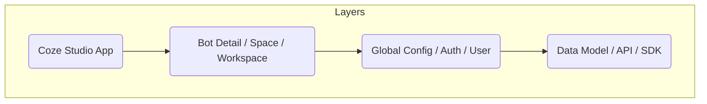

# 状态管理 (State Management)

## 概述

Coze Studio 前端架构采用了以 **Zustand** 为核心的响应式状态管理方案。该方案结合 **Immer** 实现不可变更新，并针对复杂的 IDE 场景设计了分层架构和自动化机制。

| 核心库 | 版本 | 用途 |
| :--- | :--- | :--- |
| **Zustand** | ^4.4.7 | 核心状态管理，提供极简的 Hook API |
| **Immer** | ^10.0.3 | 简化不可变数据结构的更新逻辑 |
| **Ahooks** | ^3.7.8 | 配合 React Hooks 管理部分组件级状态 |

项目的 Store 文件分布于 `frontend/packages/foundation/` 和 `frontend/packages/studio/stores/` 目录，覆盖从全局配置到具体业务模块的各个层面。

## 架构层次

状态管理架构遵循"关注点分离"原则，自下而上分为四层：



1.  **应用层 (Apps)**: 负责组合各个 Store，处理路由级别的状态初始化。
2.  **业务状态层 (Studio Stores)**: 处理特定业务场景的复杂逻辑（如 Bot 编排、工作流编辑）。
3.  **基础状态层 (Foundation Stores)**: 提供通用的基础设施状态（如用户信息、全局配置、权限）。
4.  **领域状态层 (Domain Stores)**: 封装底层数据实体和 API 交互。

## 核心 Store 模式

### 1. Global Store (全局配置)

全局 Store 用于管理跨应用的基础配置，如 Feature Flags、环境信息等。位于 `@coze-foundation/global-store`。

**特点**：
*   使用 `devtools` 中间件进行调试监控。
*   单例模式，应用启动时初始化。

```typescript
// frontend/packages/foundation/global-store/src/stores/common-config-store.ts
import { devtools } from 'zustand/middleware';
import { create } from 'zustand';

export const useCommonConfigStore = create<ICommonConfigStoreState & ICommonConfigStoreAction>()(
  devtools(set => ({
    ...DEFAULT_COMMON_CONFIG_STATE,
    updateCommonConfigs(commonConfigs: ICommonConfig) {
      set(state => ({ ...state, commonConfigs }));
    },
    setInitialized: () => {
      set({ initialized: true });
    },
  })),
);
```

### 2. Space Store (空间管理)

空间管理采用了 **Adapter 模式**，将底层实现 (`space-store-adapter`) 与业务逻辑分离，支持多空间切换和轮询机制。

**特点**：
*   **轮询机制**: `fetchSpaces` 内置轮询逻辑，确保空间列表实时更新。
*   **Promise 缓存**: 防止并发请求导致的竞态问题。
*   **自动创建**: 检测到无个人空间时自动创建。

```typescript
// frontend/packages/foundation/space-store-adapter/src/space/index.ts
export const useSpaceStore = create<SpaceStoreState & SpaceStoreAction>()(
  devtools((set, get) => ({
    ...defaultState,
    
    // 轮询与缓存机制示例
    fetchSpaces: async (force?: boolean) => {
      const request = async () => {
        const { data } = await PlaygroundApi.GetSpaceListV2({});
        return data;
      };
      // 复用进行中的 Promise
      const prePromise = get().loading;
      const currentPromise = force ? request() : prePromise || request();
      
      // ... 处理 loading 状态和轮询结果
    },
  })),
);
```

### 3. Bot Detail Store (最复杂业务状态)

Bot 详情页状态是系统中最复杂的部分，采用了 **组合 Store** 和 **Setter Factory** 模式。

**架构设计**：
*   **Store 拆分**: 将庞大的 Bot 状态拆分为 11+ 个子 Store（Persona, Model, BotSkill, BotInfo 等）。
*   **统一初始化**: 通过 `initBotDetailStore` 统一聚合初始化。
*   **Immer 集成**: 使用 `produce` 简化深层对象更新。
*   **细粒度订阅**: 使用 `subscribeWithSelector` 优化渲染性能。

```typescript
// frontend/packages/studio/stores/bot-detail/src/store/bot-skill/store.ts
export const useBotSkillStore = create<BotSkillStore & BotSkillAction>()(
  devtools(
    subscribeWithSelector((set, get) => ({
      ...getDefaultBotSkillStore(),

      // Setter Factory 模式，减少样板代码
      setBotSkill: setterActionFactory<BotSkillStore>(set),
      
      // Immer 集成模式
      setBotSkillByImmer: update =>
        set(produce<BotSkillStore>(botSkill => update(botSkill))),
        
      // 复杂更新逻辑
      updateSkillPluginApis: (pluginApis: PluginApi[]) => {
        set(s => ({
          ...s,
          pluginApis: getPluginApisFilterExample(pluginApis),
        }));
      },
    })),
    { name: 'botStudio.botDetail.botSkill' }
  ),
);
```

### 4. Bot Plugin Store (动态实例)

为了支持多插件实例隔离，插件 Store 采用了 **Factory + Context** 模式，而不是全局单例。

**特点**：
*   **动态创建**: 使用 `createPluginStore` 工厂函数为每个插件实例创建独立的 Store。
*   **Context 注入**: 通过 `BotPluginStoreProvider` 将 Store 实例下发给子组件。
*   **生命周期管理**: 支持数据清理和生命周期扩展。

```typescript
// frontend/packages/common/chat-area/chat-area/src/hooks/context/use-create-plugin-store.ts
export const useCreatePluginStoreSet = ({ mark, scene }) => {
  // 使用 useCreation 确保 Store 实例的稳定性
  const usePluginStore = useCreation(
    () => preStore?.usePluginStore || createPluginStore(mark),
    [],
  );
  return { usePluginStore };
};
```

### 5. Workflow Store

工作流编辑器状态管理关注于图数据的实时操作。

**特点**：
*   **简洁设计**: 核心状态仅包含 `nodes`, `edges` 和画布状态。
*   **操作原子化**: 每个节点拖拽、连线都对应原子化的 Action。

## 高级模式

### AutoSave System (自动保存系统)

IDE 场景下，自动保存是核心体验。项目实现了一套基于 **Observer 模式** 的通用自动保存管理器。

**核心组件 (`@coze-studio/autosave`)**：
1.  **AutosaveManager**: 管理器类，负责注册 Observer 和协调保存请求。
2.  **Observer**: 监听 Zustand Store 的变化。
3.  **Debounce**: 内置防抖逻辑，避免频繁网络请求。

```typescript
// frontend/packages/studio/autosave/src/core/manager.ts
export class AutosaveManager<StoreType, ScopeKey, ScopeStateType> {
  // 注册需要自动保存的 Store 片段
  public register = (registers) => { ... };

  // 启动监听
  public start = () => {
    this.observerList = this.configList.map(config =>
      new AutosaveObserver({ store: this.store, ...config })
    );
  };
  
  // 强制立即保存
  public saveFlush = (key: ScopeKey) => { ... };
}

// 使用示例 (Persona 模块)
export const personaSaveManager = new AutosaveManager({
  store: usePersonaStore,
  registers: [personaConfig],
  saveRequest,
});
```

### 状态共享策略

1.  **直接导入 (Direct Import)**: 对于全局单例 Store（如 UserStore），直接 import hook 使用。
2.  **Adapter 封装**: 跨包共享时，通过 Adapter 包（如 `space-store-adapter`）暴露接口，隐藏实现细节。
3.  **Context 注入**: 对于需要多实例隔离的场景（如插件、多 Agent 编辑），通过 React Context 传递 Store 实例。

### 性能优化

1.  **Selector 优化**: 必须使用 Selector 选取最小状态集，避免全量订阅导致的不必要重渲染。
    ```typescript
    // ✅ Good
    const name = useStore(state => state.name);
    // ❌ Bad
    const { name } = useStore(); 
    ```
2.  **Shallow 比较**: 对于返回对象的 Selector，使用 `shallow` 比较函数。
3.  **subscribeWithSelector**: 在非 React 组件中（如 Manager 类中）监听状态变化，精确控制响应粒度。
4.  **动态 Store**: 仅在组件挂载时创建 Store，卸载时销毁，减少内存占用。

## 最佳实践

1.  **创建 Store**: 优先使用 `create` + `devtools` 中间件，并在开发模式下启用命名。
2.  **状态更新**:
    *   简单层级更新使用 `set` + Spread Operator。
    *   复杂嵌套更新**必须**使用 `immer` (`produce`)。
3.  **Action 定义**: 业务逻辑应封装在 Store 的 Actions 中，组件只负责调用。
4.  **DevTools 命名**: 为每个 Store 定义清晰的命名空间（如 `botStudio.botDetail.botSkill`），便于调试。
