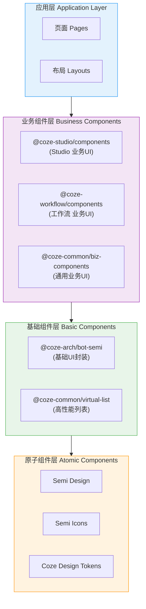

# UI 组件系统架构

本文档详细说明 Coze Studio 前端 UI 组件系统的架构设计、分层策略及核心实现细节。系统基于 Semi Design 构建，通过多层封装实现业务定制与品牌一致性。

## 1. 概述

Coze Studio UI 系统采用了 **"原子基础 + 业务增强"** 的分层架构。底层复用成熟的 Semi Design 体系，上层通过 `@coze-arch` 和业务包进行定制封装，形成了覆盖 Semi 大部分组件并提供增强组件的企业级 UI 解决方案。

### 核心技术栈

| 类别 | 技术选型 | 版本/说明 |
| :--- | :--- | :--- |
| **UI 基础库** | `@douyinfe/semi-ui` | `~2.72.3` |
| **图标库** | `@douyinfe/semi-icons` | `^2.36.0` |
| **设计系统** | `@coze-arch/coze-design` | `0.0.6-alpha.346d77` |
| **定制主题** | `@coze-arch/semi-theme-hand01` | 定制品牌主题包 |
| **样式引擎** | Less + Tailwind CSS | 双引擎驱动 |

---

## 2. 组件封装分层

组件系统自下而上分为四层，严格控制依赖方向，禁止反向依赖。

### 2.1 原子组件层 (Atomic Layer)
直接使用 Semi Design 提供的基础组件（Button, Input, Modal 等）以及 Coze Design 定义的基础 Design Tokens。

### 2.2 基础组件层 (Basic Layer)
**核心包：`@coze-arch/bot-semi`**
- **定位**：对 Semi 组件进行"Coze 风格化"的浅层封装。
- **作用**：统一默认 Props、样式覆盖、行为修正，屏蔽底层库的直接依赖。
- **包含组件**：50+ 个，如 `UIButton`, `UIModal`, `UITable`, `UIInput`。
- **增强特性**：
    - `UIModal`: 集成 `useGrab` 拖拽能力，统一样式。
    - `UISelect`: 定制下拉菜单宽度策略。

### 2.3 业务组件层 (Business Layer)
包含特定业务逻辑的复合组件。

- **`@coze-studio/components` (40+组件)**
    - **场景**：Studio IDE 核心区域。
    - **组件**：`CozeBrand` (品牌标识), `AvatarName` (头像组合), `MarkdownEditor`, `InputWithCount`, `SortableList` (基于 react-dnd), `ResizableLayout`.

- **`@coze-workflow/components` (10+组件)**
    - **场景**：工作流编排画布。
    - **组件**：`ExpressionEditor` (Slate.js 实现), `WorkflowModal`, `WorkflowEdit`, `ImageUploader`.

- **`@coze-common/biz-components`**
    - **场景**：跨应用通用的业务区块。
    - **组件**：`Banner`, `PictureUpload`, `Parameters` (参数配置表), `Coachmark` (引导气泡).

---

## 3. 样式系统 (Styling System)

项目采用 CSS Modules (Less) 与 Tailwind CSS 混合使用的策略，既保证了组件样式的隔离性，又提供了原子类开发的便捷性。

### 3.1 技术架构
- **预处理器**: Less + CSS Modules (`.module.less`)
- **原子类框架**: Tailwind CSS 3.3.3
- **后处理器**: PostCSS (支持 nesting, import)
- **Lint工具**: Stylelint 15.11.0

### 3.2 Tailwind 配置 (`@coze-arch/tailwind-config`)

Tailwind 配置深度集成了 Coze Design 的 Token 系统：

- **颜色系统 (Color Palette)**
    - `foreground`: 文本/图标色，等级 1-7 (e.g., `text-coz-fg-primary`).
    - `background`: 背景色，等级 0-9 (e.g., `bg-coz-bg-0`).
    - `brand`: 品牌主色，等级 0-7, 50 (e.g., `text-coz-brand-1`).
    - `functional`: 成功、警告、错误等功能色.

- **语义化工具类**
    - `coz-fg-primary`: 主要文本
    - `coz-bg-secondary`: 次级背景
    - `coz-border-subtle`: 微弱边框

- **间距系统 (Spacing)**
    - 基于 tokens 定义: `mini`, `small`, `normal`, `large`.

### 3.3 主题系统 (Theming)
- **暗色模式**: 支持 `darkMode: 'class'` 策略，通过 HTML 根节点 class 切换。
- **CSS 变量**: Design Tokens 映射为 CSS Variables (如 `--coze-brand-5`)，实现运行时动态换肤。
- **Semi 主题**: 使用 `@coze-arch/semi-theme-hand01` 覆盖 Semi 默认样式。

---

## 4. 图标系统 (Iconography)

- **核心包**: `@coze-arch/bot-icons`
- **实现**:
    - 封装 `@douyinfe/semi-icons`。
    - 自定义 SVG 图标通过构建工具链处理。
- **构建工具**:
    - `vite-plugin-svgr`: 将 SVG 转换为 React 组件。
    - `@rsbuild/plugin-svgr`: 生产环境构建支持。
- **使用规范**: 优先使用语义化图标组件，支持 `spin`, `rotate`, `size` 等标准属性。

---

## 5. 设计模式 (Design Patterns)

### 5.1 增强型封装 (Enhancement)
保留原组件 API，仅增加特定功能。
*示例*: `UIModal` 在 `Modal` 基础上增加了 `useGrab` hook 实现头部拖拽。

### 5.2 组合型封装 (Composition)
将多个原子组件组合为业务区块。
*示例*: `InputWithCount` 组合了 `Input` 和字数统计 `Text`。

### 5.3 Hook 模式
提取交互逻辑。
*示例*:
- `useGrab`: 为模态框提供拖拽逻辑。
- `useUIModal`: 命令式调用模态框的 Hook 封装。

### 5.4 适配器模式 (Adapter)
在 `@coze-arch/bot-semi` 层屏蔽底层库差异，方便未来潜在的底层库升级或替换。

---

## 6. 响应式与可访问性

### 响应式设计 (Responsive)
- **工具包**: `@coze-arch/responsive-kit`
- **Hooks**: `useMediaQuery` 监听屏幕断点。
- **组件**: `ResponsiveBox` 根据容器宽度渲染不同内容。
- **Tailwind**: 使用 `md:`, `lg:` 等断点修饰符。

### 可访问性 (Accessibility / A11y)
- **ARIA**: 组件内部集成标准 ARIA 属性 (role, aria-label, aria-expanded)。
- **键盘导航**: 确保所有交互元素支持 Tab 键索引和 Enter/Space 激活。
- **焦点管理**: 模态框打开时自动聚焦，关闭时还原焦点。

---

## 7. 开发与优化

### Storybook
- **集成**: 使用 `@storybook/react-vite`。
- **覆盖**: `@coze-workflow/components` 等业务组件库拥有完整的 Storybook 文档，便于独立开发和测试。

### 性能优化
- **Tree Shaking**: 所有组件包均支持 ES Modules 导出，确保按需加载。
- **虚拟化**: 大数据量列表使用 `@coze-common/virtual-list` (基于 react-window) 渲染。
- **代码分割**: 复杂组件（如 Slate 编辑器）采用动态导入 (Dynamic Import)。
