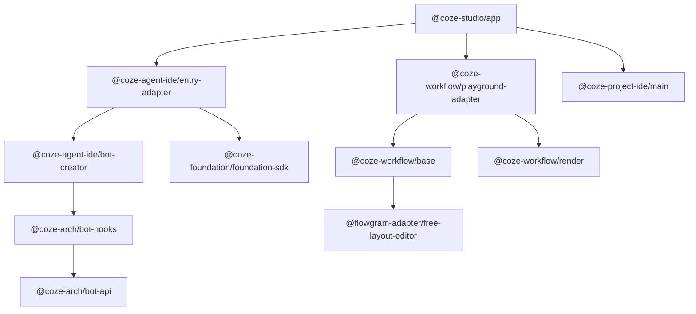
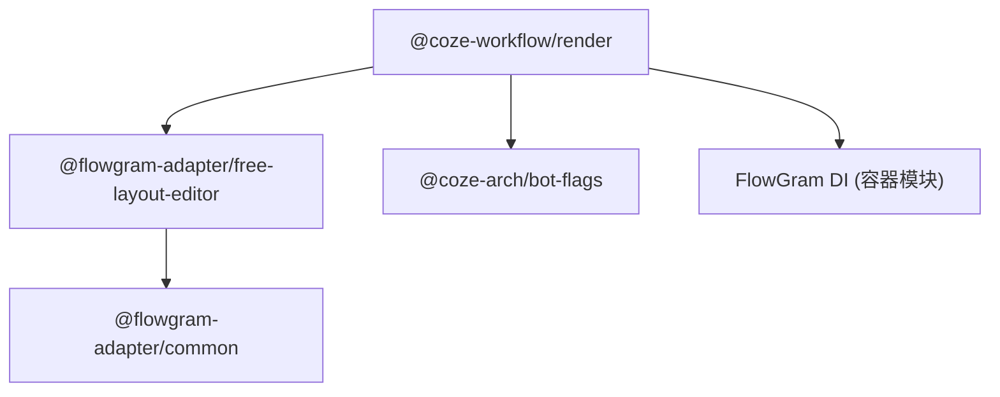
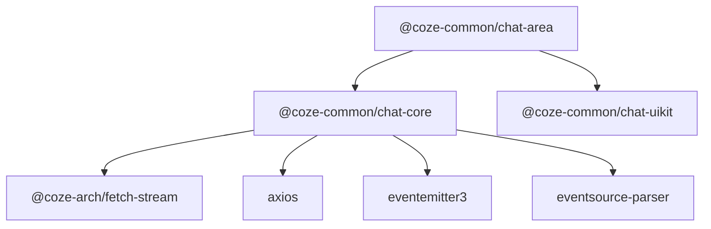

# 前端依赖图谱 (Frontend Dependency Graph)

## 概述

Coze Studio 前端架构由 259+ 个 Rush 项目组成（包含内部业务包和配置包），这些包通过严格的 4 层分级体系（Level 1 到 Level 4）来组织依赖关系，确保架构的可维护性和可扩展性。

## 依赖层级架构

### Level 1 - 基础设施层
这是架构的最底层，无内部依赖或仅有同层依赖。它们提供了项目的基础构建块。

- **配置包**: `eslint-config`, `ts-config`, `stylelint-config`, `tailwind-config`, `vitest-config`, `rsbuild-config`
- **核心工具**: `utils`, `logger`, `bot-error`, `bot-flags` (特性开关), `bot-typings` (全局类型), `bot-env`, `web-context`
- **UI基础**: `bot-semi` (UI组件库封装), `bot-icons`, `assets`
- **国际化**: `i18n`, `studio-i18n-resource-adapter`
- **接口定义**: `idl`, `slardar-interface`, `tea-interface`, `uploader-interface`
- **基座核心**: `space-store`, `local-storage`
- **API层** (按 rush.json 标记为 level-1): `bot-api`, `bot-http`

### Level 2 - 核心服务层
构建在 Level 1 之上，提供通用的业务无关服务。

- **API扩展**: `bot-space-api`, `api-schema`
- **状态管理**: `bot-studio-store`, `user-store`
- **工具包**: `bot-utils`
- **监控埋点**: `report-events`, `report-tti`, `bot-tea`, `slardar-adapter`
- **数据层**: `reporter`, `utils` (通用), `e2e` (测试辅助)
- **聊天核心**: `chat-core` (核心逻辑), `chat-area-utils`, `fetch-stream` (流式响应处理)
- **认证**: `auth`, `auth-adapter`, `account-base`
- **IDL工具链**: `idl-parser`, `idl2ts-cli`, `idl2ts-generator`, `idl2ts-helper`, `idl2ts-plugin`, `idl2ts-runtime`
- **Flowgram适配器**: `@flowgram-adapter/common`, `free-layout-editor`, `fixed-layout-editor`

### Level 3 - 业务功能层
包含了具体的业务模块和功能实现，依赖 Level 1 和 Level 2。

- **Workflow引擎**: `@coze-workflow/base`, `render`, `sdk`, `nodes`, `variable`, `history`, `components`, `playground`, `test-run-next` 等
- **Studio组件**: `components` (通用业务组件), `biz-components`
- **聊天区域**: `chat-area` (UI实现), `chat-uikit`, `chat-hooks`, 及各类聊天插件
- **Agent IDE**: `@coze-agent-ide/bot-creator`, `layout`, `navigate`, `entry-adapter`, 各类编辑器与插件
- **数据管理**: `database`, `database-v2`, `knowledge` 系列包
- **DevOps**: `testset-manage`, `mockset-manage`, `debug-panel`
- **Project IDE**: `@coze-project-ide/base-interface`, `ui-adapter`, `core`, `main`
- **Studio功能**: `autosave`, `bot-plugin-store`, `workspace` 系列
- **Foundation功能**: `global-store`, `layout`, `foundation-sdk`, `account-ui`, `space-ui`
- **开放平台**: `open-auth`, `open-chat`, `chat-app-sdk`

### Level 4 - 应用层
架构的顶层，负责组装各个模块。

- **@coze-studio/app**: 主应用入口，依赖所有下层包。

## 关键依赖链

### 主应用依赖链

### Workflow依赖链

### 聊天系统依赖链

## 共享依赖分析

### 高引用量内部包
这些包是整个系统的基石，变更影响范围广。引用数据基于 `rush.json` 依赖分析。

1. **@coze-arch/bot-api** (80+ 引用): API 请求定义的中心仓库。
2. **@coze-arch/bot-semi** (60+ 引用): UI 组件的基础封装。
3. **@coze-arch/i18n** (50+ 引用): 国际化支持。
4. **@coze-arch/logger** (40+ 引用): 统一日志记录。
5. **@coze-arch/bot-flags** (40+ 引用): 特性开关管理。
6. **@coze-arch/bot-typings** (196 devDeps): 通用类型定义。

### 高引用量外部包
系统依赖的核心第三方库。引用数据基于 `common/config/subspaces/default/pnpm-lock.yaml` 分析。

1. **react/react-dom** ~18.2.0: 核心视图库（所有 UI 包）。
2. **lodash-es** ^4.17.21 (40+ 引用): 通用工具函数。
3. **zustand** ^4.4.7 (30+ 引用): 状态管理。
4. **classnames** ^2.3.2 (30+ 引用): CSS 类名处理。
5. **@douyinfe/semi-ui** ~2.72.3 (20+ 引用): 基础 UI 组件库。
6. **axios** ^1.4.0 (15+ 引用): HTTP 请求。
7. **ahooks** ^3.7.8 (15+ 引用): React Hooks 工具库。

## 关键外部依赖

### 核心框架
- `react` ~18.2.0
- `react-dom` ~18.2.0
- `react-router-dom` ^6.11.1

### 状态管理
- `zustand` ^4.4.7: 轻量级状态管理（30+ 包引用）。
- `immer` ^10.0.3: 不可变数据结构处理。
- `@tanstack/react-query` ~5.13.4: 服务端状态管理。

### UI组件
- `@douyinfe/semi-ui` ~2.72.3: 主要 UI 库。
- `@coze-arch/coze-design`: 自研设计系统实现。

### 构建工具
- `@rsbuild/core` ~1.1.0: 高性能构建工具。
- `tailwindcss` ~3.3.3: 原子化 CSS。
- `typescript` ~5.8.2: 静态类型检查。

### 其他核心库
- `eventemitter3` ^5.0.1: 事件总线。
- `dayjs` ^1.11.7: 日期处理。
- `nanoid` ^4.0.2: ID 生成。

## 架构模式

### Adapter-Base 模式
为了隔离具体实现和接口定义，项目采用 Adapter-Base 模式（参考 `frontend/packages/` 目录中的 `*-base` 和 `*-adapter` 包对）。
- **Base 包**: 定义接口 (Interface) 和基础抽象类，位于较低层级。
- **Adapter 包**: 提供具体实现 (Implementation)，依赖 Base 包，位于较高层级或同级。
这种模式用于隔离接口定义与具体实现。

### 分层架构 (Layered Architecture)
严格遵守单向依赖原则：
`Level 4 (App) -> Level 3 (Feature) -> Level 2 (Core) -> Level 1 (Infra) -> External`
禁止反向依赖。

### 按业务领域划分的包结构
包的组织结构按业务领域划分（参考 `frontend/packages/` 目录结构）：
- `arch`: 架构基础设施
- `foundation`: 基础业务能力
- `common`: 通用业务逻辑
- `studio`: Studio 特定业务
- `workflow`: 工作流引擎领域
- `agent-ide`: Agent 开发环境领域
- `project-ide`: 项目开发环境领域
- `data`: 数据处理领域

## 循环依赖防护
为了防止复杂的循环依赖问题，项目采用了基于 Level 标签的防护机制。
- 每个包在 `rush.json` 的 `projects[*].tags` 中标记其层级 (如 `level-1`, `level-2` 等)。
- 通过 Rush 插件或自定义 Lint 规则检查：**Level N 的包只能依赖 Level N-1 及以下的包（或同层级，视具体严格程度而定）。**
- 这确保了依赖图的有向无环特性 (DAG)。
- 注：具体检查规则配置位于 `common/autoinstallers/plugins/rush-plugins/@coze-arch/rush-dep-level-check-plugin/` 目录。
