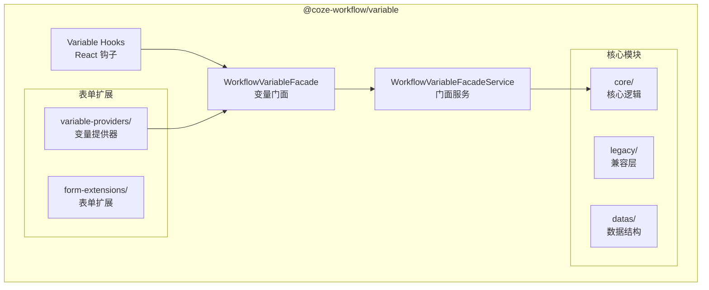
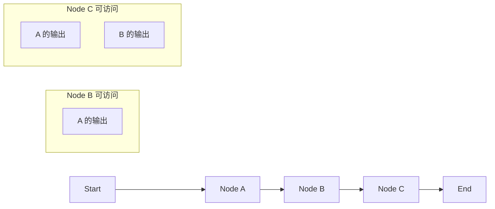

# 变量系统详解

> 工作流变量系统是整个引擎的核心，负责变量定义、类型推断、作用域管理和循环引用检测。

## 架构概览



## 核心文件结构

```
frontend/packages/workflow/variable/
├── src/
│   ├── core/
│   │   ├── workflow-variable-facade.ts       # 变量门面类
│   │   ├── workflow-variable-facade-service.ts
│   │   └── utils/
│   │       ├── parse-ast.ts                  # AST 解析
│   │       └── name-path.ts                  # 路径处理
│   ├── hooks/
│   │   ├── use-workflow-variable-by-keypath.tsx
│   │   ├── use-variable-type.tsx
│   │   ├── use-variable-rename.tsx
│   │   ├── use-variable-dispose.tsx
│   │   └── use-available-workflow-variables.tsx
│   ├── legacy/
│   │   ├── workflow-variable-service.ts
│   │   ├── workflow-variable-validation-service.ts
│   │   └── variable-utils.ts
│   ├── services/
│   │   └── global-variable-service.ts
│   └── form-extensions/
│       └── variable-providers/
│           ├── provide-node-output-variables.tsx
│           └── provide-node-batch-variables.tsx
```

## WorkflowVariableFacade

变量门面是访问变量的统一入口，封装了底层 AST 操作：

```typescript
// frontend/packages/workflow/variable/src/core/workflow-variable-facade.ts

export class WorkflowVariableFacade {
  protected _fieldVersion: number;
  protected _variableMeta: ViewVariableMeta | undefined;
  protected _keyPath: string[];

  constructor(
    public readonly field: WorkflowVariableField,
    protected readonly _facadeService: WorkflowVariableFacadeService,
  ) {}

  // 获取变量元数据
  get viewMeta(): ViewVariableMeta | undefined {
    if (this._fieldVersion !== this.field.version) {
      this._variableMeta = getViewVariableByField(this.field);
    }
    return this._variableMeta;
  }

  // 获取变量类型
  get viewType(): ViewVariableType | undefined {
    return getViewVariableTypeByAST(this.field.type)?.type;
  }

  // 获取渲染类型 (用于 UI 显示)
  get renderType(): JSX.Element | string | undefined {
    if (!this.viewType) {
      return 'Unknown';
    }
    return VARIABLE_TYPE_ALIAS_MAP[this.viewType];
  }

  // 获取变量键
  get key(): string {
    return this.field.key;
  }

  // 获取子变量 (用于对象/数组类型)
  get children(): WorkflowVariableFacade[] {
    const { childFields } = getViewVariableTypeByAST(this.field.type);
    return (childFields || []).map(_field =>
      this._facadeService.getVariableFacadeByField(_field),
    );
  }

  // 获取父变量链
  get parentVariables(): WorkflowVariableFacade[] {
    const { parentFields } = this.field;
    return parentFields
      .reverse()
      .map(_field => this._facadeService.getVariableFacadeByField(_field));
  }

  // 获取表达式路径 (用于变量引用)
  get expressionPath(): { source: string; keyPath: string[] } {
    return {
      source: this.globalVariableKey ?? WORKFLOW_VARIABLE_SOURCE,
      keyPath: this.keyPath,
    };
  }

  // 检查节点是否可以访问该变量
  canAccessByNode(nodeId: string) {
    return !!this.field.scope.coverScopes.find(_scope => _scope.id === nodeId);
  }

  // 监听变量销毁
  onDispose(cb?: () => void): Disposable {
    const toDispose = new DisposableCollection();
    // ... 处理变量销毁回调
    return toDispose;
  }

  // 监听变量重命名
  onRename(cb?: (params: RenameInfo) => void): Disposable {
    return this._facadeService.fieldRenameService.onRename(({ before, after }) => {
      // ... 处理重命名回调
    });
  }

  // 监听类型变更
  onTypeChange(cb?: (facade: WorkflowVariableFacade) => void): Disposable {
    return this.field.subscribe(() => cb?.(this), {
      selector: field => {
        const { type } = getViewVariableTypeByAST(field.type);
        return type;
      },
    });
  }
}
```

## 支持的变量类型

```typescript
// frontend/packages/workflow/base/src/types/view-variable-type.ts

export enum ViewVariableType {
  String = 'string',
  Number = 'number',
  Boolean = 'boolean',
  Object = 'object',
  Array = 'array',
  File = 'file',
  MultiFile = 'multi_file',
  SingleChoice = 'single_choice',
}

// 类型别名映射 (用于 UI 显示)
export const VARIABLE_TYPE_ALIAS_MAP = {
  [ViewVariableType.String]: 'String',
  [ViewVariableType.Number]: 'Number',
  [ViewVariableType.Boolean]: 'Boolean',
  [ViewVariableType.Object]: 'Object',
  [ViewVariableType.Array]: 'Array',
  [ViewVariableType.File]: 'File',
  [ViewVariableType.MultiFile]: 'Files',
  [ViewVariableType.SingleChoice]: 'Choice',
};
```

## 变量 Hooks

### useAvailableWorkflowVariables

获取当前节点可用的所有变量：

```typescript
// frontend/packages/workflow/variable/src/hooks/use-available-workflow-variables.tsx

export function useAvailableWorkflowVariables(nodeId: string) {
  const facadeService = useService(WorkflowVariableFacadeService);
  
  return useMemo(() => {
    return facadeService.getAvailableVariables(nodeId);
  }, [facadeService, nodeId]);
}
```

### useWorkflowVariableByKeypath

通过 keyPath 获取变量门面：

```typescript
// frontend/packages/workflow/variable/src/hooks/use-workflow-variable-by-keypath.tsx

export function useWorkflowVariableByKeypath(keyPath: string[]) {
  const facadeService = useService(WorkflowVariableFacadeService);
  
  return useMemo(() => {
    return facadeService.getVariableFacadeByKeypath(keyPath);
  }, [facadeService, keyPath]);
}
```

### useVariableType

获取变量类型并监听变化：

```typescript
// frontend/packages/workflow/variable/src/hooks/use-variable-type.tsx

export function useVariableType(facade: WorkflowVariableFacade) {
  const [type, setType] = useState(facade.viewType);
  
  useEffect(() => {
    return facade.onTypeChange(updated => {
      setType(updated.viewType);
    });
  }, [facade]);
  
  return type;
}
```

## 变量引用格式

工作流使用 `{{ }}` 语法引用变量：

```
{{ node_id.output_name }}           // 引用节点输出
{{ node_id.output_name.field }}     // 引用嵌套字段
{{ sys.user_id }}                   // 引用系统变量
{{ input.param_name }}              // 引用输入参数
```

### 表达式 DTO 结构

```typescript
// 源码路径: frontend/packages/workflow/base/src/types/dto.ts:157-166 (摘录)
export interface ValueExpressionDTO {
  type?: string;                // 变量类型（可选）
  assistType?: number;          // 辅助类型，用于文件类型细分（可选）
  schema?: any;                 // JSON Schema 定义（可选）
  value:
    | DTODefine.LiteralExpression      // 字面量表达式
    | DTODefine.RefExpression          // 引用表达式
    | DTODefine.ObjectRefExpression;   // 对象引用表达式
}

// 工厂方法 (dto.ts:169-185)
export namespace ValueExpressionDTO {
  export function createEmpty(): ValueExpressionDTO {
    return {
      type: 'string',
      value: { type: 'ref', content: { source: 'block-output', blockID: '', name: '' } },
    };
  }
}
```

## 全局变量

系统提供预定义的全局变量：

```typescript
// frontend/packages/workflow/variable/src/constants.ts

export type GlobalVariableKey = 
  | 'sys'      // 系统变量
  | 'input'    // 输入变量
  | 'env';     // 环境变量

export const GLOBAL_VAR_ALIAS_MAP = {
  sys: '系统变量',
  input: '输入参数',
  env: '环境变量',
};
```

### 全局变量服务

```typescript
// frontend/packages/workflow/variable/src/services/global-variable-service.ts

export class GlobalVariableService {
  private _variables: Map<GlobalVariableKey, WorkflowVariableFacade[]>;
  
  registerGlobalVariable(key: GlobalVariableKey, facade: WorkflowVariableFacade) {
    // ... 注册全局变量
  }
  
  getGlobalVariables(key: GlobalVariableKey): WorkflowVariableFacade[] {
    return this._variables.get(key) || [];
  }
}
```

## 变量提供器

变量提供器为表单组件提供可选变量列表：

```typescript
// frontend/packages/workflow/variable/src/form-extensions/variable-providers/provide-node-output-variables.tsx

export function provideNodeOutputVariables(
  nodeId: string,
  options?: ProviderOptions
): VariableProvider {
  return (facadeService) => {
    const variables = facadeService.getNodeOutputVariables(nodeId);
    
    return variables.filter(v => {
      if (options?.typeFilter) {
        return options.typeFilter.includes(v.viewType);
      }
      return true;
    });
  };
}
```

## 循环引用检测

变量系统内置循环引用检测，防止无限循环：

```typescript
// frontend/packages/workflow/variable/src/legacy/workflow-variable-validation-service.ts

export class WorkflowVariableValidationService {
  checkRefCycle(
    sourceNodeId: string,
    targetKeyPath: string[]
  ): ValidationResult {
    const visited = new Set<string>();
    const stack = [targetKeyPath];
    
    while (stack.length > 0) {
      const current = stack.pop()!;
      const nodeId = current[0];
      
      if (visited.has(nodeId)) {
        return {
          valid: false,
          error: 'CIRCULAR_REFERENCE',
          path: current,
        };
      }
      
      visited.add(nodeId);
      
      // 获取该节点引用的其他变量
      const refs = this.getNodeReferences(nodeId);
      stack.push(...refs);
    }
    
    return { valid: true };
  }
}
```

## 变量作用域

每个节点的输出变量有特定的作用域，只有后续节点可以访问：



```typescript
// 作用域覆盖检查
canAccessByNode(nodeId: string) {
  return !!this.field.scope.coverScopes.find(_scope => _scope.id === nodeId);
}
```

## 变量事件系统

变量系统提供事件机制监听变化：

| 事件 | 触发时机 | 用途 |
|------|----------|------|
| `onDispose` | 变量被删除 | 清理引用 |
| `onRename` | 变量重命名 | 更新引用路径 |
| `onTypeChange` | 类型变更 | 更新 UI 显示 |
| `onDataChange` | 数据变更 | 重新验证 |

## 最佳实践

1. **使用 Hooks 访问变量**: 优先使用 `useAvailableWorkflowVariables` 等 Hooks
2. **监听变量变化**: 使用 `onRename`/`onTypeChange` 保持 UI 同步
3. **类型过滤**: 使用 `typeFilter` 只显示兼容类型的变量
4. **作用域检查**: 使用 `canAccessByNode` 验证变量可访问性
5. **避免循环引用**: 在保存前调用 `checkRefCycle` 验证
