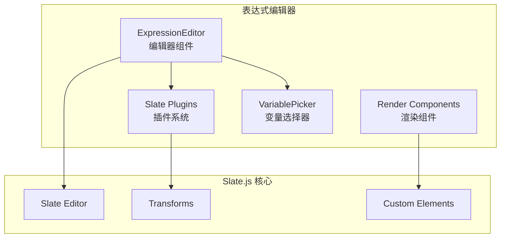
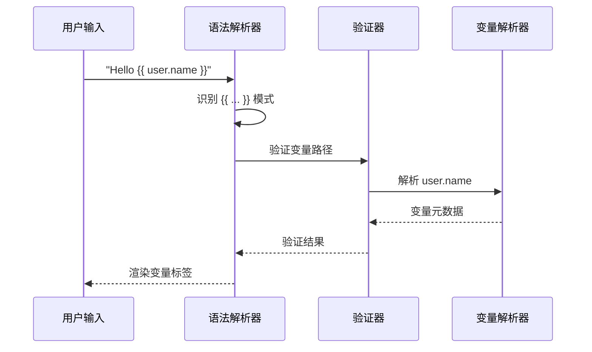

# 表达式编辑器详解

> 表达式编辑器是工作流中用于输入变量引用和表达式的核心组件，基于 Slate.js 实现富文本编辑能力。

## 架构概览



## 核心文件结构

> **注意**: 以下为概念性文件结构示意，用于说明表达式编辑器的模块组织。实际实现位于 `frontend/packages/workflow/playground/src/node-registries/common/` 目录下，主要文件包括：
> - `fields/expression-editor-field.tsx`
> - `components/expression-editor-field.tsx`

```
# 概念性结构示意
expression-editor/
├── components/
│   ├── render/                       # 自定义元素渲染
│   ├── variable-tag/                 # 变量标签组件
│   └── variable-picker/              # 变量选择器
├── plugins/
│   ├── with-variables.ts             # 变量处理插件
│   ├── with-mentions.ts              # @提及插件
│   └── with-keyboard.ts              # 键盘快捷键
├── utils/
│   ├── serialize.ts                  # 序列化/反序列化
│   └── transforms.ts                 # 自定义变换
└── index.tsx                         # 主入口
```

## 表达式语法

工作流使用 `{{ }}` 语法表示变量引用：

```
{{ node_id.output_name }}           # 简单引用
{{ node_id.output.nested.field }}   # 嵌套引用
{{ sys.user_id }}                   # 系统变量
{{ input.param_name }}              # 输入参数
```

### 语法解析流程



## ExpressionEditor 组件

```typescript
// 示意代码 - 展示 ExpressionEditor 组件的核心结构
// 实际实现位于 frontend/packages/workflow/playground/src/node-registries/common/

import { Slate, Editable, withReact } from 'slate-react';
import { createEditor, Transforms, Editor } from 'slate';

interface ExpressionEditorProps {
  value: string;
  onChange: (value: string) => void;
  variables: WorkflowVariableFacade[];
  placeholder?: string;
  disabled?: boolean;
}

export const ExpressionEditor: React.FC<ExpressionEditorProps> = ({
  value,
  onChange,
  variables,
  placeholder,
  disabled,
}) => {
  // 创建编辑器实例，应用自定义插件
  const editor = useMemo(() => {
    return withVariables(
      withMentions(
        withKeyboard(
          withReact(createEditor())
        )
      )
    );
  }, []);

  // 将字符串值转换为 Slate 文档
  const initialValue = useMemo(() => {
    return deserialize(value);
  }, [value]);

  // 处理编辑器变化
  const handleChange = useCallback((newValue: Descendant[]) => {
    const serialized = serialize(newValue);
    onChange(serialized);
  }, [onChange]);

  return (
    <Slate editor={editor} initialValue={initialValue} onChange={handleChange}>
      <Editable
        placeholder={placeholder}
        readOnly={disabled}
        renderElement={renderElement}
        renderLeaf={renderLeaf}
        onKeyDown={handleKeyDown}
      />
      <VariablePicker 
        variables={variables} 
        onSelect={handleVariableSelect} 
      />
    </Slate>
  );
};
```

## 自定义 Slate 元素

### 变量标签元素

```typescript
// 示意代码 - 展示变量标签元素结构
// 实际实现位于 frontend/packages/workflow/playground/src/node-registries/common/

interface VariableTagElement {
  type: 'variable';
  keyPath: string[];
  source: string;
  children: [{ text: '' }];
}

export const VariableTag: React.FC<{
  element: VariableTagElement;
  attributes: any;
  children: any;
}> = ({ element, attributes, children }) => {
  const { keyPath, source } = element;
  const facade = useWorkflowVariableByKeypath(keyPath);
  
  // 获取显示文本
  const displayText = useMemo(() => {
    if (!facade) return keyPath.join('.');
    return facade.groupInfo.label + '.' + keyPath.slice(1).join('.');
  }, [facade, keyPath]);

  return (
    <span
      {...attributes}
      contentEditable={false}
      className={styles.variableTag}
      data-variable-path={keyPath.join('.')}
    >
      <span className={styles.icon}>
        {facade?.groupInfo.icon && (
          
        )}
      </span>
      <span className={styles.text}>{displayText}</span>
      {children}
    </span>
  );
};
```

### 元素渲染器

```typescript
// 示意代码 - 展示元素渲染器逻辑
// 实际实现位于 frontend/packages/workflow/playground/src/node-registries/common/

const renderElement = (props: RenderElementProps) => {
  const { element, attributes, children } = props;
  
  switch (element.type) {
    case 'variable':
      return (
        <VariableTag
          element={element as VariableTagElement}
          attributes={attributes}
          children={children}
        />
      );
    case 'paragraph':
    default:
      return <p {...attributes}>{children}</p>;
  }
};
```

## Slate 插件

### withVariables 插件

处理变量输入和删除：

```typescript
// 示意代码 - 展示变量处理插件逻辑
// 实际实现位于 frontend/packages/workflow/playground/src/node-registries/common/

export const withVariables = (editor: Editor) => {
  const { isInline, isVoid, insertText, deleteBackward } = editor;

  // 变量元素是内联的
  editor.isInline = (element) => {
    return element.type === 'variable' ? true : isInline(element);
  };

  // 变量元素是 void 的 (不可编辑内部)
  editor.isVoid = (element) => {
    return element.type === 'variable' ? true : isVoid(element);
  };

  // 处理 {{ 输入触发变量选择器
  editor.insertText = (text) => {
    if (text === '{' && Editor.string(editor, editor.selection) === '{') {
      // 触发变量选择器
      openVariablePicker(editor);
      return;
    }
    insertText(text);
  };

  // 处理删除变量
  editor.deleteBackward = (unit) => {
    const { selection } = editor;
    
    if (selection && Range.isCollapsed(selection)) {
      const [node] = Editor.nodes(editor, {
        match: n => n.type === 'variable',
      });
      
      if (node) {
        // 整体删除变量节点
        Transforms.removeNodes(editor, { at: node[1] });
        return;
      }
    }
    
    deleteBackward(unit);
  };

  return editor;
};
```

### withKeyboard 插件

处理键盘快捷键：

```typescript
// 示意代码 - 展示键盘快捷键处理逻辑
// 实际实现位于 frontend/packages/workflow/playground/src/node-registries/common/

export const withKeyboard = (editor: Editor) => {
  const handleKeyDown = (event: KeyboardEvent) => {
    // Ctrl/Cmd + Z: 撤销
    if ((event.ctrlKey || event.metaKey) && event.key === 'z') {
      event.preventDefault();
      editor.undo();
      return;
    }
    
    // Ctrl/Cmd + Y: 重做
    if ((event.ctrlKey || event.metaKey) && event.key === 'y') {
      event.preventDefault();
      editor.redo();
      return;
    }
    
    // Escape: 关闭变量选择器
    if (event.key === 'Escape') {
      closeVariablePicker();
      return;
    }
    
    // Tab: 在变量选择器中导航
    if (event.key === 'Tab') {
      event.preventDefault();
      navigateVariablePicker(event.shiftKey ? -1 : 1);
      return;
    }
  };

  return { ...editor, handleKeyDown };
};
```

## 变量选择器

```typescript
// 示意代码 - 展示变量选择器组件结构
// 实际实现位于 frontend/packages/workflow/playground/src/node-registries/common/

interface VariablePickerProps {
  variables: WorkflowVariableFacade[];
  onSelect: (variable: WorkflowVariableFacade) => void;
  position?: { x: number; y: number };
}

export const VariablePicker: React.FC<VariablePickerProps> = ({
  variables,
  onSelect,
  position,
}) => {
  const [search, setSearch] = useState('');
  const [selectedIndex, setSelectedIndex] = useState(0);

  // 按组分类变量
  const groupedVariables = useMemo(() => {
    const groups = new Map<string, WorkflowVariableFacade[]>();
    
    variables.forEach(v => {
      const groupKey = v.groupInfo.key;
      if (!groups.has(groupKey)) {
        groups.set(groupKey, []);
      }
      groups.get(groupKey)!.push(v);
    });
    
    return groups;
  }, [variables]);

  // 过滤变量
  const filteredVariables = useMemo(() => {
    if (!search) return variables;
    
    const lowerSearch = search.toLowerCase();
    return variables.filter(v => 
      v.key.toLowerCase().includes(lowerSearch) ||
      v.keyPath.join('.').toLowerCase().includes(lowerSearch)
    );
  }, [variables, search]);

  return (
    <Popover
      visible={true}
      position={position}
      className={styles.variablePicker}
    >
      <Input
        value={search}
        onChange={setSearch}
        placeholder="搜索变量..."
        className={styles.search}
      />
      
      <div className={styles.list}>
        {Array.from(groupedVariables.entries()).map(([groupKey, vars]) => (
          <div key={groupKey} className={styles.group}>
            <div className={styles.groupLabel}>
              {vars[0].groupInfo.label}
            </div>
            {vars.map((v, index) => (
              <div
                key={v.key}
                className={cx(styles.item, {
                  [styles.selected]: index === selectedIndex,
                })}
                onClick={() => onSelect(v)}
              >
                <span className={styles.icon}>
                  {VARIABLE_TYPE_ALIAS_MAP[v.viewType]}
                </span>
                <span className={styles.name}>{v.key}</span>
                <span className={styles.type}>{v.renderType}</span>
              </div>
            ))}
          </div>
        ))}
      </div>
    </Popover>
  );
};
```

## 序列化与反序列化

### 序列化 (Slate -> String)

```typescript
// 示意代码 - 展示序列化逻辑
// 实际实现位于 frontend/packages/workflow/playground/src/node-registries/common/

export function serialize(nodes: Descendant[]): string {
  return nodes.map(serializeNode).join('');
}

function serializeNode(node: Descendant): string {
  if (Text.isText(node)) {
    return node.text;
  }
  
  if (node.type === 'variable') {
    const { source, keyPath } = node;
    // 转换为 {{ source.keyPath }} 格式
    return `{{ ${source}.${keyPath.join('.')} }}`;
  }
  
  if ('children' in node) {
    return node.children.map(serializeNode).join('');
  }
  
  return '';
}
```

### 反序列化 (String -> Slate)

```typescript
// 示意代码 - 展示反序列化逻辑（续上文）

const VARIABLE_PATTERN = /\{\{\s*([^}]+)\s*\}\}/g;

export function deserialize(text: string): Descendant[] {
  const nodes: Descendant[] = [];
  let lastIndex = 0;
  let match;
  
  while ((match = VARIABLE_PATTERN.exec(text)) !== null) {
    // 添加匹配前的文本
    if (match.index > lastIndex) {
      nodes.push({
        type: 'paragraph',
        children: [{ text: text.slice(lastIndex, match.index) }],
      });
    }
    
    // 解析变量路径
    const fullPath = match[1].trim();
    const parts = fullPath.split('.');
    const source = parts[0];
    const keyPath = parts.slice(1);
    
    // 添加变量节点
    nodes.push({
      type: 'variable',
      source,
      keyPath,
      children: [{ text: '' }],
    });
    
    lastIndex = match.index + match[0].length;
  }
  
  // 添加剩余文本
  if (lastIndex < text.length) {
    nodes.push({
      type: 'paragraph',
      children: [{ text: text.slice(lastIndex) }],
    });
  }
  
  return nodes.length > 0 ? nodes : [{ type: 'paragraph', children: [{ text: '' }] }];
}
```

## 变量插入

```typescript
// 示意代码 - 展示变量插入逻辑
// 实际实现位于 frontend/packages/workflow/playground/src/node-registries/common/

export function insertVariable(
  editor: Editor,
  variable: WorkflowVariableFacade
) {
  const { expressionPath } = variable;
  
  const variableNode: VariableTagElement = {
    type: 'variable',
    source: expressionPath.source,
    keyPath: expressionPath.keyPath,
    children: [{ text: '' }],
  };
  
  // 删除触发字符 {{
  Transforms.delete(editor, { distance: 2, reverse: true });
  
  // 插入变量节点
  Transforms.insertNodes(editor, variableNode);
  
  // 移动光标到变量后面
  Transforms.move(editor, { distance: 1, unit: 'character' });
}
```

## 样式

```less
// 示意代码 - 展示样式结构
// 实际样式位于 frontend/packages/workflow/playground/src/node-registries/common/

.expressionEditor {
  @apply border border-gray-200 rounded-md p-2;
  
  &:focus-within {
    @apply border-brand-5 ring-1 ring-brand-5;
  }
}

.variableTag {
  @apply inline-flex items-center px-1.5 py-0.5 mx-0.5;
  @apply bg-brand-1 text-brand-5 rounded;
  @apply text-sm font-medium;
  
  .icon {
    @apply w-4 h-4 mr-1;
    
    img {
      @apply w-full h-full object-contain;
    }
  }
  
  .text {
    @apply max-w-[200px] truncate;
  }
}

.variablePicker {
  @apply w-64 max-h-80 overflow-auto;
  @apply bg-white shadow-lg rounded-lg border;
  
  .search {
    @apply sticky top-0 p-2 bg-white border-b;
  }
  
  .group {
    @apply py-1;
    
    .groupLabel {
      @apply px-3 py-1 text-xs text-gray-500;
    }
  }
  
  .item {
    @apply flex items-center px-3 py-2 cursor-pointer;
    @apply hover:bg-gray-50;
    
    &.selected {
      @apply bg-brand-1;
    }
    
    .icon {
      @apply w-5 h-5 mr-2 text-gray-400;
    }
    
    .name {
      @apply flex-1 text-sm;
    }
    
    .type {
      @apply text-xs text-gray-400;
    }
  }
}
```

## 使用示例

```tsx
import { ExpressionEditor } from '@coze-workflow/components';
import { useAvailableWorkflowVariables } from '@coze-workflow/variable';

function NodeConfigPanel({ nodeId }: { nodeId: string }) {
  const [expression, setExpression] = useState('');
  const variables = useAvailableWorkflowVariables(nodeId);
  
  return (
    <div>
      <label>输入表达式</label>
      <ExpressionEditor
        value={expression}
        onChange={setExpression}
        variables={variables}
        placeholder="输入文本或使用 {{ 插入变量"
      />
    </div>
  );
}
```

## 最佳实践

1. **变量验证**: 插入变量前验证其是否可访问
2. **类型过滤**: 根据目标类型过滤可选变量
3. **错误处理**: 处理变量被删除后的引用失效
4. **性能优化**: 使用 `useMemo` 缓存变量分组
5. **键盘支持**: 确保完整的键盘导航体验
