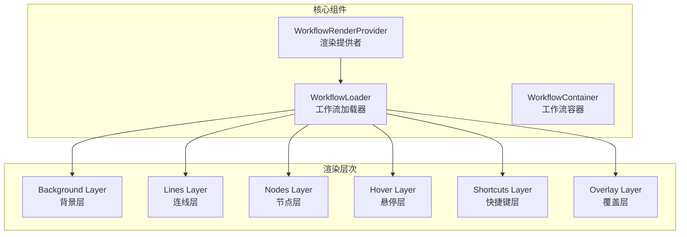

# 画布渲染系统详解

> 画布渲染系统负责工作流节点和连线的可视化呈现，基于 FlowGram (`@flowgram-adapter/free-layout-editor`) 实现分层渲染架构。
>
> **重要说明**: 本项目使用 FlowGram 作为底层画布引擎，而非 React Flow。FlowGram 是字节跳动开源的流程编排引擎。

## 架构概览



## 核心文件结构

```
frontend/packages/workflow/render/
├── src/
│   ├── workflow-render-provider.tsx      # 渲染提供者
│   ├── workflow-render-container-module.ts
│   ├── workflow-render-contribution.ts
│   ├── workflow-loader.tsx               # 工作流加载器
│   ├── layer/
│   │   ├── index.ts
│   │   ├── background-layer.tsx          # 背景层
│   │   ├── lines-layer.tsx               # 连线层
│   │   ├── hover-layer.tsx               # 悬停层
│   │   └── shortcuts-layer.tsx           # 快捷键层
│   ├── components/
│   │   ├── workflow-port-render/         # 端口渲染
│   │   ├── selector-bounds/              # 选择框
│   │   └── lines/                        # 连线组件
│   │       ├── bezier-line/              # 贝塞尔曲线
│   │       ├── fold-line/                # 折线
│   │       └── arrow/                    # 箭头
│   ├── constants/
│   │   ├── points.ts                     # 端点常量
│   │   └── lines.ts                      # 连线常量
│   └── utils/
│       ├── shortcuts-utils.ts            # 快捷键工具
│       └── selection-utils.ts            # 选择工具
```

## WorkflowRenderProvider

渲染提供者是画布渲染的入口，配置依赖注入容器和插件：

```typescript
// frontend/packages/workflow/render/src/workflow-render-provider.tsx

import { PlaygroundReactProvider, type Plugin } from '@flowgram-adapter/free-layout-editor';
import { FlowRendererContainerModule, FlowDocumentContainerModule } from '@flowgram-adapter/free-layout-editor';

export interface WorkflowRenderProviderProps {
  children: React.ReactElement;
  containerModules?: interfaces.ContainerModule[];
  preset?: () => Plugin[];
  parentContainer?: interfaces.Container;
}

export const WorkflowRenderProvider = (props: WorkflowRenderProviderProps) => {
  // 配置容器模块
  const modules = useMemo(() => [
    FlowDocumentContainerModule,      // 默认文档模块
    FlowRendererContainerModule,      // 默认渲染模块
    WorkflowDocumentContainerModule,  // 扩展文档模块
    WorkflowRenderContainerModule,    // 扩展渲染模块
    ...(props.containerModules || []),
  ], []);

  // 配置插件
  const preset = useCallback(() => [
    createFreeAutoLayoutPlugin({}),   // 自动布局插件
    createFreeStackPlugin({}),        // 层级管理插件
    createNodeCorePlugin({}),         // 节点核心插件
    ...(props.preset?.() || []),
  ], []);

  return (
    <PlaygroundReactProvider
      containerModules={modules}
      plugins={preset}
      parentContainer={props.parentContainer}
    >
      <WorkflowLoader />
      {props.children}
    </PlaygroundReactProvider>
  );
};
```

## 分层渲染架构

### 层级定义

```typescript
// frontend/packages/workflow/render/src/layer/index.ts

export * from './lines-layer';
export * from './background-layer';
export * from './hover-layer';
export * from './shortcuts-layer';
```

### 背景层

背景层 (`BackgroundLayer`) 是 FlowGram 的 `Layer` 类的子类，负责绘制点阵网格背景。

```typescript
// 源码路径: frontend/packages/workflow/render/src/layer/background-layer.tsx (摘录)

import { Layer, observeEntity, PlaygroundConfigEntity, SCALE_WIDTH } from '@flowgram-adapter/free-layout-editor';
import { domUtils } from '@flowgram-adapter/common';

/**
 * 点阵网格背景层
 */
export class BackgroundLayer extends Layer {
  static type = 'WorkflowBackgroundLayer';
  
  @observeEntity(PlaygroundConfigEntity)
  protected playgroundConfigEntity: PlaygroundConfigEntity;
  
  node = domUtils.createDivWithClass('gedit-flow-background-layer');
  grid: HTMLElement = document.createElement('div');

  /** 当前缩放比例 */
  get zoom(): number {
    return this.config.finalScale;  // 通过 Layer 基类获取缩放
  }

  onReady() {
    const { firstChild } = this.pipelineNode;
    this.pipelineNode.insertBefore(this.node, firstChild);
    // 初始化缩放范围: 10% - 200%
    this.playgroundConfigEntity.updateConfig({ minZoom: 0.1, maxZoom: 2 });
    this.grid.style.zIndex = '-1';
    this.node.appendChild(this.grid);
  }

  /** 响应式绘制 - 由 FlowGram 自动调用 */
  autorun(): void {
    const { scrollX, scrollY, width, height } = this.playgroundConfigEntity.config;
    const scaleUnit = this.getScaleUnit();
    // 使用 scrollX/scrollY 计算偏移，通过 SVG pattern 绘制点阵
    this.drawGrid(scaleUnit);
  }

  protected drawGrid(unit: BackgroundScaleUnit): void {
    const patternSize = 1 * this.zoom;
    this.grid.innerHTML = `
      <svg width="100%" height="100%">
        <pattern id="${this.patternId}" width="${unit.renderSize}" height="${unit.renderSize}" patternUnits="userSpaceOnUse">
          <circle cx="${patternSize}" cy="${patternSize}" r="${patternSize}" stroke="#eceeef" fill-opacity="0.5"/>
        </pattern>
        <rect width="100%" height="100%" fill="url(#${this.patternId})"/>
      </svg>`;
  }
}
```

**关键设计要点**:
- 继承 FlowGram 的 `Layer` 基类，而非 React 组件
- 使用 `@observeEntity` 装饰器观察 `PlaygroundConfigEntity`，实现响应式更新
- 视口位置通过 `playgroundConfigEntity.config.scrollX/scrollY` 获取
- 缩放比例通过 `this.config.finalScale` 获取（`Layer` 基类提供）
```

### 连线层

```typescript
// frontend/packages/workflow/render/src/layer/lines-layer.tsx

export const LinesLayer: React.FC = () => {
  const edges = useEdges();
  const { lineStyle } = useWorkflowSettings();

  return (
    <svg className={styles.linesLayer}>
      <g>
        {edges.map(edge => (
          <EdgeRenderer
            key={edge.id}
            edge={edge}
            style={lineStyle}
          />
        ))}
      </g>
    </svg>
  );
};

const EdgeRenderer: React.FC<{ edge: Edge; style: LineStyle }> = ({
  edge,
  style,
}) => {
  const { sourcePoint, targetPoint, sourceHandle, targetHandle } = edge;

  // 根据样式选择连线类型
  const LineComponent = style === 'bezier' ? BezierLine : FoldLine;

  return (
    <LineComponent
      sourceX={sourcePoint.x}
      sourceY={sourcePoint.y}
      targetX={targetPoint.x}
      targetY={targetPoint.y}
      sourceHandle={sourceHandle}
      targetHandle={targetHandle}
      selected={edge.selected}
      animated={edge.animated}
    />
  );
};
```

### 悬停层

```typescript
// frontend/packages/workflow/render/src/layer/hover-layer.tsx

export const HoverLayer: React.FC = () => {
  const [hoveredNode, setHoveredNode] = useState<string | null>(null);
  const [hoveredEdge, setHoveredEdge] = useState<string | null>(null);

  // 监听鼠标移动
  useEffect(() => {
    const handleMouseMove = (e: MouseEvent) => {
      const target = e.target as HTMLElement;
      const nodeId = target.closest('[data-node-id]')?.getAttribute('data-node-id');
      const edgeId = target.closest('[data-edge-id]')?.getAttribute('data-edge-id');
      
      setHoveredNode(nodeId || null);
      setHoveredEdge(edgeId || null);
    };

    document.addEventListener('mousemove', handleMouseMove);
    return () => document.removeEventListener('mousemove', handleMouseMove);
  }, []);

  return (
    <div className={styles.hoverLayer}>
      {hoveredNode && <NodeHoverCard nodeId={hoveredNode} />}
      {hoveredEdge && <EdgeHoverCard edgeId={hoveredEdge} />}
    </div>
  );
};
```

### 快捷键层

```typescript
// frontend/packages/workflow/render/src/layer/shortcuts-layer.tsx

export const ShortcutsLayer: React.FC = () => {
  const { registerShortcut, unregisterShortcut } = useShortcuts();
  const { deleteNodes, copyNodes, pasteNodes, undo, redo } = useWorkflowActions();

  useEffect(() => {
    const shortcuts = [
      { key: 'Delete', action: deleteNodes },
      { key: 'Backspace', action: deleteNodes },
      { key: 'ctrl+c', action: copyNodes },
      { key: 'ctrl+v', action: pasteNodes },
      { key: 'ctrl+z', action: undo },
      { key: 'ctrl+shift+z', action: redo },
      { key: 'ctrl+y', action: redo },
    ];

    shortcuts.forEach(({ key, action }) => {
      registerShortcut(key, action);
    });

    return () => {
      shortcuts.forEach(({ key }) => {
        unregisterShortcut(key);
      });
    };
  }, []);

  return null; // 无渲染内容，仅注册快捷键
};
```

## 连线组件

### 贝塞尔曲线

```typescript
// frontend/packages/workflow/render/src/components/lines/bezier-line/index.tsx

interface BezierLineProps {
  sourceX: number;
  sourceY: number;
  targetX: number;
  targetY: number;
  sourceHandle: HandlePosition;
  targetHandle: HandlePosition;
  selected?: boolean;
  animated?: boolean;
}

export const BezierLine: React.FC<BezierLineProps> = ({
  sourceX, sourceY,
  targetX, targetY,
  sourceHandle, targetHandle,
  selected, animated,
}) => {
  // 计算控制点
  const path = useMemo(() => {
    const dx = Math.abs(targetX - sourceX);
    const dy = Math.abs(targetY - sourceY);
    
    // 根据方向计算控制点偏移
    const curvature = Math.min(dx, dy) * 0.5;
    
    let sx1, sy1, sx2, sy2;
    
    switch (sourceHandle) {
      case 'right':
        sx1 = sourceX + curvature;
        sy1 = sourceY;
        break;
      case 'bottom':
        sx1 = sourceX;
        sy1 = sourceY + curvature;
        break;
      // ... 其他方向
    }
    
    switch (targetHandle) {
      case 'left':
        sx2 = targetX - curvature;
        sy2 = targetY;
        break;
      case 'top':
        sx2 = targetX;
        sy2 = targetY - curvature;
        break;
      // ... 其他方向
    }
    
    return `M ${sourceX} ${sourceY} C ${sx1} ${sy1}, ${sx2} ${sy2}, ${targetX} ${targetY}`;
  }, [sourceX, sourceY, targetX, targetY, sourceHandle, targetHandle]);

  return (
    <g className={cx(styles.bezierLine, { [styles.selected]: selected })}>
      {/* 可点击区域 (更宽) */}
      <path
        d={path}
        className={styles.hitArea}
        strokeWidth={10}
        fill="none"
      />
      {/* 可见线条 */}
      <path
        d={path}
        className={cx(styles.line, { [styles.animated]: animated })}
        strokeWidth={2}
        fill="none"
      />
      {/* 箭头 */}
      <Arrow x={targetX} y={targetY} direction={targetHandle} />
    </g>
  );
};
```

### 折线

```typescript
// frontend/packages/workflow/render/src/components/lines/fold-line/index.tsx

export const FoldLine: React.FC<BezierLineProps> = ({
  sourceX, sourceY,
  targetX, targetY,
  sourceHandle, targetHandle,
  selected, animated,
}) => {
  // 计算折线路径
  const path = useMemo(() => {
    const midX = (sourceX + targetX) / 2;
    const midY = (sourceY + targetY) / 2;
    
    // 根据源和目标位置计算折线
    if (sourceHandle === 'right' && targetHandle === 'left') {
      if (sourceX < targetX) {
        return `M ${sourceX} ${sourceY} H ${midX} V ${targetY} H ${targetX}`;
      } else {
        return `M ${sourceX} ${sourceY} H ${sourceX + 50} V ${midY} H ${targetX - 50} V ${targetY} H ${targetX}`;
      }
    }
    
    // ... 其他方向组合
    
    return `M ${sourceX} ${sourceY} L ${targetX} ${targetY}`;
  }, [sourceX, sourceY, targetX, targetY, sourceHandle, targetHandle]);

  return (
    <g className={cx(styles.foldLine, { [styles.selected]: selected })}>
      <path d={path} className={styles.hitArea} strokeWidth={10} fill="none" />
      <path d={path} className={styles.line} strokeWidth={2} fill="none" />
      <Arrow x={targetX} y={targetY} direction={targetHandle} />
    </g>
  );
};
```

## 端口渲染

```typescript
// frontend/packages/workflow/render/src/components/workflow-port-render/index.tsx

interface PortRenderProps {
  nodeId: string;
  portId: string;
  position: HandlePosition;
  type: 'input' | 'output';
  connected: boolean;
  dragging: boolean;
}

export const WorkflowPortRender: React.FC<PortRenderProps> = ({
  nodeId, portId, position, type, connected, dragging,
}) => {
  const [isHovered, setIsHovered] = useState(false);
  const { startConnection, endConnection } = useConnectionHandlers();

  const handleMouseDown = (e: React.MouseEvent) => {
    e.stopPropagation();
    if (type === 'output') {
      startConnection(nodeId, portId);
    }
  };

  const handleMouseUp = (e: React.MouseEvent) => {
    e.stopPropagation();
    if (type === 'input') {
      endConnection(nodeId, portId);
    }
  };

  return (
    <div
      className={cx(styles.port, styles[position], styles[type], {
        [styles.connected]: connected,
        [styles.hovered]: isHovered,
        [styles.dragging]: dragging,
      })}
      onMouseDown={handleMouseDown}
      onMouseUp={handleMouseUp}
      onMouseEnter={() => setIsHovered(true)}
      onMouseLeave={() => setIsHovered(false)}
    >
      <div className={styles.portDot} />
      {isHovered && type === 'output' && (
        <CrossHair position={position} />
      )}
    </div>
  );
};
```

## 视口管理

工作流画布的视口管理分为两个独立系统：

### 1. FlowGram 渲染层视口

FlowGram 的渲染层通过 `PlaygroundConfigEntity` 管理视口状态，不使用 React hooks：

```typescript
// 源码路径: frontend/packages/workflow/render/src/layer/background-layer.tsx:41-52 (摘录)
// PlaygroundConfigEntity 由 @flowgram-adapter/free-layout-editor 外部依赖提供

@observeEntity(PlaygroundConfigEntity)
protected playgroundConfigEntity: PlaygroundConfigEntity;

// 获取视口状态 (参见 background-layer.tsx:87-93)
const { scrollX, scrollY, width, height } = this.playgroundConfigEntity.config;
const zoom = this.config.finalScale;  // 通过 Layer 基类获取 (background-layer.tsx:52)
```

### 2. Fabric Canvas 视口 Hook

`fabric-canvas` 包提供了用于 Fabric.js 画布的视口管理 hook：

```typescript
// 源码路径: frontend/packages/workflow/fabric-canvas/src/hooks/use-viewport.tsx:24-86 (摘录)

export const useViewport = ({
  canvas,
  schema,
  minZoom,
  maxZoom,
}: {
  canvas?: Canvas;
  schema: FabricSchema;
  minZoom: number;
  maxZoom: number;
}) => {
  const [viewport, _setViewport] = useState<TMat2D>([1, 0, 0, 1, 0, 0]);

  const setCanvasViewport = useCallback((vpt: TMat2D) => {
    if (!canvas) return;
    // 限制视口移动范围，不能移出画布
    const _vpt: TMat2D = [...vpt];
    if (_vpt[4] > 0) _vpt[4] = 0;
    // ... 更多边界检查
    setViewport({ canvas, vpt: _vpt });
    _setViewport(_vpt);
  }, [canvas, schema, minZoom, maxZoom]);

  const _zoomToPoint = useCallback((point: Point, zoomLevel: number) => {
    const vpt = zoomToPoint({ canvas, point, zoomLevel, minZoom, maxZoom });
    setCanvasViewport(vpt);
  }, [setCanvasViewport]);

  return { setViewport: setCanvasViewport, viewport, zoomToPoint: _zoomToPoint };
};
```

> **注意**: `useViewport` hook 是 `fabric-canvas` 包的一部分，用于 Fabric.js 画布的交互（如图像画布节点）。
> FlowGram 渲染层（`workflow/render`）不使用此 hook，而是通过 `PlaygroundConfigEntity` 管理视口。

## 选择框

```typescript
// frontend/packages/workflow/render/src/components/selector-bounds/index.tsx

export const SelectorBounds: React.FC = () => {
  const [selectionBox, setSelectionBox] = useState<{
    startX: number;
    startY: number;
    endX: number;
    endY: number;
  } | null>(null);

  const { selectNodesInRect } = useSelection();

  useEffect(() => {
    const handleMouseDown = (e: MouseEvent) => {
      if (e.target === canvasRef.current) {
        setSelectionBox({
          startX: e.clientX,
          startY: e.clientY,
          endX: e.clientX,
          endY: e.clientY,
        });
      }
    };

    const handleMouseMove = (e: MouseEvent) => {
      if (selectionBox) {
        setSelectionBox(prev => prev && {
          ...prev,
          endX: e.clientX,
          endY: e.clientY,
        });
      }
    };

    const handleMouseUp = () => {
      if (selectionBox) {
        const rect = {
          x: Math.min(selectionBox.startX, selectionBox.endX),
          y: Math.min(selectionBox.startY, selectionBox.endY),
          width: Math.abs(selectionBox.endX - selectionBox.startX),
          height: Math.abs(selectionBox.endY - selectionBox.startY),
        };
        selectNodesInRect(rect);
        setSelectionBox(null);
      }
    };

    // ... 添加事件监听
  }, [selectionBox]);

  if (!selectionBox) return null;

  const rect = {
    left: Math.min(selectionBox.startX, selectionBox.endX),
    top: Math.min(selectionBox.startY, selectionBox.endY),
    width: Math.abs(selectionBox.endX - selectionBox.startX),
    height: Math.abs(selectionBox.endY - selectionBox.startY),
  };

  return (
    <div
      className={styles.selectorBounds}
      style={rect}
    />
  );
};
```

## 性能优化

> **注意**: 以下为性能优化的常见模式示意代码，用于说明虚拟化渲染和批量渲染的典型实现思路。
> 实际项目中，FlowGram 框架内部处理了节点可见性判断和连线渲染优化。

### 虚拟化渲染（示意代码）

```typescript
// 示意代码 - 展示视口裁剪的典型模式，非项目实际实现
const visibleNodes = useMemo(() => {
  return nodes.filter(node => {
    const nodeRect = {
      x: node.position.x * zoom + offsetX,
      y: node.position.y * zoom + offsetY,
      width: node.width * zoom,
      height: node.height * zoom,
    };
    
    return (
      nodeRect.x + nodeRect.width > 0 &&
      nodeRect.x < containerWidth &&
      nodeRect.y + nodeRect.height > 0 &&
      nodeRect.y < containerHeight
    );
  });
}, [nodes, zoom, offsetX, offsetY, containerWidth, containerHeight]);
```

### 连线批量渲染（示意代码）

```typescript
// 示意代码 - 展示 SVG path 合并的典型模式
const edgePaths = useMemo(() => {
  return edges.map(edge => calculatePath(edge)).join(' ');
}, [edges]);

<path d={edgePaths} className={styles.edges} />
```

## 样式常量

```typescript
// frontend/packages/workflow/render/src/constants/lines.ts

export const LINE_COLORS = {
  default: 'rgba(0, 0, 0, 0.3)',
  selected: 'var(--coze-brand-5)',
  error: 'var(--coze-red-5)',
  running: 'var(--coze-green-5)',
};

export const LINE_WIDTHS = {
  default: 2,
  selected: 3,
  hitArea: 10,
};

// frontend/packages/workflow/render/src/constants/points.ts

export const PORT_SIZE = 12;
export const PORT_OFFSET = 6;
export const PORT_COLORS = {
  default: 'var(--coze-fg-3)',
  connected: 'var(--coze-brand-5)',
  dragging: 'var(--coze-brand-7)',
};
```

## 最佳实践

1. **分层渲染**: 将不同类型的元素放在不同层，便于独立更新
2. **虚拟化**: 只渲染视口内可见的元素
3. **批量更新**: 使用 `useMemo` 缓存计算结果
4. **事件委托**: 在父容器上处理事件，减少监听器数量
5. **GPU 加速**: 使用 `transform` 和 `will-change` 优化动画
