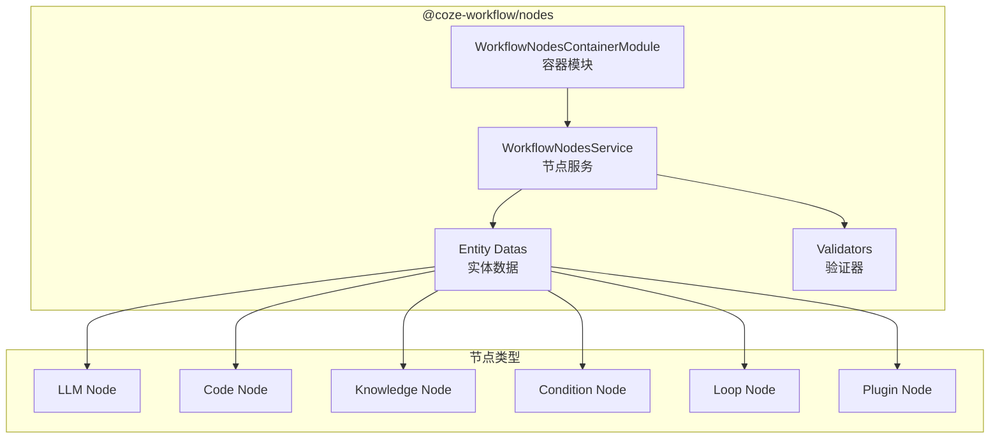

# 节点系统详解

> 节点系统管理工作流中各类节点的注册、配置、验证和渲染。

## 架构概览



## 核心文件结构

```
frontend/packages/workflow/nodes/
├── src/
│   ├── index.ts
│   ├── workflow-nodes-container-module.ts  # DI 容器模块
│   ├── constants.ts                         # 节点常量
│   ├── service/
│   │   ├── index.ts
│   │   └── workflow-nodes-service.ts       # 节点服务
│   ├── entity-datas/
│   │   ├── index.ts
│   │   ├── workflow-node-data/             # 节点数据
│   │   └── workflow-node-test-run-data/    # 测试运行数据
│   ├── validators/
│   │   ├── index.ts
│   │   ├── node-meta-validator.ts          # 元数据验证
│   │   ├── input-tree-validator.ts         # 输入验证
│   │   ├── output-tree-validator/          # 输出验证
│   │   ├── json-schema-validator.ts        # JSON Schema 验证
│   │   ├── code-empty-validator.ts         # 代码验证
│   │   └── setting-on-error-validator.ts   # 错误处理验证
│   ├── setting-on-error/                   # 错误处理配置
│   ├── typings/
│   │   ├── index.ts
│   │   ├── node.ts                         # 节点类型
│   │   ├── trigger.ts                      # 触发器类型
│   │   └── test-run.ts                     # 测试运行类型
│   └── utils/
│       ├── index.ts
│       ├── node-utils.ts                   # 节点工具
│       ├── llm-utils.ts                    # LLM 工具
│       └── add-node-data.ts                # 添加节点数据
```

## 节点容器模块

容器模块负责绑定节点服务、JSON 格式化贡献和文档适配。

```typescript
// frontend/packages/workflow/nodes/src/workflow-nodes-container-module.ts

import { ContainerModule } from 'inversify';
import {
  WorkflowJSONFormatContribution,
  WorkflowDocument,
} from '@flowgram-adapter/free-layout-editor';
import { bindContributions } from '@flowgram-adapter/common';

import { WorkflowJSONFormat } from './workflow-json-format';
import { WorkflowDocumentWithFormat } from './workflow-document-with-format';
import { WorkflowNodesService } from './service';

export const WorkflowNodesContainerModule = new ContainerModule(
  (bind, unbind, isBound, rebind) => {
    // 绑定节点服务（单例）
    bind(WorkflowNodesService).toSelf().inSingletonScope();
    
    // 绑定 JSON 格式化贡献（用于序列化/反序列化）
    bindContributions(bind, WorkflowJSONFormat, [
      WorkflowJSONFormatContribution,
    ]);
    
    // 兼容旧版画布文档格式
    bind(WorkflowDocumentWithFormat).toSelf().inSingletonScope();
    rebind(WorkflowDocument).toService(WorkflowDocumentWithFormat);
  },
);
```

> **注意**: 验证器并非通过 DI 容器绑定，而是作为**纯函数**直接导出使用。

## 节点服务

`WorkflowNodesService` 提供节点标题管理、唯一标识生成等功能。**不包含**节点注册表模式。

```typescript
// frontend/packages/workflow/nodes/src/service/workflow-nodes-service.ts

import { customAlphabet } from 'nanoid';
import { inject, injectable } from 'inversify';
import { FlowNodeFormData, EntityManager, WorkflowNodeEntity } from '@flowgram-adapter/free-layout-editor';
import { Emitter } from '@flowgram-adapter/common';

import { type FormNodeMeta } from '../typings';
import { DEFAULT_NODE_META_PATH } from '../constants';

@injectable()
export class WorkflowNodesService {
  protected onNodesTitleChangeEmitter = new Emitter<void>();
  @inject(EntityManager) protected readonly entityManager: EntityManager;
  private nanoid = customAlphabet('1234567890', 5);

  /** 节点标题变更事件 */
  readonly onNodesTitleChange = this.onNodesTitleChangeEmitter.event;

  /** 获取节点标题 */
  getNodeTitle(node: WorkflowNodeEntity): string {
    const formData = node.getData<FlowNodeFormData>(FlowNodeFormData);
    const nodeMeta = formData.formModel.getFormItemValueByPath<FormNodeMeta>(
      DEFAULT_NODE_META_PATH,
    );
    return nodeMeta?.title || '';
  }

  /** 获取所有节点（排除 root 和指定节点） */
  getAllNodes(ignoreNode?: WorkflowNodeEntity): WorkflowNodeEntity[] {
    return this.entityManager
      .getEntities<WorkflowNodeEntity>(WorkflowNodeEntity)
      .filter(n => n.id !== 'root' && n !== ignoreNode);
  }

  /** 获取所有节点标题 */
  getAllTitles(ignoreNode?: WorkflowNodeEntity): string[] {
    return this.getAllNodes(ignoreNode).map(node => this.getNodeTitle(node));
  }

  /** 获取起始节点 */
  getStartNode(): WorkflowNodeEntity {
    return this.entityManager
      .getEntities<WorkflowNodeEntity>(WorkflowNodeEntity)
      .find(node => node.isStart) as WorkflowNodeEntity;
  }

  /** 触发节点标题变更事件 */
  fireNodesTitleChange(): void {
    this.onNodesTitleChangeEmitter.fire();
  }

  /**
   * 创建不重复的标题
   * 例如: abc_1 -> abc_2
   */
  createUniqTitle(
    titlePrefix: string,
    ignoreNode?: WorkflowNodeEntity | undefined,
    ignoreTitles?: string[],
  ): string {
    const allTitles = this.getAllTitles(ignoreNode);
    if (ignoreTitles) {
      allTitles.push(...ignoreTitles);
    }
    const allTitlesSet = new Set(allTitles);

    let startIndex = 0;
    let newTitle = `${titlePrefix}`;

    const matched = titlePrefix.match(/_([0-9]+)$/);
    if (matched) {
      startIndex = Number(matched[1]);
      titlePrefix = titlePrefix.slice(0, matched.index);
    }

    while (allTitlesSet.has(newTitle)) {
      startIndex += 1;
      newTitle = `${titlePrefix}_${startIndex}`;
    }
    return newTitle;
  }

  /** 创建唯一 ID（以 1 开头，避免后端 int64 转换时丢失前导 0） */
  createUniqID() {
    let id: string;
    do {
      id = `1${this.nanoid()}`;
    } while (this.entityManager.getEntityById(id));
    return id;
  }
}
```

> **设计说明**: 节点类型配置并非通过服务的注册表管理，而是通过 `playground` 包中的 `node-registries` 目录静态定义。

## 节点数据结构

`WorkflowNodeData` 扩展 `EntityData`，用于管理**非表单数据**（如 spaceId、发布状态等业务层数据）。

> **注意**: 表单数据存储在 `formMeta` 中（提交给后端执行），而 `WorkflowNodeData` 管理的是前端业务场景消费但后端不需要的数据。

```typescript
// frontend/packages/workflow/nodes/src/entity-datas/workflow-node-data/workflow-node-data.ts

import { EntityData } from '@flowgram-adapter/free-layout-editor';
import { type EditAbleNodeData, type NodeData } from './types';

export class WorkflowNodeData extends EntityData {
  private nodeData;
  private hasSetNodeData = false;

  init() {
    this.hasSetNodeData = false;
    this.nodeData = undefined;
  }

  getDefaultData() {
    return undefined;
  }

  /**
   * 设置节点非表单数据
   * 泛型必须传入节点类型 StandardNodeType
   */
  setNodeData<T extends keyof NodeData = never>(data: NodeData[T]) {
    if (this.hasSetNodeData) {
      // 撤销/重做时会重复设置，无需报错
      console.warn(`node ${this.entity.id} has already set WorkflowNodeData`);
      return;
    }
    this.nodeData = { ...data };
    this.hasSetNodeData = true;
  }

  /**
   * 更新数据（仅非只读字段）
   * 泛型必须传入节点类型 StandardNodeType
   */
  updateNodeData<T extends keyof NodeData = never>(
    data: Partial<EditAbleNodeData<T>>,
  ) {
    this.nodeData = { ...this.nodeData, ...data };
  }

  /**
   * 获取节点非表单数据
   */
  getNodeData<T extends keyof NodeData>(): NodeData[T] {
    return this.nodeData;
  }
}
```

### 典型使用场景

- **API 节点**: 存储 `spaceId`、发布状态
- **子工作流节点**: 存储子工作流的 `spaceId`、发布状态

## 验证器

验证器是**纯函数**（非 DI 注入的类），基于 [Zod](https://zod.dev/) 进行声明式验证。

### 验证器导出

```typescript
// frontend/packages/workflow/nodes/src/validators/index.ts

export { nodeMetaValidator } from './node-meta-validator';
export { outputTreeValidator } from './output-tree-validator';
export { systemVariableValidator } from './system-variable-validator';
export { codeEmptyValidator } from './code-empty-validator';
export { questionOptionValidator } from './question-option-validator';
export { settingOnErrorValidator } from './setting-on-error-validator';
export { inputTreeValidator } from './input-tree-validator';
```

### 节点元数据验证器

```typescript
// frontend/packages/workflow/nodes/src/validators/node-meta-validator.ts

import { z } from 'zod';
import { I18n } from '@coze-arch/i18n';
import { type ValidatorProps } from '@flowgram-adapter/free-layout-editor';

const NodeMetaSchema = z.object({
  title: z
    .string({ required_error: I18n.t('workflow_detail_node_name_error_empty') })
    .min(1, I18n.t('workflow_detail_node_name_error_empty'))
    .regex(/^.{0,63}$/, I18n.t('workflow_derail_node_detail_title_max', { max: '63' })),
  icon: z.string().optional(),
  subtitle: z.string().optional(),
  description: z.string().optional(),
});

type NodeMeta = z.infer<typeof NodeMetaSchema>;

export const nodeMetaValidator = ({ value, context }: ValidatorProps<NodeMeta>) => {
  const { playgroundContext } = context;

  // 标题重复检查
  function isTitleRepeated(title: string) {
    if (!title) return false;
    const { nodesService } = playgroundContext;
    const nodes = nodesService
      .getAllNodes()
      .filter(node => nodesService.getNodeTitle(node) === title);
    return nodes?.length > 1;
  }

  // 添加标题重复校验规则
  const schema = NodeMetaSchema.refine(
    ({ title }: NodeMeta) => !isTitleRepeated(title),
    { message: I18n.t('workflow_node_title_duplicated'), path: ['title'] },
  );

  const parsed = schema.safeParse(value);
  if (!parsed.success) {
    return JSON.stringify((parsed as any).error);
  }
  return true;
};
```

### 输入树验证器

```typescript
// frontend/packages/workflow/nodes/src/validators/input-tree-validator.ts

import { z, type ZodSchema } from 'zod';
import { ValueExpression, ValueExpressionType, type InputValueVO } from '@coze-workflow/base/types';
import { I18n } from '@coze-arch/i18n';
import { type ValidatorProps, type FlowNodeEntity, type PlaygroundContext } from '@flowgram-adapter/free-layout-editor';
import { VARIABLE_NAME_REGEX } from '../constants';

/**
 * 输入树验证器（类 + 函数导出）
 */
export class InputTreeValidator {
  private node: FlowNodeEntity;
  private playgroundContext: PlaygroundContext;
  private issues: { path: (string | number)[]; message: string }[] = [];

  constructor(node: FlowNodeEntity, playgroundContext: PlaygroundContext) {
    this.node = node;
    this.playgroundContext = playgroundContext;
  }

  validate(inputValues: InputValueVO[]): typeof this.issues {
    this.issues = [];
    this.validateInputValues(inputValues);
    return this.issues;
  }

  private validateInputValues(inputValues: InputValueVO[], path: (string | number)[] = []) {
    if (!inputValues) return;

    for (let i = 0; i < inputValues.length; i++) {
      const inputValue = inputValues[i] || {};

      // 验证 name 字段
      const nameError = this.validateName({ value: inputValue.name, values: inputValues });
      if (nameError) {
        this.issues.push({ message: nameError, path: path.concat(i, 'name') });
      }

      // 验证 input 字段
      const inputError = this.validateInput({ value: inputValue.input });
      if (inputError) {
        this.issues.push({ message: inputError, path: path.concat(i, 'input') });
      }

      // 递归校验子节点
      const children = inputValues[i]?.children || [];
      this.validateInputValues(children, path.concat(i, 'children'));
    }
  }

  private validateName({ value, values }) {
    if (!value) return I18n.t('workflow_detail_node_error_name_empty');

    // 格式校验
    if (!VARIABLE_NAME_REGEX.test(value)) {
      return I18n.t('workflow_detail_node_error_format');
    }

    // 重名校验
    const names = values.map(v => v.name).filter(Boolean);
    const foundSames = names.filter((name: string) => name === value);
    return foundSames.length > 1 ? I18n.t('workflow_detail_node_input_duplicated') : undefined;
  }

  private validateInput({ value }) {
    const { variableValidationService } = this.playgroundContext;

    // 空值校验
    if (ValueExpression.isEmpty(value)) {
      return I18n.t('workflow_detail_node_error_empty');
    }

    // 引用变量校验
    if (value?.type === ValueExpressionType.REF) {
      return variableValidationService.isRefVariableEligible(value, this.node);
    }
  }
}

/** 导出的验证函数 */
export function inputTreeValidator(params: ValidatorProps<InputValueVO>) {
  const { value, context: { playgroundContext, node } } = params;
  const validator = new InputTreeValidator(node, playgroundContext);

  const InputTreeNodeSchema: ZodSchema<any> = z.lazy(() =>
    z.object({
      name: z.string().optional(),
      input: z.any(),
      children: z.array(InputTreeNodeSchema).optional(),
    }).passthrough(),
  );

  const InputTreeSchema = z.array(InputTreeNodeSchema).superRefine((data, ctx) => {
    const issues = validator.validate(data);
    issues.forEach(issue => {
      ctx.addIssue({
        path: issue.path,
        message: issue.message,
        validation: 'regex',
        code: 'invalid_string',
      });
    });
  });

  const parsed = InputTreeSchema.safeParse(value);
  if (!parsed.success) {
    return JSON.stringify((parsed as any).error);
  }
  return true;
}
```

### 输出树验证器

```typescript
// frontend/packages/workflow/nodes/src/validators/output-tree-validator/index.ts

import { type ValidatorProps } from '@flowgram-adapter/free-layout-editor';
import { OutputTreeSchema, OutputTreeUniqueNameSchema, type OutputTree } from './schema';

export function outputTreeValidator(
  params: ValidatorProps<OutputTree, { uniqueName?: boolean }>,
) {
  const { value, options } = params;
  const { uniqueName = false } = options;

  const parsed = uniqueName
    ? OutputTreeUniqueNameSchema.safeParse(value)
    : OutputTreeSchema.safeParse(value);

  if (!parsed.success) {
    return JSON.stringify((parsed as any).error);
  }
  return true;
}
```

## 错误处理配置

错误处理模块提供类型定义、数据转换和判断工具。

```typescript
// frontend/packages/workflow/nodes/src/setting-on-error/index.ts

// 类型导出
export {
  SettingOnErrorProcessType,
  type SettingOnErrorExt,
  type SettingOnErrorVO,
  type SettingOnErrorValue,
} from './types';

// 数据转换函数
export {
  settingOnErrorInit,    // 初始化时的 DTO → VO 转换
  settingOnErrorSave,    // 保存时的 VO → DTO 转换
  settingOnErrorToDTO,
  settingOnErrorToVO,
} from './data-transformer';

// 判断工具
export {
  isSettingOnError,
  isSettingOnErrorV2,
  isSettingOnErrorDynamicPort,
} from './utils';

// 元数据生成
export {
  generateErrorBodyMeta,
  generateIsSuccessMeta,
} from './utils/generate-meta';

// Hooks
export {
  useIsSettingOnError,
  useIsSettingOnErrorV2,
  useTimeoutConfig,
} from './hooks';

// 常量
export {
  SETTING_ON_ERROR_PORT,
  SETTING_ON_ERROR_NODES_CONFIG,
  ERROR_BODY_NAME,
  IS_SUCCESS_NAME,
} from './constants';

// 输出处理
export {
  getOutputsWithErrorBody,
  sortErrorBody,
  getExcludeErrorBody,
} from './utils/outputs';
```

## 节点工具函数

`nodeUtils` 命名空间提供输入参数转换、批处理配置等工具函数。以下列出主要导出的函数签名：

```typescript
// frontend/packages/workflow/nodes/src/utils/node-utils.ts
// 主要导出函数（完整实现请参考源文件，共 357 行）

export namespace nodeUtils {
  // 路径常量
  export const INPUT_PARAMS_PATH = 'inputs.inputParameters';
  
  // Map/Array 转换
  export function mapToArray<MapItem, ArrayItem>(
    map: Record<string, MapItem>,
    handle: (key: string, value: MapItem) => ArrayItem,
  ): ArrayItem[];
  
  export function arrayToMap<ArrayItem, MapItem>(
    array: ArrayItem[],
    key: keyof ArrayItem,
    handler: (item: ArrayItem) => MapItem,
  ): Record<string, MapItem>;
  
  // 批处理转换
  export function batchToDTO(batchVO: BatchVO | undefined, nodeFormContext: any): BatchDTO | undefined;
  export function batchToVO(batchDTO: BatchDTO | undefined, nodeFormContext: any): BatchVO | undefined;
  
  // 默认值生成
  export function getBatchInputListFormDefaultValue(index: number): BatchVOInputList;
  export function getBatchModeFormMeta(isBatchV2: boolean): IFormItemMeta;
  
  // 表单值转换（API 节点使用）
  export function formValueToDto(value: any, context: any): any;
  export function dtoToformValue(value: any, context: any): any;
  
  // 类型工具
  export function getLiteralExpressionViewVariableType(content: LiteralExpression['content']): ViewVariableType;
}
```

### LLM 工具函数

```typescript
// frontend/packages/workflow/nodes/src/utils/llm-utils.ts
// 主要导出函数（完整实现请参考源文件，共 115 行）

/** 格式化模型数据（根据 modelMeta 将特定字符串转为数字） */
export const formatModelData: (
  model: Record<string, unknown>,
  modelMeta: Model | undefined,
) => Record<string, unknown>;

/** 获取默认 LLM 参数 */
export const getDefaultLLMParams: (models: Model[]) => Record<string, unknown>;

/** 修正 LLM 参数键值对（处理 'modleName' typo 等） */
export const reviseLLMParamPair: (d: InputValueDTO) => [string, unknown];
```

> **注意**: 以上为函数签名摘要，完整实现包含更多细节（如类型转换、错误处理等），请参考源文件。

## 节点类型定义

节点类型在工作流引擎中通过 `StandardNodeType` 枚举定义，**值为数字字符串**（如 `'1'`、`'3'`），而非语义化字符串。

```typescript
// frontend/packages/workflow/base/src/types/node-type.ts

/**
 * 标准节点类型枚举
 * 注意：值是数字字符串，用于与后端协议对齐
 */
export enum StandardNodeType {
  Start = '1',
  End = '2',
  LLM = '3',
  Api = '4',
  Code = '5',
  Dataset = '6',            // 知识库
  If = '8',                 // 条件分支
  SubWorkflow = '9',        // 子工作流
  Variable = '11',
  Database = '12',
  Output = '13',
  Loop = '21',
  Intent = '22',            // 意图识别
  LTM = '26',               // 长期记忆
  DatasetWrite = '27',      // 知识库写入
  Batch = '28',             // 批处理
  Input = '30',
  Comment = '31',           // 注释节点
  VariableMerge = '32',     // 变量聚合
  Http = '45',              // HTTP 请求
  DatabaseCreate = '46',
  DatabaseUpdate = '42',
  DatabaseQuery = '43',
  DatabaseDelete = '44',
  // ... 共 50+ 种节点类型，完整列表见源文件
}

/**
 * 基础节点类型（排除 API、子工作流、图像流）
 */
export type BasicStandardNodeTypes = Exclude<
  StandardNodeType,
  | StandardNodeType.Api
  | StandardNodeType.Imageflow
  | StandardNodeType.SubWorkflow
>;
```

> **设计说明**: 使用数字字符串是为了与后端 Thrift IDL 协议中的数值 ID 对齐（以字符串承载），参见 `idl/workflow/workflow.thrift:114` 中的 `NodeType` / `NodeTemplateType` 枚举。

## 最佳实践

1. **验证器组合**: 多个验证器可以组合使用（均为纯函数），收集所有验证结果
2. **类型安全**: 使用 TypeScript 严格定义节点数据结构
3. **错误处理**: 通过 `setting-on-error` 模块配置节点错误处理策略
4. **数据分离**: 区分表单数据（`formMeta`，提交后端）和业务数据（`WorkflowNodeData`，前端消费）
5. **节点配置**: 节点类型配置在 `frontend/packages/workflow/playground/src/node-registries/` 目录静态定义，非动态注册
