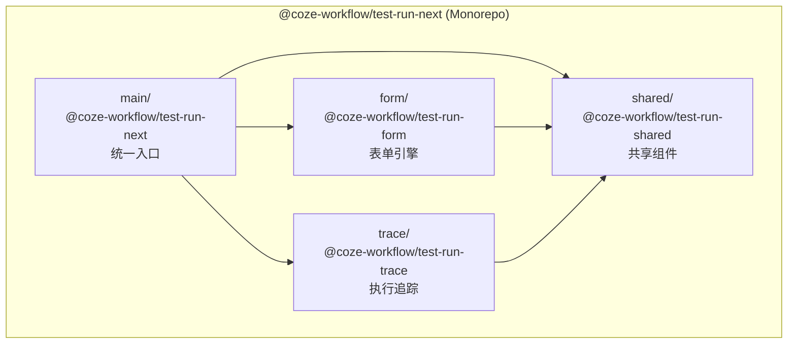
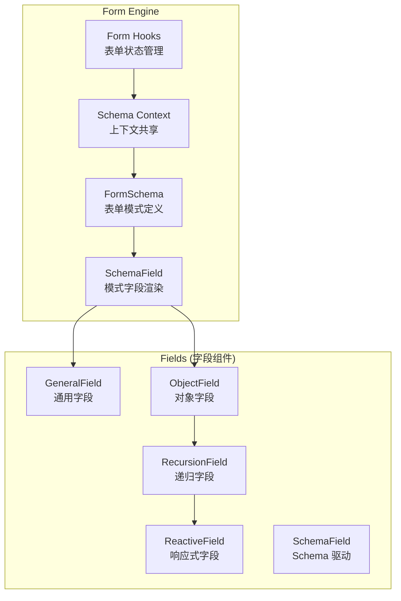
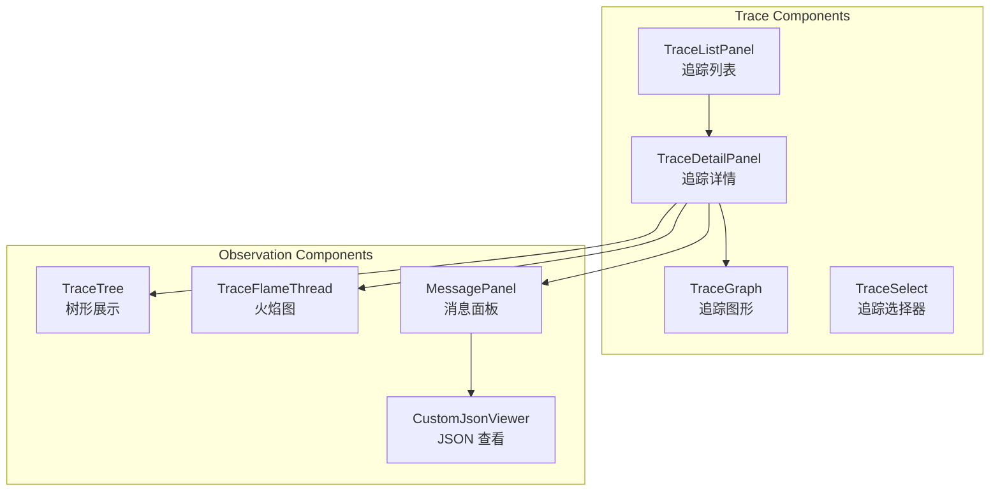

# 测试运行器详解

> 测试运行器提供工作流的调试和执行追踪能力，由四个子包组成：main (入口)、form (表单)、trace (追踪)、shared (共享)。
>
> **注意**: 本文档中标注为"示意代码"的块仅用于说明实现思路；未标注的代码块为源文件摘录，以源码路径为准。

## 架构概览



## 核心文件结构 (摘录)

```
frontend/packages/workflow/test-run-next/
├── main/                              # 入口包 @coze-workflow/test-run-next
│   └── src/
│       ├── index.ts                   # 统一导出 form/trace/shared
│       └── global.d.ts
├── form/                              # 表单包 @coze-workflow/test-run-form
│   └── src/
│       ├── index.ts                   # 导出表单组件和引擎
│       ├── components/
│       │   ├── test-run-form/         # TestRunForm 主组件
│       │   └── base-form-materials/   # 基础表单素材
│       ├── form-engine/               # 表单引擎
│       │   ├── fields/                # 字段组件 (schema-field, object-field 等)
│       │   ├── hooks/                 # 表单 Hooks
│       │   ├── shared/                # Schema 上下文
│       │   └── types/                 # 类型定义
│       ├── context/                   # TestRunFormProvider
│       ├── utils/                     # generate-field, validators 等
│       └── constants/                 # TestFormFieldName
├── trace/                             # 追踪包 @coze-workflow/test-run-trace
│   └── src/
│       ├── index.ts                   # 导出 TraceListPanel, TraceDetailPanel
│       ├── types.ts                   # GotoParams 等类型
│       ├── components/
│       │   ├── trace-list-panel/      # 追踪列表面板
│       │   ├── trace-detail-panel/    # 追踪详情面板
│       │   ├── trace-graph/           # 追踪图形
│       │   ├── trace-select/          # 追踪选择器
│       │   ├── status-tag/            # 状态标签
│       │   └── focus-button/          # 聚焦按钮
│       ├── observation-components/    # 可观测性组件
│       │   ├── trace-tree/            # 追踪树 (树形展示)
│       │   ├── trace-flame-thread/    # 火焰图 (时间线)
│       │   ├── message-panel/         # 消息面板
│       │   ├── custom-json-viewer/    # JSON 查看器
│       │   ├── common/                # 通用组件 (tree, flamethread, time-tag)
│       │   ├── typings/               # 类型定义
│       │   ├── utils/                 # 工具函数
│       │   └── consts/                # 常量
│       ├── contexts/                  # 追踪上下文
│       ├── utils.ts                   # formatDuration 等
│       └── constants.ts
└── shared/                            # 共享包 @coze-workflow/test-run-shared
    └── src/
        ├── index.ts
        ├── components/
        │   ├── json-editor/           # JSON 编辑器
        │   └── bottom-panel/          # 可调整高度的底部面板
        └── utils/
            ├── safe-json-parse.ts     # 安全 JSON 解析
            ├── safe-format-json-string.ts
            └── debug-url.ts           # 调试 URL 生成
```

## 类型定义

```typescript
// frontend/packages/workflow/test-run-next/trace/src/types.ts (摘录)

export interface GotoParams {
  nodeId: string;
  workflowId: string;
  executeId: string;
  subExecuteId: string;
}
```

## 入口包 (@coze-workflow/test-run-next)

入口包统一导出所有子包的功能：

```typescript
// frontend/packages/workflow/test-run-next/main/src/index.ts (摘录)

/**
 * TestRun Main - 统一入口
 */

// TestRun Form 导出
export {
  // 组件
  TestRunForm,
  FormBaseFieldItem,
  FormBaseInputJson,
  FormBaseGroupCollapse,
  TestRunFormProvider,
  // Hooks
  useForm,
  useTestRunFormStore,
  useFormSchema,
  useCurrentFieldState,
  // 函数
  createSchemaField,
  generateField,
  generateFieldValidator,
  isFormSchemaPropertyEmpty,
  stringifyFormValuesFromBacked,
  FormSchema,
  // 常量
  TestFormFieldName,
  // 类型
  type FormModel,
  type TestRunFormState,
  type IFormSchema,
} from '@coze-workflow/test-run-form';

// TestRun Shared 导出
export { safeJsonParse } from '@coze-workflow/test-run-shared';

// TestRun Trace 导出
export {
  TraceListPanel,
  TraceDetailPanel,
} from '@coze-workflow/test-run-trace';
```

## 表单包 (@coze-workflow/test-run-form)

### 核心导出

```typescript
// frontend/packages/workflow/test-run-next/form/src/index.ts (摘录)

// 表单引擎
export {
  createSchemaField,
  useFormSchema,
  useForm,
  useCurrentFieldState,
  FormSchema,
  type FormModel,
  type IFormSchema,
} from './form-engine';

// 组件
export { TestRunForm } from './components/test-run-form';
export {
  InputJson as FormBaseInputJson,
  GroupCollapse as FormBaseGroupCollapse,
  FieldItem as FormBaseFieldItem,
} from './components/base-form-materials';

// 上下文
export {
  TestRunFormProvider,
  useTestRunFormStore,
  type TestRunFormState,
} from './context';

// 工具函数
export {
  generateField,
  generateFieldValidator,
  isFormSchemaPropertyEmpty,
  stringifyFormValuesFromBacked,
} from './utils';

// 常量
export { TestFormFieldName } from './constants';
```

### 表单引擎架构



### 表单字段组件

```typescript
// frontend/packages/workflow/test-run-next/form/src/form-engine/fields/ (文件列表)

// general-field.tsx   - 通用字段渲染
// object-field.tsx    - 对象类型字段 (支持嵌套属性)
// recursion-field.tsx - 递归字段 (用于深层嵌套结构)
// reactive-field.tsx  - 响应式字段 (自动更新)
// schema-field.tsx    - Schema 驱动的字段
// create-schema-field.tsx - 创建 Schema Field 工厂
```

### 表单 Hooks

```typescript
// frontend/packages/workflow/test-run-next/form/src/form-engine/hooks/ (文件列表)

// use-create-form.ts    - 创建表单实例
// use-form-schema.ts    - 获取表单 Schema
// use-form-ui-state.ts  - 获取表单 UI 状态
// use-field-schema.ts   - 获取字段 Schema
// use-field-ui-state.ts - 获取字段 UI 状态
// use-components.ts     - 获取组件注册表
```

### 工具函数

```typescript
// frontend/packages/workflow/test-run-next/form/src/utils/ (文件列表)

// generate-field.ts              - 根据 Schema 生成字段配置
// generate-field-validator.ts    - 根据 Schema 生成验证器
// generate-field-component.ts    - 根据类型生成字段组件
// is-property-empty.ts           - 检查属性是否为空
// stringify-form-values-from-backed.ts - 序列化后端返回的表单值
```

## 追踪包 (@coze-workflow/test-run-trace)

### 核心导出

```typescript
// frontend/packages/workflow/test-run-next/trace/src/index.ts (摘录)

export { TraceListPanel } from './components/trace-list-panel';
export { TraceDetailPanel } from './components/trace-detail-panel';
```

### 追踪组件架构



### TraceListPanel

追踪列表面板显示执行历史：

```typescript
// frontend/packages/workflow/test-run-next/trace/src/components/trace-list-panel/
// - list-panel.tsx  主组件
// - header.tsx      列表头部
// - index.ts        导出
```

### TraceDetailPanel

追踪详情面板显示节点执行细节：

```typescript
// frontend/packages/workflow/test-run-next/trace/src/components/trace-detail-panel/
// - trace-detail-panel.tsx  主组件
// - pay-block.tsx           付费阻断组件
// - index.ts                导出
```

### 可观测性组件

```typescript
// frontend/packages/workflow/test-run-next/trace/src/observation-components/

// trace-tree/          - 追踪树 (树形展示执行链路)
//   - index.tsx
//   - graph-render.tsx
//   - context.ts

// trace-flame-thread/  - 火焰图 (时间线展示)
//   - index.tsx

// message-panel/       - 消息面板
//   - index.tsx

// custom-json-viewer/  - 自定义 JSON 查看器
//   - index.tsx

// common/              - 通用组件
//   - tree/            - 树组件
//   - flamethread/     - 火焰图组件
//   - time-tag/        - 时间标签
//   - message-title/   - 消息标题

// typings/             - 类型定义
//   - idl.ts
//   - graph.ts
//   - basic.ts

// utils/               - 工具函数
//   - time.ts
//   - graph.ts
//   - basic.tsx

// consts/              - 常量
//   - index.ts
//   - graph.tsx
//   - basic.tsx
```

### 追踪选择器

```typescript
// frontend/packages/workflow/test-run-next/trace/src/components/trace-select/

// trace-select.tsx   - 追踪选择下拉框
// status-select.tsx  - 状态筛选
// date-picker.tsx    - 日期选择器
// select-option.tsx  - 选项组件
// use-options.ts     - 选项 Hook
// index.ts           - 导出
```

## 共享包 (@coze-workflow/test-run-shared)

### 核心导出

```typescript
// frontend/packages/workflow/test-run-next/shared/src/index.ts (摘录)

// 工具函数
export { safeJsonParse } from './utils/safe-json-parse';
export { safeFormatJsonString } from './utils/safe-format-json-string';
export { getDebugUrl } from './utils/debug-url';

// 组件
export { JsonEditor } from './components/json-editor';
export { BottomPanel } from './components/bottom-panel';
```

### JSON 编辑器

```typescript
// frontend/packages/workflow/test-run-next/shared/src/components/json-editor/
// - json-editor.tsx  主组件
// - base.tsx         基础编辑器
// - index.ts         导出
```

### 底部面板

```typescript
// frontend/packages/workflow/test-run-next/shared/src/components/bottom-panel/
// - panel.tsx        面板组件
// - use-resize.ts    调整大小 Hook
// - index.ts         导出
```

### 工具函数

```typescript
// frontend/packages/workflow/test-run-next/shared/src/utils/ (摘录)

// safe-json-parse.ts - 安全 JSON 解析
export function safeJsonParse<T>(json: string, fallback: T): T {
  try {
    return JSON.parse(json);
  } catch {
    return fallback;
  }
}

// safe-format-json-string.ts - 安全格式化 JSON
// debug-url.ts - 生成调试 URL
```

## 使用示例

```tsx
import {
  TestRunForm,
  TestRunFormProvider,
  TraceListPanel,
  TraceDetailPanel,
  useTestRunFormStore,
  safeJsonParse,
} from '@coze-workflow/test-run-next';

function WorkflowDebugPanel({ workflowId }: { workflowId: string }) {
  const [selectedTrace, setSelectedTrace] = useState<string | null>(null);
  
  return (
    <div className="debug-panel">
      {/* 测试运行表单 */}
      <TestRunFormProvider workflowId={workflowId}>
        <TestRunForm onRun={handleRun} />
      </TestRunFormProvider>
      
      {/* 追踪列表 */}
      <TraceListPanel
        workflowId={workflowId}
        onSelect={setSelectedTrace}
      />
      
      {/* 追踪详情 */}
      {selectedTrace && (
        <TraceDetailPanel
          traceId={selectedTrace}
          onClose={() => setSelectedTrace(null)}
        />
      )}
    </div>
  );
}
```

## 关键符号索引

| 符号 | 路径 | 说明 |
|------|------|------|
| `TestRunForm` | `form/src/components/test-run-form/` | 测试运行表单主组件 |
| `TestRunFormProvider` | `form/src/context/form.tsx` | 表单上下文提供者 |
| `FormSchema` | `form/src/form-engine/shared/form-schema.ts` | 表单 Schema 定义 |
| `TraceListPanel` | `trace/src/components/trace-list-panel/` | 追踪列表面板 |
| `TraceDetailPanel` | `trace/src/components/trace-detail-panel/` | 追踪详情面板 |
| `TraceTree` | `trace/src/observation-components/trace-tree/` | 追踪树组件 |
| `safeJsonParse` | `shared/src/utils/safe-json-parse.ts` | 安全 JSON 解析 |
| `JsonEditor` | `shared/src/components/json-editor/` | JSON 编辑器 |

## 最佳实践

1. **使用入口包**: 优先从 `@coze-workflow/test-run-next` 导入，而非直接使用子包
2. **表单验证**: 使用 `generateFieldValidator` 生成验证器
3. **安全解析**: 使用 `safeJsonParse` 处理用户输入的 JSON
4. **追踪导航**: 通过 `GotoParams` 实现节点跳转
5. **状态管理**: 使用 `useTestRunFormStore` 管理表单状态
