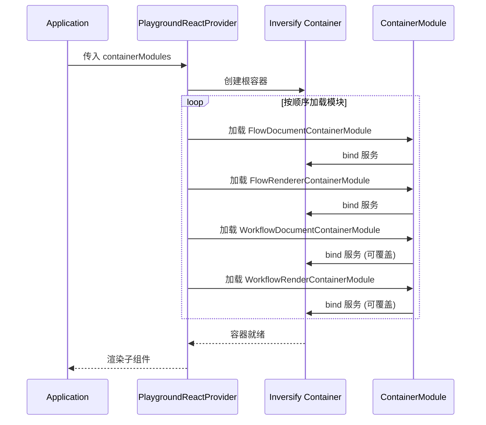

# DI 容器与扩展点详解

> 工作流引擎使用 Inversify 进行依赖注入，通过 ContainerModule 和 Plugin 系统实现模块化架构和功能扩展。
>
> **核心入口**: `@flowgram-adapter/free-layout-editor` 提供的 `PlaygroundReactProvider`

## 架构概览

```mermaid
graph TB
    subgraph "FlowGram 核心"
        PROVIDER["PlaygroundReactProvider<br/>@flowgram-adapter/free-layout-editor"]
        FLOW_DOC[FlowDocumentContainerModule]
        FLOW_RENDER[FlowRendererContainerModule]
    end
    
    subgraph "Coze 扩展模块"
        WF_DOC[WorkflowDocumentContainerModule]
        WF_RENDER[WorkflowRenderContainerModule]
        WF_NODES[WorkflowNodesContainerModule]
        WF_HISTORY[WorkflowHistoryContainerModule]
        WF_PAGE[WorkflowPageContainerModule]
    end
    
    subgraph "插件系统"
        AUTO_LAYOUT[createFreeAutoLayoutPlugin]
        STACK[createFreeStackPlugin]
        NODE_CORE[createNodeCorePlugin]
        CUSTOM[自定义插件...]
    end
    
    PROVIDER --> FLOW_DOC
    PROVIDER --> FLOW_RENDER
    PROVIDER --> WF_DOC
    PROVIDER --> WF_RENDER
    PROVIDER --> WF_NODES
    PROVIDER --> WF_HISTORY
    PROVIDER --> WF_PAGE
    
    PROVIDER --> AUTO_LAYOUT
    PROVIDER --> STACK
    PROVIDER --> NODE_CORE
    PROVIDER --> CUSTOM
```



## 入口组件装配

### WorkflowPlayground

工作流的主入口组件，负责装配所有模块和插件：

```typescript
// frontend/packages/workflow/playground/src/workflow-playground.tsx (摘录)

import { WorkflowRenderProvider } from '@coze-workflow/render';
import { WorkflowNodesContainerModule } from '@coze-workflow/nodes';
import { WorkflowHistoryContainerModule } from '@coze-workflow/history';

export const WorkflowPlayground = forwardRef<
  WorkflowPlaygroundRef,
  WorkflowPlaygroundProps
>(({ spaceId = PUBLIC_SPACE_ID, parentContainer, ...props }, ref) => {
  // 使用 Space Store 管理空间状态
  const { spaceList, setSpace, fetchSpaces, checkSpaceID, inited } =
    useSpaceStore(useShallow(store => ({
      spaceList: store.spaceList,
      setSpace: store.setSpace,
      fetchSpaces: store.fetchSpaces,
      checkSpaceID: store.checkSpaceID,
      inited: store.inited,
    })));

  // 初始化空间
  useEffect(() => {
    let isActive = true;
    const initSpace = async () => {
      if (!inited) {
        await fetchSpaces(true);
      }
      if (!isActive) return;
      checkSpaceID(spaceId);
      if (spaceId !== PUBLIC_SPACE_ID) {
        setSpace(spaceId);
      }
    };
    initSpace();
    return () => { isActive = false; };
  }, [spaceId, fetchSpaces, setSpace, checkSpaceID]);

  // 获取预设插件
  const preset = useWorkflowPreset(props);

  if (!inited) return null;

  return (
    <DndProvider backend={HTML5Backend} context={window}>
      <QueryClientProvider client={workflowQueryClient}>
        <WorkflowRenderProvider
          parentContainer={parentContainer}
          containerModules={[
            WorkflowNodesContainerModule,      // 节点模块
            WorkflowPageContainerModule,       // 页面模块
            WorkflowHistoryContainerModule,    // 历史模块
          ]}
          preset={preset}
        >
          <PlayGroundErrorBoundary>
            <WorkflowContainer
              ref={ref}
              {...props}
              spaceId={spaceId}
              spaceList={spaceList}
            />
          </PlayGroundErrorBoundary>
        </WorkflowRenderProvider>
      </QueryClientProvider>
    </DndProvider>
  );
});
```

### WorkflowRenderProvider

渲染层提供者，配置核心容器模块和插件：

```typescript
// frontend/packages/workflow/render/src/workflow-render-provider.tsx (摘录)

import { type interfaces } from 'inversify';
import {
  FlowRendererContainerModule,
  FlowDocumentContainerModule,
  WorkflowDocumentContainerModule,
  PlaygroundReactProvider,
  createNodeCorePlugin,
  createFreeStackPlugin,
  createFreeAutoLayoutPlugin,
  type Plugin,
} from '@flowgram-adapter/free-layout-editor';

import { WorkflowRenderContainerModule } from './workflow-render-container-module';
import { WorkflowLoader } from './workflow-loader';

export interface WorkflowRenderProviderProps {
  children: React.ReactElement;
  containerModules?: interfaces.ContainerModule[];
  preset?: () => Plugin[];
  parentContainer?: interfaces.Container;
}

export const WorkflowRenderProvider = (props: WorkflowRenderProviderProps) => {
  // 配置容器模块 (顺序重要！)
  const modules = useMemo(() => [
    FlowDocumentContainerModule,      // 1. FlowGram 默认文档模块
    FlowRendererContainerModule,      // 2. FlowGram 默认渲染模块
    WorkflowDocumentContainerModule,  // 3. Coze 扩展文档模块
    WorkflowRenderContainerModule,    // 4. Coze 扩展渲染模块
    ...(props.containerModules || []), // 5. 额外模块
  ], []);

  // 配置插件
  const preset = useCallback(() => [
    createFreeAutoLayoutPlugin({}),   // 自动布局插件
    createFreeStackPlugin({}),        // 层级管理插件
    createNodeCorePlugin({}),         // 节点核心插件
    ...(props.preset?.() || []),      // 额外插件
  ], []);

  return (
    <PlaygroundReactProvider
      containerModules={modules}
      plugins={preset}
      parentContainer={props.parentContainer}
    >
      <WorkflowLoader />
      {props.children}
    </PlaygroundReactProvider>
  );
};
```

## ContainerModule 详解

### 模块加载顺序



### WorkflowRenderContainerModule

渲染层容器模块：

```typescript
// frontend/packages/workflow/render/src/workflow-render-container-module.ts (示意)

import { ContainerModule } from 'inversify';
import { FlowRendererRegistry, FlowRendererContribution } from '@flowgram-adapter/free-layout-editor';
import { WorkflowRenderContribution } from './workflow-render-contribution';
import { WorkflowShortcutsContribution } from './workflow-shorcuts-contribution';

export const WorkflowRenderContainerModule = new ContainerModule((bind) => {
  // 绑定渲染贡献
  bind(FlowRendererContribution).to(WorkflowRenderContribution);
  
  // 绑定快捷键贡献
  bind(FlowRendererContribution).to(WorkflowShortcutsContribution);
  
  // 可以覆盖 FlowGram 默认服务
  // bind(SomeService).to(CustomService).inSingletonScope();
});
```

### WorkflowNodesContainerModule

节点层容器模块：

```typescript
// frontend/packages/workflow/nodes/src/workflow-nodes-container-module.ts (示意)

import { ContainerModule } from 'inversify';
import { WorkflowNodesService } from './service/workflow-nodes-service';

export const WorkflowNodesContainerModule = new ContainerModule((bind) => {
  // 绑定节点服务
  bind(WorkflowNodesService).toSelf().inSingletonScope();
  
  // 绑定节点数据
  bind('WorkflowNodeData').to(WorkflowNodeData).inTransientScope();
  bind('WorkflowNodeTestRunData').to(WorkflowNodeTestRunData).inTransientScope();
  
  // 绑定验证器
  bind('NodeMetaValidator').to(NodeMetaValidator).inSingletonScope();
  bind('InputTreeValidator').to(InputTreeValidator).inSingletonScope();
  bind('OutputTreeValidator').to(OutputTreeValidator).inSingletonScope();
});
```

### WorkflowHistoryContainerModule

历史记录容器模块：

```typescript
// frontend/packages/workflow/history/src/ (示意)

import { ContainerModule } from 'inversify';

export const WorkflowHistoryContainerModule = new ContainerModule((bind) => {
  // 绑定历史服务
  bind('WorkflowHistoryService').to(WorkflowHistoryService).inSingletonScope();
  
  // 绑定撤销/重做命令
  bind('UndoCommand').to(UndoCommand);
  bind('RedoCommand').to(RedoCommand);
});
```

## Contribution 模式

### FlowRendererContribution

渲染贡献接口，用于扩展渲染能力：

```typescript
// @flowgram-adapter/free-layout-editor 提供的接口 (示意)

export interface FlowRendererContribution {
  // 注册到渲染器
  registerRenderer?(registry: FlowRendererRegistry): void;
  
  // 注册快捷键
  registerShortcuts?(registry: ShortcutsRegistry): void;
  
  // 生命周期钩子
  onStart?(): void;
  onStop?(): void;
}
```

### WorkflowRenderContribution

Coze 的渲染贡献实现：

```typescript
// frontend/packages/workflow/render/src/workflow-render-contribution.ts (示意)

import { injectable } from 'inversify';
import { FlowRendererContribution, FlowRendererRegistry } from '@flowgram-adapter/free-layout-editor';

@injectable()
export class WorkflowRenderContribution implements FlowRendererContribution {
  registerRenderer(registry: FlowRendererRegistry): void {
    // 注册自定义渲染器
    registry.registerRenderer('workflow-port', WorkflowPortRender);
    registry.registerRenderer('workflow-line', WorkflowLineRender);
    registry.registerRenderer('selector-bounds', SelectorBounds);
  }
}
```

### WorkflowShortcutsContribution

快捷键贡献：

```typescript
// frontend/packages/workflow/render/src/workflow-shorcuts-contribution.ts (示意)

import { injectable } from 'inversify';
import { FlowRendererContribution, ShortcutsRegistry } from '@flowgram-adapter/free-layout-editor';

@injectable()
export class WorkflowShortcutsContribution implements FlowRendererContribution {
  registerShortcuts(registry: ShortcutsRegistry): void {
    // 注册快捷键
    registry.registerShortcut('Delete', this.deleteSelected);
    registry.registerShortcut('Backspace', this.deleteSelected);
    registry.registerShortcut('ctrl+c', this.copySelected);
    registry.registerShortcut('ctrl+v', this.paste);
    registry.registerShortcut('ctrl+z', this.undo);
    registry.registerShortcut('ctrl+shift+z', this.redo);
    registry.registerShortcut('ctrl+y', this.redo);
    registry.registerShortcut('ctrl+a', this.selectAll);
  }
  
  private deleteSelected = () => { /* ... */ };
  private copySelected = () => { /* ... */ };
  private paste = () => { /* ... */ };
  private undo = () => { /* ... */ };
  private redo = () => { /* ... */ };
  private selectAll = () => { /* ... */ };
}
```

## Plugin 系统

### 内置插件

```typescript
// @flowgram-adapter/free-layout-editor 提供的插件

// 1. 自动布局插件
createFreeAutoLayoutPlugin({
  // 配置选项
  enabled: true,
  algorithm: 'dagre',
});

// 2. 层级管理插件 (z-index 管理)
createFreeStackPlugin({
  // 配置选项
});

// 3. 节点核心插件
createNodeCorePlugin({
  // 配置选项
});
```

### 自定义插件

```typescript
// 自定义插件示例 (示意)

import { type Plugin } from '@flowgram-adapter/free-layout-editor';

export function createCustomPlugin(options: CustomPluginOptions): Plugin {
  return {
    name: 'custom-plugin',
    
    // 插件激活
    activate(context: PluginContext) {
      // 注册服务
      context.container.bind('CustomService').to(CustomService);
      
      // 注册命令
      context.commands.register('custom.command', () => {
        // 执行命令
      });
      
      // 监听事件
      context.events.on('node:created', (node) => {
        // 处理节点创建
      });
    },
    
    // 插件停用
    deactivate(context: PluginContext) {
      // 清理资源
    },
  };
}
```

### 使用自定义插件

```typescript
// 在 WorkflowPlayground 中使用自定义插件

const preset = useWorkflowPreset({
  ...props,
  plugins: [
    createCustomPlugin({ option1: 'value' }),
  ],
});
```

## 服务注入

### 使用 useService Hook

```typescript
// 在组件中获取服务

import { useService } from '@flowgram-adapter/free-layout-editor';
import { WorkflowNodesService } from '@coze-workflow/nodes';

function NodeConfigPanel({ nodeId }: { nodeId: string }) {
  // 获取节点服务
  const nodesService = useService(WorkflowNodesService);
  
  // 使用服务
  const nodeConfig = nodesService.getNodeConfig(nodeId);
  
  return <div>{/* ... */}</div>;
}
```

### 使用 @inject 装饰器

```typescript
// 在服务中注入其他服务

import { injectable, inject } from 'inversify';

@injectable()
export class WorkflowValidationService {
  constructor(
    @inject(WorkflowNodesService) private nodesService: WorkflowNodesService,
    @inject(WorkflowVariableService) private variableService: WorkflowVariableService,
  ) {}
  
  validateWorkflow(workflowId: string) {
    const nodes = this.nodesService.getNodes(workflowId);
    const variables = this.variableService.getVariables(workflowId);
    // ... 验证逻辑
  }
}
```

## 扩展点总结

| 扩展点 | 类型 | 用途 |
|--------|------|------|
| `ContainerModule` | DI 模块 | 注册/覆盖服务 |
| `FlowRendererContribution` | 贡献接口 | 扩展渲染器、快捷键 |
| `Plugin` | 插件 | 模块化功能扩展 |
| `@inject` | 装饰器 | 服务间依赖注入 |
| `useService` | Hook | 组件获取服务 |

## 关键符号索引

| 符号 | 来源 | 说明 |
|------|------|------|
| `PlaygroundReactProvider` | `@flowgram-adapter/free-layout-editor` | 核心入口 Provider |
| `FlowDocumentContainerModule` | `@flowgram-adapter/free-layout-editor` | 默认文档模块 |
| `FlowRendererContainerModule` | `@flowgram-adapter/free-layout-editor` | 默认渲染模块 |
| `WorkflowDocumentContainerModule` | `@flowgram-adapter/free-layout-editor` | 扩展文档模块 |
| `WorkflowRenderContainerModule` | `@coze-workflow/render` | Coze 渲染模块 |
| `WorkflowNodesContainerModule` | `@coze-workflow/nodes` | 节点模块 |
| `WorkflowHistoryContainerModule` | `@coze-workflow/history` | 历史模块 |
| `createFreeAutoLayoutPlugin` | `@flowgram-adapter/free-layout-editor` | 自动布局插件 |
| `createFreeStackPlugin` | `@flowgram-adapter/free-layout-editor` | 层级管理插件 |
| `createNodeCorePlugin` | `@flowgram-adapter/free-layout-editor` | 节点核心插件 |

## 最佳实践

1. **模块顺序**: ContainerModule 按依赖顺序加载，后加载的可覆盖先加载的服务
2. **单例服务**: 使用 `.inSingletonScope()` 确保服务唯一实例
3. **瞬态实例**: 使用 `.inTransientScope()` 为每次请求创建新实例
4. **贡献模式**: 使用 Contribution 模式扩展核心功能
5. **插件隔离**: 每个插件应独立，避免插件间直接依赖
6. **懒加载**: 使用 `parentContainer` 支持容器继承和懒加载
