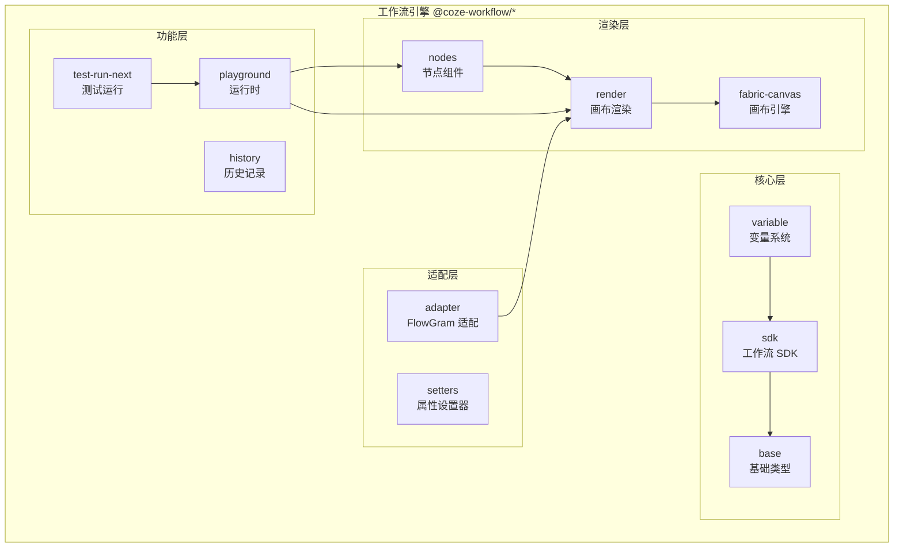
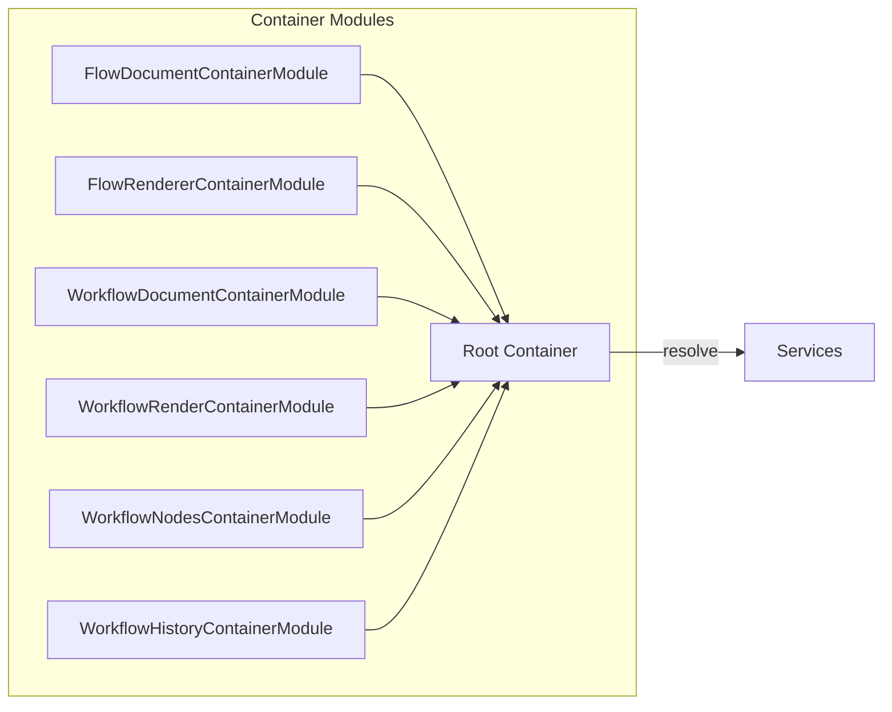
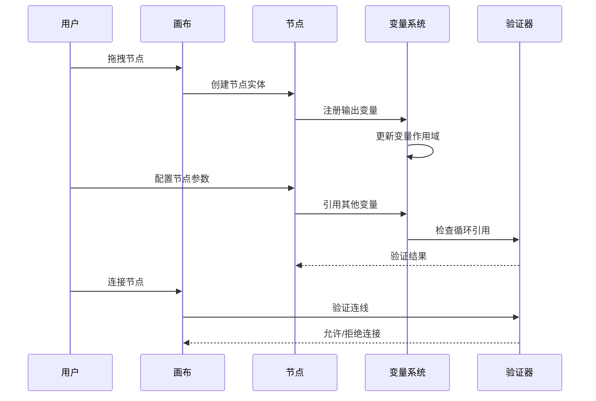

# 工作流引擎深度分析

> 本文档深入分析 Coze Studio 工作流引擎的核心实现，包括变量系统、表达式编辑器、画布渲染、节点系统和测试运行器。

## 目录

1. [变量系统](./01-variable-system.md) - 工作流变量的定义、引用和类型系统
2. [表达式编辑器](./02-expression-editor.md) - 基于 Slate.js 的表达式输入组件
3. [画布渲染](./03-canvas-rendering.md) - 分层渲染架构和 FlowGram 集成
4. [节点系统](./04-node-system.md) - 节点注册、配置和验证
5. [测试运行器](./05-test-runner.md) - 工作流调试和执行追踪
6. [DI 容器与扩展点](./06-di-extensions.md) - 依赖注入容器和插件扩展机制

## 架构概览



## 核心包职责

| 包名 | 路径 | 职责 |
|------|------|------|
| `@coze-workflow/variable` | `packages/workflow/variable/` | 变量定义、类型推断、循环引用检测 |
| `@coze-workflow/render` | `packages/workflow/render/` | 画布渲染、分层系统、连线绘制 |
| `@coze-workflow/nodes` | `packages/workflow/nodes/` | 节点数据结构、验证器、服务 |
| `@coze-workflow/playground` | `packages/workflow/playground/` | 工作流运行时环境 |
| `@coze-workflow/sdk` | `packages/workflow/sdk/` | 工作流 SDK 和工具函数 |
| `@coze-workflow/fabric-canvas` | `packages/workflow/fabric-canvas/` | 底层画布引擎 |
| `@coze-workflow/test-run-next` | `packages/workflow/test-run-next/` | 测试运行和执行追踪 |
| `@coze-workflow/history` | `packages/workflow/history/` | 操作历史和撤销/重做 |
| `@coze-workflow/setters` | `packages/workflow/setters/` | 属性编辑器组件 |

## 技术栈

- **底层框架**: FlowGram (字节跳动开源的流程编排引擎)
- **依赖注入**: Inversify
- **状态管理**: Zustand
- **富文本编辑**: Slate.js
- **拖拽**: react-dnd
- **查询缓存**: React Query

## 入口组件

工作流引擎的主入口是 `WorkflowPlayground` 组件：

```typescript
// frontend/packages/workflow/playground/src/workflow-playground.tsx (摘录，省略部分逻辑)
import { HTML5Backend } from 'react-dnd-html5-backend';
import { DndProvider } from 'react-dnd';
import { QueryClientProvider } from '@tanstack/react-query';
import { WorkflowRenderProvider } from '@coze-workflow/render';
import { WorkflowNodesContainerModule } from '@coze-workflow/nodes';
import { WorkflowHistoryContainerModule } from '@coze-workflow/history';
import { workflowQueryClient } from '@coze-workflow/base/api';
import { useSpaceStore } from '@coze-foundation/space-store-adapter';

export const WorkflowPlayground = forwardRef<
  WorkflowPlaygroundRef,
  WorkflowPlaygroundProps
>(({ spaceId = PUBLIC_SPACE_ID, parentContainer, ...props }, ref) => {
  // 使用 SpaceStore 管理空间状态
  const { spaceList, setSpace, fetchSpaces, checkSpaceID, inited } = useSpaceStore(...);
  
  // 初始化空间
  useEffect(() => {
    const initSpace = async () => {
      if (!inited) await fetchSpaces(true);
      checkSpaceID(spaceId);
      if (spaceId !== PUBLIC_SPACE_ID) setSpace(spaceId);
    };
    initSpace();
  }, [spaceId, ...]);

  const preset = useWorkflowPreset(props);

  if (!inited) return null;  // 等待初始化完成

  return (
    <DndProvider backend={HTML5Backend} context={window}>
      <QueryClientProvider client={workflowQueryClient}>
        <WorkflowRenderProvider
          parentContainer={parentContainer}
          containerModules={[
            WorkflowNodesContainerModule,
            WorkflowPageContainerModule,
            WorkflowHistoryContainerModule,
          ]}
          preset={preset}
        >
          <PlayGroundErrorBoundary>
            <WorkflowContainer ref={ref} {...props} spaceId={spaceId} spaceList={spaceList} />
          </PlayGroundErrorBoundary>
        </WorkflowRenderProvider>
      </QueryClientProvider>
    </DndProvider>
  );
});
```

> **注意**: 上述代码为摘录版本，完整实现请参考源文件。关键差异包括：`DndProvider` 使用 `context={window}`、包含 `PlayGroundErrorBoundary` 错误边界、以及 `inited` 状态检查。

## 依赖注入架构

工作流引擎使用 Inversify 进行依赖注入，通过 ContainerModule 组织服务：



## 数据流



## 关键设计模式

### 1. Facade 模式 (变量系统)
`WorkflowVariableFacade` 提供统一的变量访问接口，隐藏底层 AST 复杂性。

### 2. Provider 模式 (渲染层)
`WorkflowRenderProvider` 使用 React Context 提供画布上下文。

### 3. 静态配置模式 (节点系统)
节点类型配置在 `frontend/packages/workflow/playground/src/node-registries/` 目录下静态定义，通过 FlowGram 的表单元数据机制注册。

### 4. Plugin 模式 (功能扩展)
通过 FlowGram 的插件系统扩展功能，如自动布局、层级管理等。

## 相关文档

- [FlowGram 官方文档](https://github.com/bytedance/flowgram.ai)
- [Coze 工作流开发指南](https://www.coze.cn/open/docs/guides/workflow)
