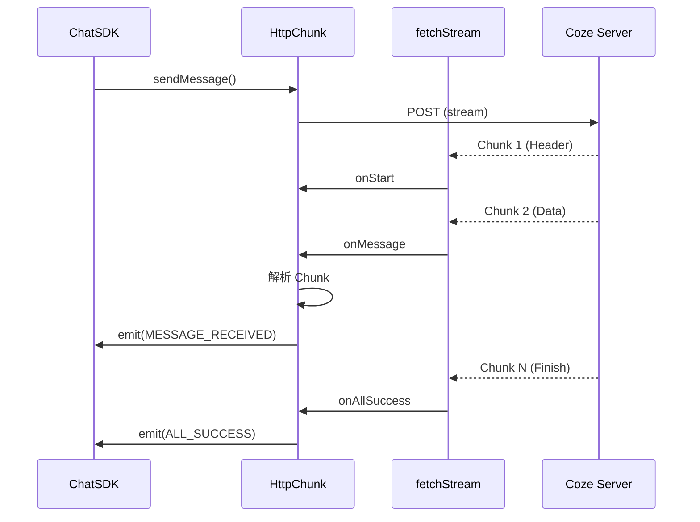

# 流式数据处理

Coze Studio 的聊天响应基于 SSE 协议的事件流实现（使用 `@coze-arch/fetch-stream` 库解析），实现了 AI 的逐字生成效果。核心逻辑位于 `Chat Core` 的 `channel/http-chunk` 模块。

## 核心类：HttpChunk

`HttpChunk` 类负责管理底层的 Fetch 请求流，处理事件流数据（由 fetch-stream 解析），并将其转换为 SDK 内部的标准事件。

### 源码路径
`frontend/packages/common/chat-area/chat-core/src/channel/http-chunk/index.ts`

### 流程图



### 关键特性

1.  **FetchStream**: 使用 `@coze-arch/fetch-stream` 库处理流式响应。
2.  **多路复用管理**: 通过 `FetchDataHelper` 和 `fetchDataHelperMap` 管理并发的流请求。
3.  **超时控制**:
    - `totalFetchTimeout`: 整体请求超时。
    - `betweenChunkTimeout`: 两个数据包之间的超时（防止死连接）。
4.  **事件转换**: 将底层的网络流事件转换为业务可理解的事件（如 `MESSAGE_RECEIVED`）。

```typescript
// frontend/packages/common/chat-area/chat-core/src/channel/http-chunk/index.ts (签名摘要)
private pullMessage = async (...) => {
  await fetchStream<ParsedEvent, FetchDataHelper>(channelFetchInfo.url, {
    onMessage: ({ message, dataClump }) =>
      this.handleMessage({ message, fetchDataHelper: dataClump }),
    // ...处理各种生命周期
  });
};
```

## 块处理器 (ChunkProcessor)

接收到的原始 Chunk 数据是碎片化的，需要组装成完整的消息对象。`ChunkProcessor` 负责这一工作。

### 源码路径
`frontend/packages/common/chat-area/chat-core/src/message/chunk-processor.ts`

### StreamBufferHelper

维护了两个缓冲区：
- `streamChunkBuffer`: 存储原始 Chunk。
- `streamMessageBuffer`: 存储组装后的 Message 对象。

### 增量更新逻辑

当新的 Chunk 到达时：
1.  **查找**: 根据 `message_id` 在缓冲区查找现有消息。
2.  **拼接**: 将新内容追加到现有内容的末尾。
    ```typescript
    message.content = (previousMessage?.content || '') + message.content;
    message.reasoning_content = (previousMessage?.reasoning_content ?? '') + (message.reasoning_content ?? '');
    ```
3.  **更新**: 更新缓冲区中的消息对象。

### 调试支持

`ChunkProcessor` 还支持 `debug_messages` 的组装，这对于排查 AI 生成过程中的问题非常有用（可以看到原始的中间步骤）。

```typescript
// frontend/packages/common/chat-area/chat-core/src/message/chunk-processor.ts (签名摘要)
private assembleDebugMessage(message: Message<ContentType>): Message<ContentType> {
  if (!this.enableDebug) return message;
  // 将所有相关的 Chunk 挂载到消息对象上，便于调试
  message.debug_messages = this.streamBuffer.getChunkByMessageId(message.message_id);
  return message;
}
```
