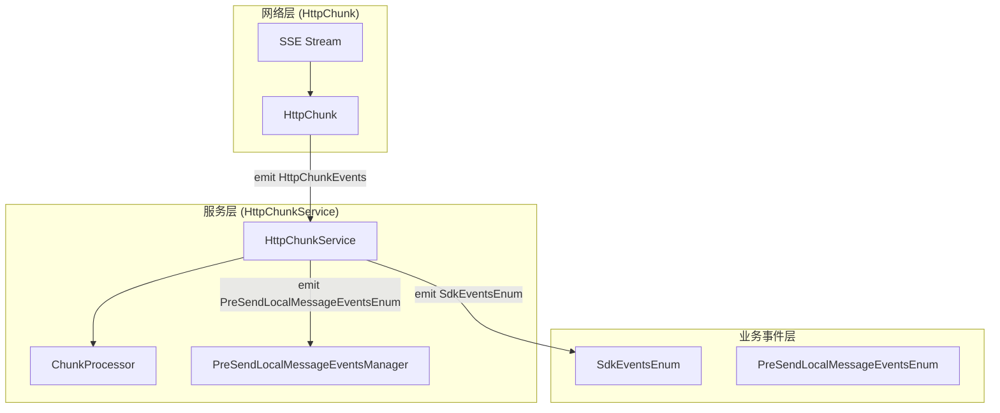
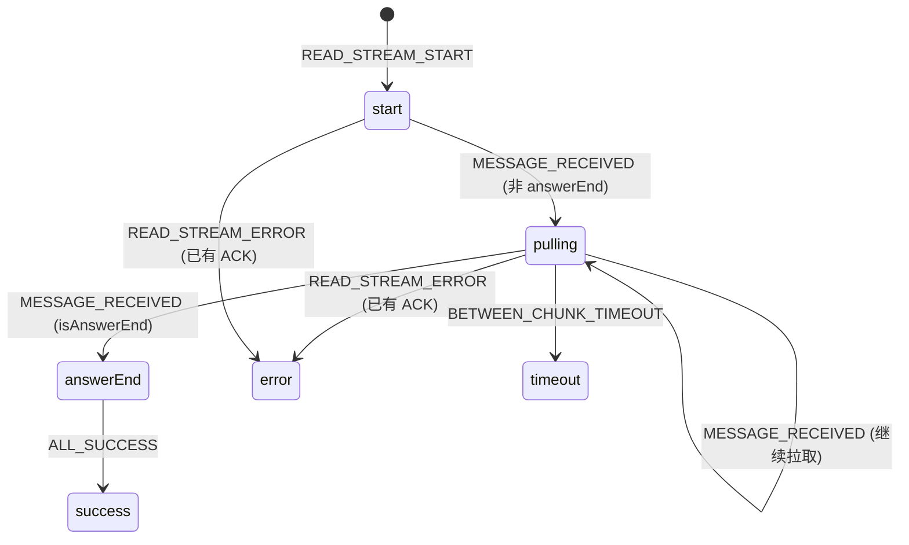
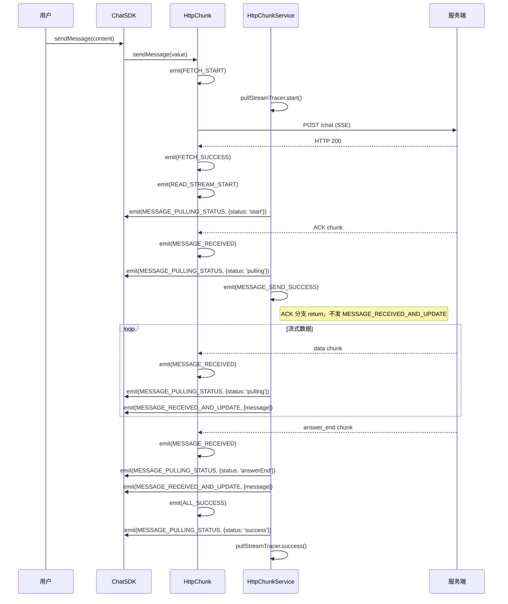
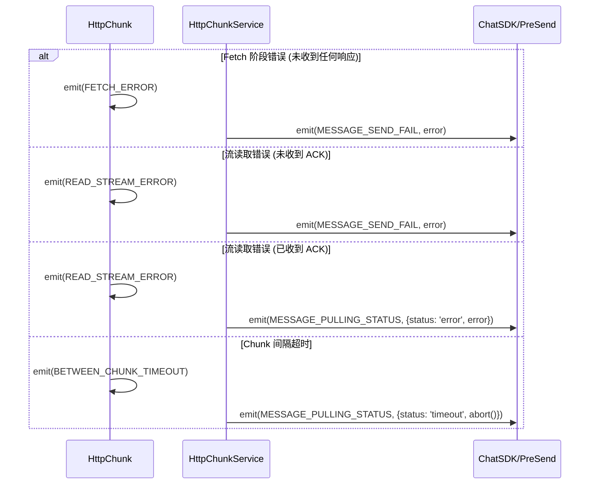

# 事件流映射表

> 本文档详细描述 Chat SDK 的事件流机制，从底层 `HttpChunk` 类（流处理实现）到业务层 SDK 事件的完整映射关系。基于源码分析，准确反映事件的触发与监听关系。
> 
> **注意**: `HttpChunk` 是实现类名（非协议名称），位于 `frontend/packages/common/chat-area/chat-core/src/channel/http-chunk/`。

## 事件流架构



## SDK 事件体系

Coze Studio 的聊天 SDK 采用分层事件体系：

| 层级 | 枚举名 | 源码位置 | 用途 |
|------|--------|----------|------|
| SDK 业务层 | `SdkEventsEnum` | `frontend/packages/common/chat-area/chat-core/src/chat-sdk/events/sdk-events.ts` | 消息接收、拉取状态变更 |
| 预发送消息层 | `PreSendLocalMessageEventsEnum` | `frontend/packages/common/chat-area/chat-core/src/message/types/index.ts` | 发送成功/失败 |
| 网络传输层 | `HttpChunkEvents` | `frontend/packages/common/chat-area/chat-core/src/channel/http-chunk/events/http-chunk-events.ts` | 流处理 |
| 监控埋点层 | `SlardarEvents` | `frontend/packages/common/chat-area/chat-core/src/chat-sdk/events/slardar-events.ts` | 性能监控、链路追踪 |

## SdkEventsEnum (SDK 业务事件)

```typescript
// frontend/packages/common/chat-area/chat-core/src/chat-sdk/events/sdk-events.ts

export enum SdkEventsEnum {
  // 消息接收并更新 - 每次收到非 ACK chunk 时触发
  MESSAGE_RECEIVED_AND_UPDATE = 'message_received_and_update',
  
  // 拉取状态变更 - 贯穿整个拉取流程
  MESSAGE_PULLING_STATUS = 'message_pulling_status',
  
  // 错误事件 - 当前源码中未被主动 emit
  ERROR = 'error',
}
```

### SdkEventsEnum 事件详解

| 事件名 | 值 | 触发时机 | Payload 类型 |
|--------|-----|----------|--------------|
| `MESSAGE_RECEIVED_AND_UPDATE` | `message_received_and_update` | 每次收到非 ACK 类型的 chunk 时 | `SdkMessageReceivedAndUpdateEvent` |
| `MESSAGE_PULLING_STATUS` | `message_pulling_status` | 拉取状态变更时（start/pulling/answerEnd/success/error/timeout） | `SdkPullingStatusEvent` |
| `ERROR` | `error` | 类型定义存在，但当前源码未主动 emit | `SdkErrorEvent` |

### PullingStatus 状态机



### SdkPullingStatusEvent 结构

```typescript
// frontend/packages/common/chat-area/chat-core/src/chat-sdk/types/interface.ts

export interface SdkPullingStatusEvent {
  name: SdkEventsEnum.MESSAGE_PULLING_STATUS;
  data: {
    pullingStatus: PullingStatus;  // 'start' | 'pulling' | 'answerEnd' | 'success' | 'error' | 'timeout'
    local_message_id: string;
    reply_id: string;
  };
  error?: ChatCoreError;  // 仅在 error/timeout 时存在
  abort?: () => void;     // 仅在 timeout 时存在，可调用中止请求
}
```

## HttpChunkEvents (HttpChunk 类事件)

```typescript
// frontend/packages/common/chat-area/chat-core/src/channel/http-chunk/events/http-chunk-events.ts

export enum HttpChunkEvents {
  MESSAGE_RECEIVED = 'http_chunk_message_received',
  MESSAGE_RECEIVED_INVALID = 'http_chunk_message_received_invalid',  // 枚举存在但未被 emit
  TOTAL_FETCH_TIMEOUT = 'http_chunk_total_fetch_timeout',
  BETWEEN_CHUNK_TIMEOUT = 'http_chunk_between_chunk_timeout',
  FETCH_START = 'http_chunk_fetch_start',
  FETCH_SUCCESS = 'http_chunk_fetch_success',
  FETCH_ERROR = 'http_chunk_fetch_error',
  INVALID_MESSAGE = 'http_chunk_invalid_message',
  READ_STREAM_START = 'http_chunk_read_stream_start',
  READ_STREAM_ERROR = 'http_chunk_read_stream_error',
  ALL_SUCCESS = 'http_chunk_all_success',
}
```

### HttpChunkEvents 触发与监听对照表

| 事件名 | HttpChunk 是否 emit | HttpChunkService 是否监听 | 说明 |
|--------|---------------------|---------------------------|------|
| `FETCH_START` | ✅ | ✅ | 开始 fetch 请求 |
| `FETCH_SUCCESS` | ✅ | ❌ | fetch 成功，当前未被监听 |
| `FETCH_ERROR` | ✅ | ✅ | fetch 阶段异常 |
| `READ_STREAM_START` | ✅ | ✅ | 开始读取流 |
| `MESSAGE_RECEIVED` | ✅ | ✅ | 收到有效 chunk |
| `INVALID_MESSAGE` | ✅ | ❌ | 无效消息格式，当前未被监听 |
| `READ_STREAM_ERROR` | ✅ | ✅ | 流读取异常 |
| `BETWEEN_CHUNK_TIMEOUT` | ✅ | ✅ | chunk 间隔超时 |
| `TOTAL_FETCH_TIMEOUT` | ✅ | ❌ | 整体超时，**当前未被监听** |
| `ALL_SUCCESS` | ✅ | ✅ | 完整接收成功 |
| `MESSAGE_RECEIVED_INVALID` | ❌ | ❌ | 枚举存在但未使用 |

> **重要**: `TOTAL_FETCH_TIMEOUT` 虽然被 HttpChunk emit，但 HttpChunkService 当前版本未监听该事件。

## 事件映射关系

### HttpChunkEvents → SDK 事件/行为

| HttpChunk 事件 | 触发的 SDK 事件/行为 | 条件 |
|----------------|---------------------|------|
| `FETCH_START` | `pullStreamTracer.start()` | 无条件 |
| `READ_STREAM_START` | `MESSAGE_PULLING_STATUS` (status: 'start') | 无条件 |
| `MESSAGE_RECEIVED` (任意) | `MESSAGE_PULLING_STATUS` (status: 'pulling' 或 'answerEnd') | **所有 chunk 都会先发此事件** |
| `MESSAGE_RECEIVED` (ACK) | `PreSendLocalMessageEventsEnum.MESSAGE_SEND_SUCCESS` | chunk.type === 'ack'，发完 pulling_status 后 return |
| `MESSAGE_RECEIVED` (非 ACK) | `MESSAGE_RECEIVED_AND_UPDATE` | chunk.type !== 'ack' |
| `ALL_SUCCESS` | `MESSAGE_PULLING_STATUS` (status: 'success') | 无条件 |
| `FETCH_ERROR` | `PreSendLocalMessageEventsEnum.MESSAGE_SEND_FAIL` | 无条件 |
| `READ_STREAM_ERROR` (无 ACK) | `PreSendLocalMessageEventsEnum.MESSAGE_SEND_FAIL` | 未收到 ACK |
| `READ_STREAM_ERROR` (有 ACK) | `MESSAGE_PULLING_STATUS` (status: 'error') | 已收到 ACK |
| `BETWEEN_CHUNK_TIMEOUT` | `MESSAGE_PULLING_STATUS` (status: 'timeout') | 无条件 |

> **关键**: `MESSAGE_RECEIVED` 无论 ACK 还是非 ACK，都会**先**发送 `MESSAGE_PULLING_STATUS` 事件（`:138-145`），然后 ACK 分支 return（`:175-183`），非 ACK 分支继续发送 `MESSAGE_RECEIVED_AND_UPDATE`（`:186-189`）。参见 `frontend/packages/common/chat-area/chat-core/src/chat-sdk/services/http-chunk-service.ts:138-190`（摘录覆盖该方法分支逻辑）。

## 事件流程图

### 发送消息成功流程



### 错误处理流程



## SlardarEvents (监控埋点事件)

```typescript
// frontend/packages/common/chat-area/chat-core/src/chat-sdk/events/slardar-events.ts

export enum SlardarEvents {
  SDK_INIT = 'chat_sdk_init',
  SDK_MESSAGE_UPLOAD_FAIL = 'chat_sdk_message_upload_fail',
  SDK_BREAK_MESSAGE = 'chat_sdk_break_message',
  SDK_MESSAGE_SEND_TRACER = 'chat_sdk_message_send_tracer',
  SDK_PULL_STREAM_TRACER = 'chat_sdk_pull_stream_tracer',
}
```

### Tracer 链路追踪

`ReportEventsTracer` 类封装了链路追踪逻辑，在关键节点自动打点：

| Tracer 方法 | 触发时机 | 对应 HttpChunkEvent |
|-------------|----------|---------------------|
| `sendMessageTracer.start()` | 消息发送开始 | N/A (SDK 层) |
| `pullStreamTracer.start()` | 开始拉取 | `FETCH_START` |
| `pullStreamTracer.receiveAck()` | 收到 ACK | `MESSAGE_RECEIVED` (ACK) |
| `pullStreamTracer.receiveFirstAnsChunk()` | 收到首个回答 | `MESSAGE_RECEIVED` (首次非 ACK) |
| `pullStreamTracer.success()` | 拉取成功 | `ALL_SUCCESS` |
| `pullStreamTracer.error()` | 拉取错误 | `READ_STREAM_ERROR` |
| `pullStreamTracer.timeout()` | 拉取超时 | `BETWEEN_CHUNK_TIMEOUT` |

## 事件监听示例

```typescript
import { ChatCore, SdkEventsEnum } from '@coze-common/chat-core';

const chatCore = new ChatCore({ /* config */ });

// 监听消息接收更新 - 每次收到非 ACK chunk 时触发
chatCore.on(SdkEventsEnum.MESSAGE_RECEIVED_AND_UPDATE, (event) => {
  const { data: messages } = event;
  console.log('收到消息:', messages);
  // messages 是 Message[] 数组
});

// 监听拉取状态变更 - 贯穿整个拉取流程
chatCore.on(SdkEventsEnum.MESSAGE_PULLING_STATUS, (event) => {
  const { data, error, abort } = event;
  const { pullingStatus, local_message_id, reply_id } = data;
  
  switch (pullingStatus) {
    case 'start':
      console.log('开始拉取');
      break;
    case 'pulling':
      console.log('拉取中...');
      break;
    case 'answerEnd':
      console.log('回答结束');
      break;
    case 'success':
      console.log('拉取完成');
      break;
    case 'error':
      console.error('拉取错误:', error);
      break;
    case 'timeout':
      console.warn('拉取超时');
      // 可调用 abort() 中止请求
      abort?.();
      break;
  }
});
```

## 超时配置

HttpChunk 层支持两种超时检测：

| 超时类型 | 事件 | 是否被监听 | 说明 |
|----------|------|------------|------|
| chunk 间隔超时 | `BETWEEN_CHUNK_TIMEOUT` | ✅ | 两次 chunk 之间最大间隔 |
| 整体请求超时 | `TOTAL_FETCH_TIMEOUT` | ❌ | emit 但未监听，当前版本不生效 |

## 关键符号索引

| 符号 | 路径 | 说明 |
|------|------|------|
| `SdkEventsEnum` | `frontend/packages/common/chat-area/chat-core/src/chat-sdk/events/sdk-events.ts` | SDK 业务事件枚举 |
| `HttpChunkEvents` | `frontend/packages/common/chat-area/chat-core/src/channel/http-chunk/events/http-chunk-events.ts` | 流事件枚举 |
| `HttpChunk` | `frontend/packages/common/chat-area/chat-core/src/channel/http-chunk/index.ts` | 流处理底层实现 |
| `HttpChunkService` | `frontend/packages/common/chat-area/chat-core/src/chat-sdk/services/http-chunk-service.ts` | 事件监听与处理 |
| `SlardarEvents` | `frontend/packages/common/chat-area/chat-core/src/chat-sdk/events/slardar-events.ts` | 监控埋点事件枚举 |
| `ReportEventsTracer` | `frontend/packages/common/chat-area/chat-core/src/chat-sdk/events/slardar-events.ts` | 链路追踪类 |
| `PreSendLocalMessageEventsEnum` | `frontend/packages/common/chat-area/chat-core/src/message/types/index.ts` | 预发送消息事件枚举 |

## 最佳实践

1. **监听 `MESSAGE_PULLING_STATUS`**: 这是状态同步的核心事件，包含完整的生命周期状态
2. **区分 ACK 与数据**: ACK 表示发送成功，后续 chunk 才是实际回复内容
3. **处理超时**: 使用 `abort()` 回调中止超时请求，避免资源浪费
4. **错误分类**: 根据是否收到 ACK 判断是发送失败还是拉取失败
5. **清理监听**: 在组件卸载时移除事件监听，避免内存泄漏
