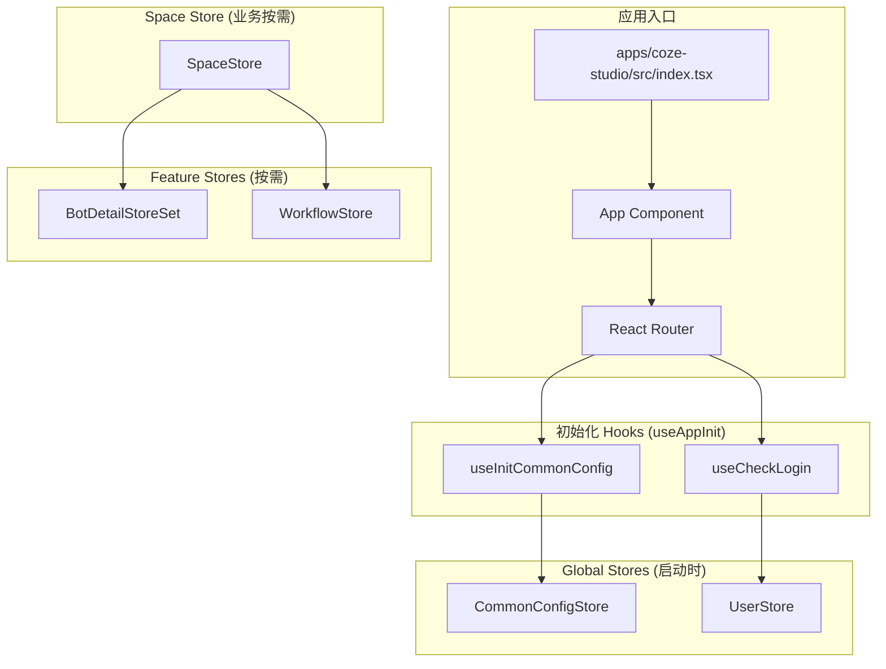
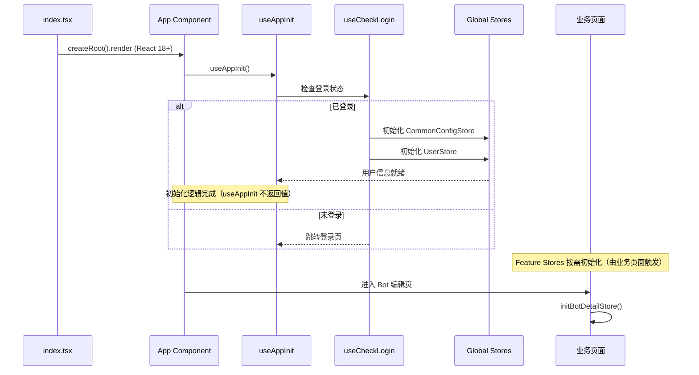
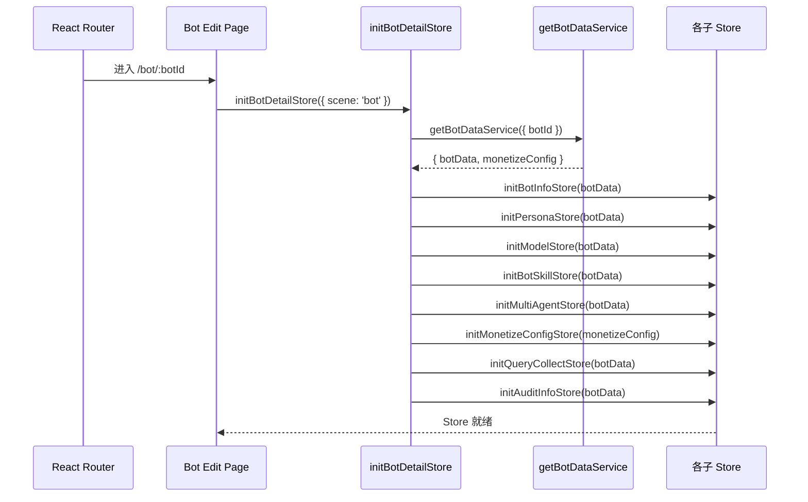
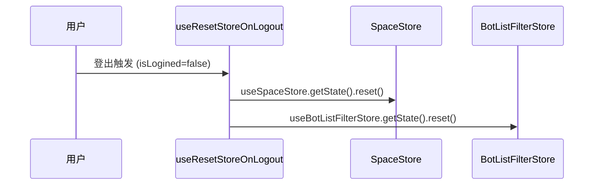

# 应用初始化流程

> 本文档描述 Coze Studio 应用启动时 Store 的初始化顺序和触发点。

## 初始化架构



> **注意**: SpaceStore 不由 `useAppInit` 触发，而是由业务组件（如 `WorkflowPlayground`）按需初始化。

## 初始化时序



> **注意**: Bot 编辑页通过 `initBotDetailStore()` 函数统一初始化所有子 Store。

## 关键初始化 Hook

### useAppInit

应用级初始化入口，聚合所有初始化逻辑：

```typescript
// frontend/packages/foundation/global-adapter/src/hooks/use-app-init/index.ts (实际代码)

export const useAppInit = () => {
  const { requireAuth, requireAuthOptional, loginFallbackPath } =
    useRouteConfig();

  // 1. 登录检查
  useCheckLogin({
    needLogin: !!(requireAuth && !requireAuthOptional),
    loginFallbackPath,
  });

  // 2. 同步 LocalStorage 中的 UID
  useSyncLocalStorageUid();

  // 3. 初始化 Reporter 和 Logger
  useEffect(() => {
    reporter.info({ message: 'Ok fine' });
    reporter.init(slardar);
    logger.init(slardar);
  }, []);

  // 4. 错误捕获
  useErrorCatch(slardar);

  // 5. 初始化通用配置
  useInitCommonConfig();

  // 6. 登出时重置 Store
  useResetStoreOnLogout();

  // 7. 响应式 body 样式
  useSetResponsiveBodyStyle();

  // 8. 登出弹窗提示
  useAlertOnLogout();
};
```

**关键依赖**:

| Hook | 来源 | 职责 |
|------|------|------|
| `useRouteConfig` | `@coze-arch/bot-hooks` | 获取当前路由的鉴权配置 |
| `useCheckLogin` | `@coze-foundation/account-adapter` | 检查登录状态，未登录则跳转 |
| `useSyncLocalStorageUid` | `@coze-foundation/account-adapter` | 同步用户 ID 到 LocalStorage |
| `useErrorCatch` | `@coze-arch/bot-error` | 全局错误捕获与上报 |
| `useInitCommonConfig` | 同目录 | 初始化通用配置 Store |
| `useResetStoreOnLogout` | 同目录 | 登出时清理所有 Store |
| `useSetResponsiveBodyStyle` | 同目录 | 根据屏幕尺寸设置 body 样式 |
| `useAlertOnLogout` | `@coze-foundation/global/use-app-init` | 登出时弹窗提示 |
```

### 空间初始化

空间初始化逻辑**分布在具体的业务组件中**，例如 `WorkflowPlayground` 组件：

```typescript
// frontend/packages/workflow/playground/src/workflow-playground.tsx (摘录)

export const WorkflowPlayground = forwardRef<...>(
  ({ spaceId = PUBLIC_SPACE_ID, ... }, ref) => {
    const { spaceList, setSpace, fetchSpaces, checkSpaceID, inited } = useSpaceStore(...);

    useEffect(() => {
      const initSpace = async () => {
        if (!inited) await fetchSpaces(true);
        checkSpaceID(spaceId);
        if (spaceId !== PUBLIC_SPACE_ID) setSpace(spaceId);
      };
      initSpace();
    }, [spaceId, ...]);

    if (!inited) return null; // 等待初始化完成
    // ...
  }
);
```

> **设计说明**: 不存在统一的 `useSpaceInit` Hook。空间初始化由各业务组件自行处理。

## Store 初始化顺序

### 第一层：全局 Store (应用启动时由 useAppInit 触发)

| Store | 触发点 | 依赖 | 说明 |
|-------|--------|------|------|
| `CommonConfigStore` | `useInitCommonConfig` | 无 | 通用配置 |
| `UserStore` | `useCheckLogin` | Auth | 用户信息 |

### 第二层：空间 Store (业务组件按需触发)

| Store | 触发点 | 依赖 | 说明 |
|-------|--------|------|------|
| `SpaceStore` | 业务组件（如 `WorkflowPlayground`） | User | 空间列表 |

> **注意**: SpaceStore 不由 `useAppInit` 直接初始化，而是由需要空间上下文的业务组件按需触发（调用 `fetchSpaces()`）。

### 第三层：功能 Store (按需初始化)

| Store | 触发点 | 依赖 | 说明 |
|-------|--------|------|------|
| `BotDetailStoreSet` | `initBotDetailStore()` | Space | Bot 详情 |
| `WorkflowStore` | 进入工作流页面 | Space | 工作流数据 |

## BotDetailStoreSet 初始化

BotDetailStoreSet 是最复杂的 Store 集合，通过 `initBotDetailStore` 函数统一初始化：



### 初始化函数

```typescript
// frontend/packages/studio/stores/bot-detail/src/init/init-bot-detail-store.ts

export async function initBotDetailStore(params?: {
  version?: HistoryInfo['version'];
  scene?: 'bot' | 'market';
}) {
  const { version, scene = 'bot' } = params ?? {};
  const { botId, version: botInfoVersion } = useBotInfoStore.getState();
  
  // 获取 Bot 数据
  const { botData, monetizeConfig = {} } = await getBotDataService({
    scene, botId, customVersion: version, botInfoVersion,
  });
  
  // 初始化各子 Store
  initBotDetailStoreSet(botData, monetizeConfig);
}
```

> **源码位置**: `frontend/packages/studio/stores/bot-detail/src/init/init-bot-detail-store.ts`

## 登出清理流程



### 清理流程说明

登出时的 Store 清理由 `useResetStoreOnLogout` Hook 处理。

```typescript
// frontend/packages/foundation/global-adapter/src/hooks/use-app-init/use-reset-store-on-logout.ts

export const useResetStoreOnLogout = () => {
  const isSettled = userStoreService.useIsSettled();
  const isLogined = userStoreService.useIsLogined();
  
  useEffect(() => {
    if (isSettled && !isLogined) {
      useSpaceStore.getState().reset();
      useBotListFilterStore.getState().reset();
    }
  }, [isLogined, isSettled]);
};
```

> **注意**: 当前实现仅清理 `SpaceStore` 和 `BotListFilterStore`。其他 Store（如 `BotDetailStore`）的清理由各自的页面组件或路由守卫负责。

## 初始化状态检查

```typescript
// 概念示意 - 应用初始化状态检查
// 注意：useAppInit 实际不返回任何值，此处为示意用法

function AppContent() {
  // useAppInit 执行初始化逻辑，但不返回状态
  useAppInit();
  
  // 实际初始化状态需从各 Store 获取
  // 注意：CommonConfigStore 使用 `initialized`，SpaceStore 使用 `inited`
  const { initialized: commonConfigInited } = useCommonConfigStore();
  const { inited: spaceInited } = useSpaceStore();
  
  if (!commonConfigInited) {
    return <Loading text="应用初始化中..." />;
  }
  
  if (!spaceInited) {
    return <Loading text="加载空间..." />;
  }
  
  return <Router />;
}
```

> **注意**: `useAppInit` Hook 不返回任何值，它只负责执行初始化逻辑。应用的初始化状态需要从各个 Store 的 `inited` 字段获取。

## 关键符号索引

| 符号 | 路径 | 说明 |
|------|------|------|
| `useAppInit` | `foundation/global-adapter/src/hooks/use-app-init/index.ts` | 应用初始化 Hook |
| `useResetStoreOnLogout` | `foundation/global-adapter/src/hooks/use-app-init/use-reset-store-on-logout.ts` | 登出清理 Hook |
| `useCommonConfigStore` | `foundation/global-store/src/stores/common-config-store.ts` | 通用配置 Store |
| `useSpaceStore` | `foundation/space-store-adapter/src/space/index.ts` | 空间 Store |
| `useBotDetailStoreSet` | `studio/stores/bot-detail/src/store/index.ts` | Bot 详情 Store 集合 |
| `initBotDetailStore` | `studio/stores/bot-detail/src/init/init-bot-detail-store.ts` | Bot Store 统一初始化函数 |
| `getBotDataService` | `studio/stores/bot-detail/src/services/get-bot-data-service.ts` | 获取 Bot 数据服务 |

## 最佳实践

1. **懒加载**: Feature Store 按需初始化，避免启动时加载过多数据
2. **依赖顺序**: 严格按依赖顺序初始化，避免数据不一致
3. **清理责任**: 每个 Store 负责自己的 reset 逻辑
4. **状态检查**: 使用 `inited` 标志控制渲染时机
5. **错误处理**: 初始化失败时提供降级方案
