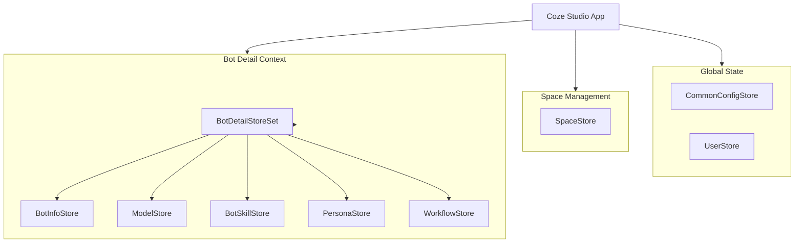

# 03. 状态管理 (State Management)

[TOC]

Coze Studio 采用 **Zustand** 作为核心状态管理库，配合 **Immer** 实现不可变状态更新。状态管理架构主要分为全局状态（Global Store）、工作空间状态（Space Store）和 Bot 详情状态（Bot Detail Store）。

## 1. 状态管理概览

### 1.1 技术栈
- **Zustand**: 轻量级状态管理库，支持 Hook 风格 API
- **Immer**: 简化不可变数据操作
- **Redux DevTools**: 支持开发者工具调试
- **Middleware**: 自定义中间件（如持久化、日志上报）

### 1.2 核心 Store 架构

| Store 类型 | 描述 | 主要包路径 |
| --- | --- | --- |
| **Global Store** | 全局通用配置、用户信息、主题设置 | `@coze-foundation/global-store` |
| **Space Store** | 团队/个人空间管理、权限控制 | `@coze-foundation/space-store-adapter` |
| **Bot Detail Store** | Bot 编辑器核心状态，包含多个子 Store | `@coze-studio/bot-detail-store` |



---

## 2. Global Store (全局状态)

管理应用级别的通用配置，如引导页配置、横幅广告、快速开始模板等。

**源码路径**: `frontend/packages/foundation/global-store/src/stores/common-config-store.ts`

### 2.1 状态结构
```typescript
// 源码路径: frontend/packages/foundation/global-store/src/stores/common-config-store.ts:25-36 (摘录)
interface ICommonConfigStoreState {
  initialized: boolean;
  commonConfigs: {
    botIdeGuideVideoUrl: string;    // IDE 引导视频
    bannerConfig?: CozeBanner;      // 横幅配置
    homeBannerTask?: HomeBannerDisplay[]; // 首页任务
    quickStart?: QuickStartConfig[]; // 快速开始模板
    oceanProjectSpaces?: string[];  // Ocean 项目空间
    douyinAvatarSpaces?: string[];  // 抖音头像空间
  };
}
```

### 2.2 使用示例
```typescript
import { useCommonConfigStore } from '@coze-foundation/global-store';

// 获取配置
const commonConfigs = useCommonConfigStore(state => state.commonConfigs);

// 更新配置
const updateConfig = useCommonConfigStore(state => state.updateCommonConfigs);
```

---

## 3. Space Store (空间管理)

管理用户的工作空间（个人空间/团队空间），支持轮询更新和自动创建个人空间。

### 包分层结构

| 包名 | 职责 | 推荐场景 |
|------|------|----------|
| `@coze-foundation/space-store-adapter` | 底层 Store，提供原始 `useSpaceStore` | 仅在需要直接访问底层 store 时使用 |
| `@coze-foundation/space-store` | 高级封装，提供 `useSpaceList/useSpace/useRefreshSpaces` | **业务开发默认使用** |

### 3.1 核心功能
- **空间列表管理**: `spaceList`, `recentlyUsedSpaceList`
- **当前空间上下文**: `space` (已废弃，建议使用 hooks)
- **轮询机制**: 自动轮询空间列表更新状态
- **自动初始化**: 如果没有个人空间，自动创建

### 3.2 底层 Store (`@coze-foundation/space-store-adapter`)

**源码路径**: `frontend/packages/foundation/space-store-adapter/src/space/index.ts`

```typescript
interface SpaceStoreState {
  spaceList: BotSpace[];              // 所有可用空间
  recentlyUsedSpaceList: BotSpace[];  // 最近使用
  loading: false | Promise<SpaceInfo>; // 加载状态
  inited?: boolean;                   // 初始化标志
  createdTeamSpaceNum: number;        // 已创建团队空间数
  maxTeamSpaceNum: number;            // 最大允许团队空间数
}
```

### 3.3 高级 Hooks (`@coze-foundation/space-store`) - 推荐

**源码路径**: `frontend/packages/foundation/space-store/src/`

业务开发应优先使用这些封装好的 Hooks：

- `useSpaceList()`: 获取空间列表和加载状态
- `useSpace(id)`: 获取指定空间信息
- `useRefreshSpaces()`: 强制刷新空间列表

```typescript
// 推荐用法
import { useSpaceList, useSpace } from '@coze-foundation/space-store';

const SpaceSelector = () => {
  const { spaces, loading } = useSpaceList();
  const { space } = useSpace('space-id-123');
  
  if (loading) return <Spin />;
  
  return (
    <Select options={spaces.map(s => ({ label: s.name, value: s.id }))} />
  );
};
```

---

## 4. Bot Detail Store (Bot 编辑器核心)

这是整个系统中最复杂的状态管理部分，采用 **Store Set** 模式组合了多个子 Store，管理 Bot 编排过程中的所有数据。

**源码路径**: `frontend/packages/studio/stores/bot-detail/src/store/index.ts`

### 4.1 组合架构 (Store Set)
`useBotDetailStoreSet` 充当外观模式（Facade），统一管理所有子 Store 的生命周期。

```typescript
// 源码路径: frontend/packages/studio/stores/bot-detail/src/store/index.ts:31-43 (摘录)
export interface BotDetailStoreSet {
  usePersonaStore: typeof usePersonaStore;               // 人设与提示词
  useQueryCollectStore: typeof useQueryCollectStore;     // 查询收集
  useMultiAgentStore: typeof useMultiAgentStore;         // 多智能体
  useModelStore: typeof useModelStore;                   // 模型配置
  useBotSkillStore: typeof useBotSkillStore;             // 技能 (插件/工作流/数据库等)
  useBotInfoStore: typeof useBotInfoStore;               // 基本信息
  useCollaborationStore: typeof useCollaborationStore;   // 协作
  usePageRuntimeStore: typeof usePageRuntimeStore;       // 页面运行时
  useMonetizeConfigStore: typeof useMonetizeConfigStore; // 变现配置
  useManuallySwitchAgentStore: typeof useManuallySwitchAgentStore; // 手动切换 Agent
  useDiffTaskStore: typeof useDiffTaskStore;             // Diff 任务
}
// 注: getStore() 返回时还包含 useAuditInfoStore
```

### 4.2 核心子 Store 详解

#### A. BotInfoStore (基本信息)
管理 Bot 的元数据，如名称、图标、描述、发布状态等。
- **路径**: `frontend/packages/studio/stores/bot-detail/src/store/bot-info.ts`
- **关键字段**: `botId`, `mode`, `icon_uri`, `botMarketStatus`, `connectors`

#### B. ModelStore (模型配置)
管理模型参数配置。
- **路径**: `frontend/packages/studio/stores/bot-detail/src/store/model.ts`
- **关键字段**: `model` (ID), `temperature`, `max_tokens`, `context_mode`

#### C. BotSkillStore (技能配置 - 核心)
管理 Bot 拥有的各种能力，是业务逻辑最集中的 Store。
- **路径**: `frontend/packages/studio/stores/bot-detail/src/store/bot-skill/store.ts`
- **包含模块**:
  - `pluginApis`: 已启用的插件列表
  - `workflows`: 关联的工作流
  - `knowledge`: 知识库配置
  - `database`: 数据库/变量配置
  - `onboardingContent`: 开场白配置
  - `suggestionConfig`: 推荐问题配置
  - `voicesInfo`: 音色配置

### 4.3 初始化流程
Bot 详情页加载时，通过 `initBotDetailStore` 函数批量初始化所有子 Store：

```typescript
// 伪代码示例
export const initBotDetailStore = (data) => {
  // 1. 初始化基本信息
  useBotInfoStore.getState().initStore(data);
  
  // 2. 初始化模型配置
  useModelStore.getState().initStore(data);
  
  // 3. 初始化技能 (转换后端 DTO -> 前端 VO)
  useBotSkillStore.getState().initStore(data);
  
  // 4. 初始化人设
  usePersonaStore.getState().initStore(data);
};
```

### 4.4 数据转换 (DTO vs VO)
Store 内部维护了 `transformDto2Vo` 和 `transformVo2Dto` 方法，负责后端数据结构与前端状态之间的双向转换，实现了数据层与视图层的解耦。

---

## 5. 最佳实践与模式

### 5.1 Setter Factory 模式
为了减少样板代码，Bot Detail Store 使用了 `setterActionFactory` 自动生成状态更新函数。

```typescript
// 定义
export const setterActionFactory = <T>(set) => (partial) => {
  set((state) => ({ ...state, ...partial }));
};

// 使用
setBotInfo: setterActionFactory<BotInfoStore>(set),
```

### 5.2 Immer 集成
对于深层嵌套的对象更新，统一使用 `produce` (Immer)：

```typescript
setBotSkillByImmer: update =>
  set(produce<BotSkillStore>(draft => update(draft))),

// 调用
store.setBotSkillByImmer(draft => {
  draft.knowledge.dataSetInfo.params.limit = 10;
});
```

### 5.3 模块化开发建议
1. **新建 Store**: 在 `packages/studio/stores/bot-detail/src/store/` 下创建新文件
2. **注册**: 在 `index.ts` 的 `BotDetailStoreSet` 中注册
3. **清理**: 在 `clear()` 方法中添加重置逻辑
4. **DevTools**: 务必为 create 添加 `devtools` 中间件并指定唯一的 `name`

```typescript
export const useMyNewStore = create()(
  devtools(
    (set) => ({ ... }),
    { name: 'botStudio.botDetail.myNewStore' }
  )
);
```

---

## 6. 相关文档

- [全局 Store 详解](./01-global-store.md) - CommonConfigStore 实现细节
- [Space Store 详解](./02-space-store.md) - 空间管理和轮询机制
- [Bot Detail Store 详解](./03-bot-detail-store.md) - 子 Store 组合模式
- [Store 模式与最佳实践](./04-store-patterns.md) - Setter Factory 和 Immer 使用
- [应用初始化流程](./05-initialization-flow.md) - 从入口到 Store 的触发链路
