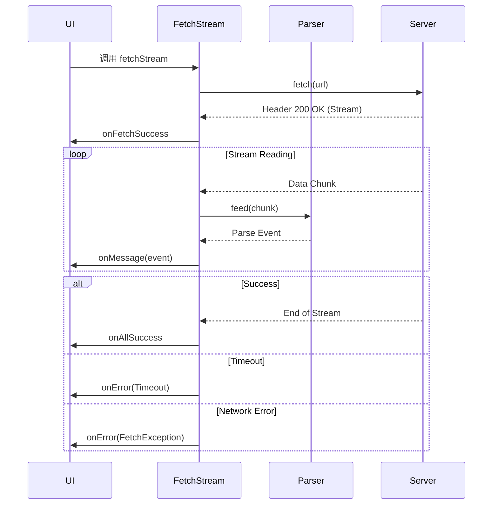

# 流式处理 (Streaming)

对于对话、日志实时输出等场景，Coze Studio 使用 `@coze-arch/fetch-stream` 包来处理基于 SSE 协议的事件流。

## 核心函数：fetchStream

源码路径: `frontend/packages/arch/fetch-stream/src/fetch-stream.ts`

`fetchStream` 是一个独立的实用函数，不依赖于 Axios，而是直接使用原生 `fetch` API 以支持流式读取。

```typescript
// frontend/packages/arch/fetch-stream/src/fetch-stream.ts (签名摘要)
export async function fetchStream<Message = ParseEvent, DataClump = unknown>(
  requestInfo: RequestInfo,
  config: FetchSteamConfig<Message, DataClump>,
): Promise<void>
```

### 配置项详解

| 参数 | 类型 | 说明 |
|------|------|------|
| `onStart` | `() => void` | 请求发起时调用 |
| `onFetchSuccess` | `(res: Response) => void` | Fetch 成功建立连接时调用 |
| `onMessage` | `(data: Message) => void` | **核心回调**：收到单条消息时触发 |
| `onAllSuccess` | `() => void` | 流结束且无错误时调用 |
| `onError` | `(err: unknown) => void` | 发生错误时调用 |
| `streamParser` | `StreamParser` | 解析器实例 (如 SSE Parser) |
| `signal` | `AbortSignal` | 用于取消请求 |
| `totalFetchTimeout` | `number` | 总超时时间 (ms) |
| `betweenChunkTimeout` | `number` | 块间超时时间 (ms) |

## 工作流程



## 错误处理

流式请求定义了一套独立的错误码系统。

```typescript
export enum FetchStreamErrorCode {
  FetchException = 10001,             // 建立连接失败 (网络错误)
  HttpChunkStreamingException = 10002 // 读取流过程中断或解析失败
}
```

## 使用示例

```typescript
// 示意代码 - 展示 fetchStream 的基本用法
import { fetchStream } from '@coze-arch/fetch-stream';

const controller = new AbortController();

await fetchStream('/api/chat/stream', {
  method: 'POST',
  body: JSON.stringify({ message: 'Hello' }),
  signal: controller.signal,
  
  // streamParser 由调用方提供，chat-core 中使用自定义解析器
  // 见 frontend/packages/common/chat-area/chat-core/src/channel/http-chunk/index.ts
  
  onMessage: (event) => {
    console.log('收到消息:', event.data);
    appendMessage(event.data);
  },
  
  onError: (err) => {
    console.error('流中断:', err);
  },
  
  onAllSuccess: () => {
    console.log('回复完成');
  }
});
```
