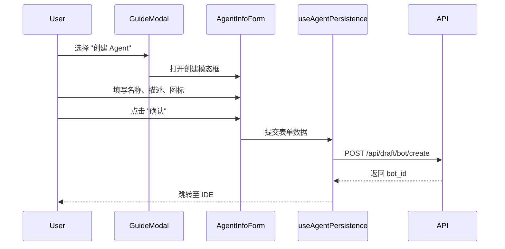
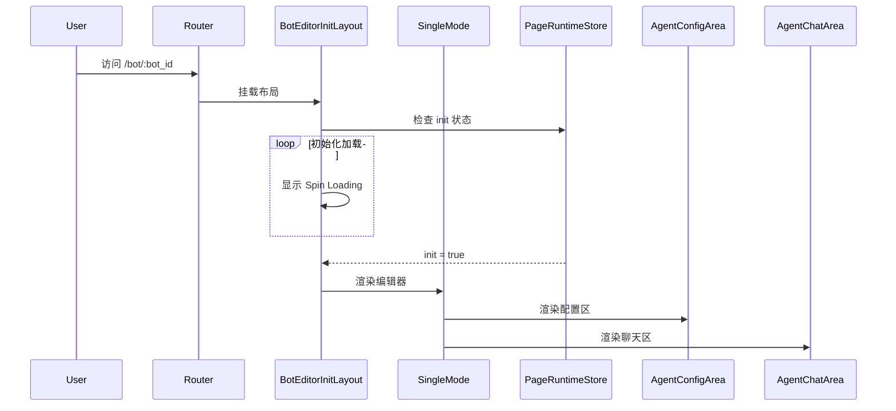

# Bot 创建与编辑流程

## 概览

Bot 的生命周期始于创建向导，随后进入编辑器进行开发。本文档详细分析 Bot 的创建流程（Creation Flow）和编辑流程（Editing Flow）。

## 第一部分：Bot 创建流程 (Creation Flow)

创建流程负责引导用户填写 Bot 的基本信息（名称、描述、图标）并初始化 Bot 实例。

### 核心 Hook 与组件

1.  **`useCreateAgent`**
    - **位置**: `frontend/packages/studio/entity-adapter/src/hooks/use-create-agent.tsx`
    - **作用**: 对外暴露的便捷 Hook，封装了创建模态框的显示逻辑。
    - **用法**:
        ```typescript
        const { modal, startEdit } = useCreateAgent({
          mode: 'add',
          onSuccess: (botId) => navigateToEditor(botId)
        });
        ```

2.  **`AgentInfoForm` (表单组件)**
    - **位置**: `frontend/packages/agent-ide/space-bot/src/hook/use-create-bot/agent-info-form.tsx`
    - **作用**: 渲染 Bot 信息填写表单，包含名称、描述、图标上传及空间选择。

3.  **`useAgentPersistence` (持久化)**
    - **位置**: `frontend/packages/agent-ide/space-bot/src/hook/use-create-bot/use-agent-persistence.ts`
    - **作用**: 处理与后端的 API 交互。
    - **关键流程**:
        - 调用 `DeveloperApi.DraftBotCreate()` 创建草稿 Bot。
        - 触发 Tea 事件追踪创建行为。
        - 处理服务端返回的校验错误。

### 数据流图



---

## 第二部分：Bot 编辑流程 (Editor Flow)

创建完成后，用户进入 Agent IDE (`/space/:id/bot/:id`)，核心界面由 `SingleMode` 承载。

### 核心组件架构

### 1. SingleMode 容器
`SingleMode` 是 Bot 编辑页面的顶级容器，负责初始化上下文、管理全局状态（如历史记录、页面来源）以及组装左右两侧区域。

**源码路径**: `frontend/packages/agent-ide/entry/src/modes/single-mode/index.tsx`

```tsx
// 核心代码片段
export const SingleMode: React.FC<SingleModeProps> = ({ ...agentConfigAreaProps }) => {
  const { isInit, historyVisible } = usePageRuntimeStore(...);
  
  return (
    <div className={classNames(s.container, ...)}>
      <AbilityAreaContainer mode={BotMode.SingleMode} ...>
        <ContentView>
          {/* 左侧配置区 */}
          <AgentConfigArea {...agentConfigAreaProps} />
          {/* 右侧聊天/预览区 */}
          <AgentChatArea ... />
        </ContentView>
        {/* 调试面板 */}
        <BotDebugPanel />
      </AbilityAreaContainer>
    </div>
  );
};
```

### 2. AgentConfigArea (配置区域)
位于左侧，集成了模型选择、人设与提示词编辑、以及技能/知识库配置。

**源码路径**: `frontend/packages/agent-ide/entry/src/modes/single-mode/section-area/agent-config-area/index.tsx`

```tsx
export const AgentConfigArea: React.FC<AgentConfigAreaProps> = props => {
  return (
    <SingleSheet title={I18n.t('bot_build_title')}>
      <div className={s['tool-card']}>
        {/* 提示词编辑器 */}
        <LayoutContext value={{ placement: PlacementEnum.LEFT }}>
          <PromptView />
        </LayoutContext>
        {/* 工具配置区 (插件、工作流、知识库等) */}
        <ToolArea {...props} />
      </div>
    </SingleSheet>
  );
};
```

## 状态管理

Bot 编辑器的状态主要由以下几个 Store 管理：

1. **PageRuntimeStore** (`@coze-studio/bot-detail-store/page-runtime`)
   - 管理页面级别的 UI 状态，如加载状态、编辑模式、历史记录显示等。

2. **BotPageStore** (`@coze-agent-ide/space-bot/store`)
   - 管理 Bot 的业务数据，包括 Mode 切换（单 Agent 模式 vs 工作流模式）。

3. **BotContext** (`@coze-agent-ide/bot-editor-context-store`)
   - 维护 Bot 的核心数据模型（Prompt、Model Config、Tools）。

## Bot 初始化流程



## 关键交互

### 模式切换
用户可以在 **Single Agent Mode** (基于 Prompt) 和 **Workflow Mode** (基于工作流编排) 之间切换。这是通过 `useBotPageStore` 中的 `modeSwitching` 状态控制的。

### 实时预览
右侧的 `AgentChatArea` 是一个实时互动的聊天窗口，它与左侧配置实时同步。修改 Prompt 或添加插件后，聊天窗口会通过 `BotDebugChatAreaProvider` 获取最新的配置上下文，从而实现"所见即所得"的调试体验。
